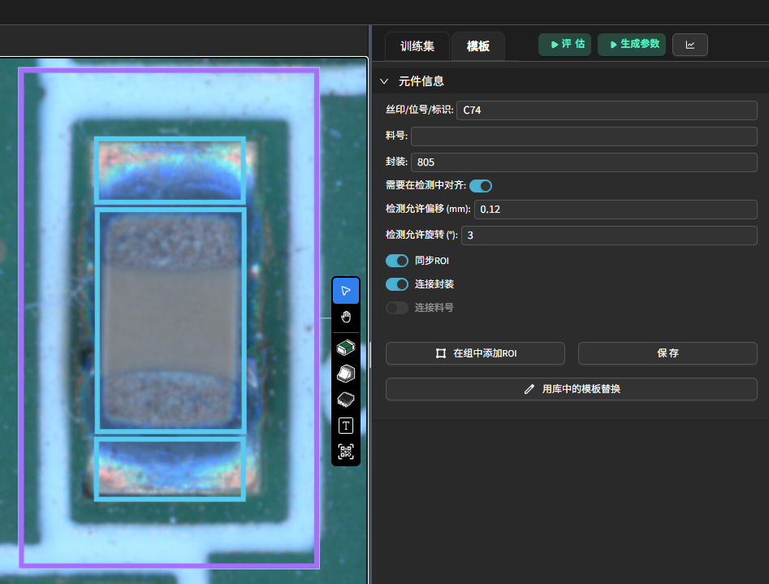

元件配置
=================

在模板编辑器的元件视图中，选中目标元件后，可在右侧“模板”栏查看并编辑其全部属性参数。

- **丝印/位号/标识** (Reference/Identifier)：必填，建议与 PCB 丝印一致，便于检测时快速定位。
- **料号** (PN)：可选，填写该元件的物料编码，便于后续按料号分组与统计。
- **封装** (Package)：必填，填写该元件的封装名称，便于后续按封装分组与统计。
- **需要在检测中对齐** : 是否启用该元件的对齐功能, 默认开启。启用后，系统会在检测时自动调整该元件的位置与旋转角度，确保其与模板位置一致。
- **检测允许偏移** ：
- **检测允许旋转** ：
- **同步 ROI** ：控制该元件在子板中的 ROI（检测区域）是否与主板保持一致。关闭后，可在每个子板单独调整该元件的 ROI，适用于拼版中局部差异场景。
- **链接封装** ：关联该元件至对应封装分组，实现训练样本聚合与参数统一管理。关闭后，该元件可独立设置参数，不参与封装组同步。
- **链接料号** ：关联该元件至对应料号分组，便于同料号元件批量训练与参数同步。关闭后，该元件不参与料号组的参数继承。
- **在组中添加ROI** : 点击该按钮后，支持在已经分组为元件的基础上，为该元件添加新的 ROI（检测区域）。
- **保存** ：保存当前元件的属性与参数设置。
- **用库中的模板替换** ：从私有元件库中选择一个已保存的标准化元件，替换当前选中的元件。便于复用已有模板。
