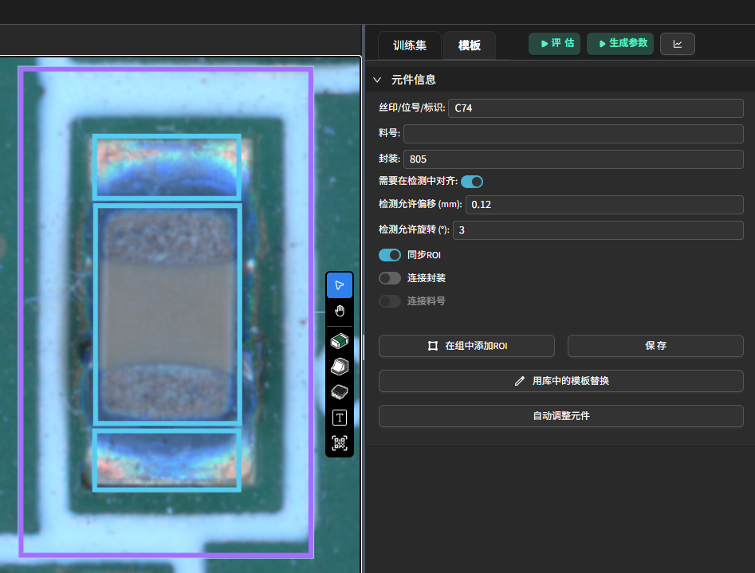

元件配置
=================

在模板编辑器的元件视图中，选中目标元件后，可在右侧"模板"栏查看并编辑其全部属性参数。

元件基本信息
------------

- **丝印/位号/标识**：必填，建议与 PCB 丝印一致，便于检测时快速定位。
- **料号**：可选，填写该元件的物料编码，便于后续按料号分组与统计。
- **封装号**：填写该元件的封装名称，便于后续按封装分组与统计。

对齐参数
--------

- **需要在检测中对齐**：是否启用该元件的对齐功能，默认开启。启用后，系统会在检测时自动调整该元件的位置与旋转角度，确保其与模板位置一致。被设为坏板标记时，该开关强制关闭并禁用。
- **启用AI对齐**：为该元件启用基于 AI 的对齐，进一步减小残余位移，适用于对位敏感的元件（如细间距 BGA、小字符 OCR）。与"需要在检测中对齐"互为补充，可独立启用。
- **必须在视野中心捕获**：启用后，路径规划器将为该元件专门生成一个以其为中心的视野停靠点，确保该元件始终位于相机视野中心进行拍摄，以提升光学质量，适用于尺寸微小的 OCR 或细间距 BGA 元件。对齐与此开关正交互补。修改后需通过"重载检测"使设置生效。
- **检测允许偏移 (mm)**：当整个 PCB 板的偏移超过设定值时，将不会对齐该元件，避免误对齐导致检测失败。仅在"需要在检测中对齐"开启时可编辑。
- **检测允许旋转 (°)**：当整个 PCB 板的旋转超过设定值时，将不会对齐该元件。仅在"需要在检测中对齐"开启时可编辑。

.. _检测控制与特殊标记:

坏板标记
--------

**坏板标记**：将元件用作"坏板标记"，用于驱动子板（拼板联）的良率判定。可选三种模式：

- **非坏板标记**：普通检测元件（默认）。
- **坏板标记 — 通过表示好板**：该标记检测通过 ⇒ 所在子板视为好板。
- **坏板标记 — 通过表示坏板**：该标记检测通过 ⇒ 所在子板视为坏板。

约束与联动：

- 坏板标记必须位于子板位置（拼板的子板内，不可在拼板共享区域）；如尚未注册基板，请先注册。当元件不在子板位置（``array_index`` 为 ``-1`` 或未设置）时，选择框禁用。
- 设为坏板标记后，**需要在检测中对齐**、**基准产品中是否NG** 两个开关将被强制关闭并禁用；**同步ROI** 须保持开启（保存时由服务端校验，否则返回 400 错误）。
- 坏板标记驱动子板判定，但**不计入**复检 NG 列表与数据分析报告（报表中的总数/报警数/NG 数均排除坏板标记）。

检测跳过
--------

- **跳过此元件的检测**：将该元件实例排除在检测之外，不进行推理、不产生检测结果、不计入良率。被设为坏板标记时，该开关强制关闭并禁用。
- **跳过检测 (料号)**：按料号将该元件整体排除在检测之外。当元件有料号时显示。跳过操作会传播至所有相同料号的实例。
- **跳过检测 (封装号)**：按封装号将该元件整体排除在检测之外。当元件有封装号时显示。

其他开关
--------

- **基准产品中是否NG**：用于拼板子板实例（``array_index > 0``），标记该位置在基准良品板上本身即为异常（如缺件），从而在检测时不将其误报为缺陷。被设为坏板标记时，该开关强制关闭并禁用。
- **同步ROI**：控制该元件在子板中的 ROI（检测区域）是否与主板保持一致。关闭后，可在每个子板单独调整该元件的 ROI，适用于拼版中局部差异场景。
- **连接封装**：关联该元件至对应封装分组，实现训练样本聚合与参数统一管理。关闭后，该元件可独立设置参数，不参与封装组同步。
- **连接料号**：关联该元件至对应料号分组，便于同料号元件批量训练与参数同步。关闭后，该元件不参与料号组的参数继承。

操作按钮
--------

- **保存**：保存当前元件的属性与参数设置。有未保存更改时按钮高亮显示。
- **绘制ROI**：在当前元件上绘制新的 ROI 区域（仅支持主板实例 ``array_index = 0``）。
- **用库中的模板替换**：从私有元件库中选择一个已保存的标准化元件，替换当前选中的元件，便于复用已有模板。
- **在组中添加ROI**：在已分组的元件基础上，为该元件添加新的 ROI（检测区域）。

.. note::

   替代料（Variation）面板在元件为替代料时显示，用于管理替代料的料号/封装号重命名及批量复制操作。详见 :doc:`../features/variations` 页面，此处不重复说明。
