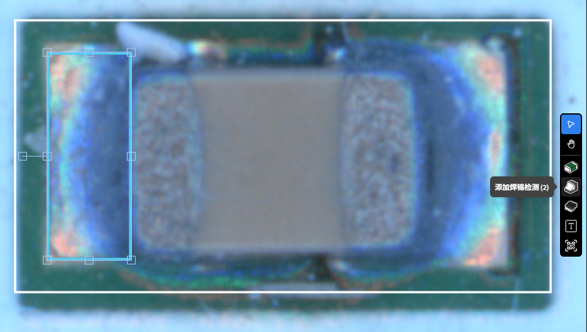
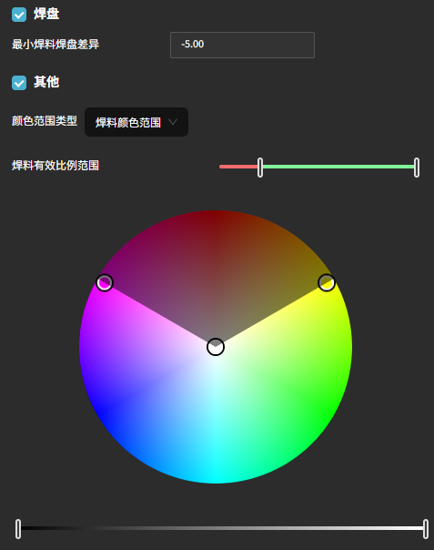

检测参数 2D
=================

本章节详细介绍 2D 检测工具及其参数含义，并结合典型用法与调参思路，帮助你在实际产线中高效完成建模与检测。

   .. image:: images/params_overview.png
      :scale: 180%
      :alt: 检测参数总览

.. contents::
   :local:
   :depth: 2

1. 本体工具
---------------------

**用途**：检测元件本体缺陷，支持 AI 缺陷检测、角度/偏移、极性等。绘制区域应覆盖元器件主体表面。  

   .. image:: images/tool_body_roi.png
      :scale: 50%
      :alt: 本体检测ROI示例

**参数说明**

- **旋转角度 (°)**  
   元件本体的姿态偏差；启用后当偏差角度 > 阈值判定为 NG。

- **常规检测（AI）**  
   对元件本体的 AI 异常分数进行判定；分数接近 0 代表与正常相似，接近 1 代表与正常不相似。通过统计表查看正常/异常分数分布，选择合适阈值。  
  
   .. image:: images/tool_body_ai.png
      :scale: 60%
      :alt: 本体AI分数分布示例
   .. image:: images/tool_body_ai2.png
      :scale: 70%
      :alt: 本体AI分数分布示例2 

- **X 偏移 (mm) / Y 偏移 (mm)**  
   样本元件本体 与 标准元件本体 的平移偏差；大于阈值则 NG。

- **损件检测（AI，对齐后检测）**  
   针对元件本体的破损、缺口等异常。检测前会先将元件图像与 标准样本 自动对齐，避免因位置偏移导致误判。  
   模型会输出一个分数：接近 0 表示与正常样本相似，接近 1 表示与正常样本差异大。  
   用户可以通过统计图表对比正常样本和异常样本的分数分布，进而选择合适的判定阈值。

      .. image:: images/tool_body_align.png
         :scale: 120%
         :alt: 损件检测

   .. image:: images/tool_body_align_inference.png
      :scale: 60%
      :alt: 本体对齐后检测
   .. image:: images/tool_body_align_inference2.png
      :scale: 80%
      :alt: 本体对齐后检测2

- **极性检测（AI，对齐后检测）**  
   用于判断元件的极性方向是否正确。检测前同样会先对齐，以减少位置误差。  
   系统会在检测框内生成一个绿色的极性 ROI，只在该 ROI 区域内学习和判定极性特征，从而识别是否存在极性反转。  
   分数判定方式与损件检测相同：0 趋近正常，1 趋近异常，可通过分布图表设定阈值。    
  
   **极性 ROI**：点击 *设置 ROI* 或在显示窗口中直接拖拽 调整ROI框。

   .. image:: images/tool_body_polarity.png
      :scale: 50%
      :alt: 极性检测框
   .. image:: images/tool_body_polarity_inference.png
      :scale: 60%
      :alt: 极性检测
   .. image:: images/tool_body_polarity_inference2.png
      :scale: 70%
      :alt: 极性检测2

- **启用遮罩**  
  对含有不固定字符/图案的区域进行遮蔽，避免影响 AI 检测。

   .. image:: images/tool_body_mask.png
      :scale: 50%
      :alt: 遮罩

2. 焊料工具（2D，基于颜色比例）
---------------------

**核心思路**：在 ROI 内用 **HSV 颜色范围** 对像素进行二值化，计算“有效像素比例”，并与设定范围比较以判定 OK/NG。一个 ROI 可配置 **多个颜色范围** （如蓝通道斜面焊料、红通道平面焊盘），分别计算比例并独立设阈值。

**步骤与参数**

- **设置 ROI**：框选存在焊料（爬锡/焊盘）的区域，ROI 支持旋转。
  

- **启用可视化**：  
  评估后显示有效/无效区域的二值化 Mask；因有额外计算，建议仅在调试阶段开启。
  
   .. image:: images/solder2d_binarize1.png
      :scale: 80%
      :alt: 焊料2D可视化

- **颜色范围（HSV）**：  
  在 HSV 色彩空间中，通过在色盘上选择三个点来定义颜色范围：中心点 (center) 位于色盘内部，作为色调基准；起点 (hsv_start) 和终点 (hsv_end) 位于圆环边缘（S=100），共同形成一个扇形区域作为有效色相范围，并配合下方的 **亮度范围** 限定最终有效的颜色区间。  

   .. image:: images/solder2d_hsv_pick.png
      :scale: 80%
      :alt: HSV颜色范围挑选
   
   .. image:: images/solder2d_color_ranges.png
      :scale: 80%
      :alt: 多颜色范围示例（蓝/红）

- **二值化与有效比例（Valid Ratio）**：  
  将 ROI 内属于颜色范围的像素计为“有效点”，有效比例定义为： **有效比例 = 100 × 有效点数 / ROI 面积**  
  
  在评价时，会检查每个颜色范围对应的有效比例是否落入给定范围。  
  一个 ROI 可设置多组颜色范围，而这些范围可以在 **颜色范围（HSV）** 中配置。
  
   .. image:: images/solder2d_binarize.png
      :scale: 80%
      :alt: 颜色范围二值化与比例统计
   .. image:: images/solder2d_binarize1.png
      :scale: 80%
      :alt: 颜色范围二值化与比例统计
   .. image:: images/solder2d_binarize2.png
      :scale: 80%
      :alt: 颜色范围二值化与比例统计

3. 引脚工具
---------------------

3.1 IC 引脚检测（2D，AI）
^^^^^^^^^^^^^^^^^^^^^^^^^^^^

**用途**：在引脚阵列上自动生成引脚子框，结合 AI 缺陷检测识别桥接、缺焊、虚焊、少锡等。  
**方向标识**：检测框上的三角箭头指向 *外侧*。  

   .. image:: images/lead2d_ai_overview.png
      :scale: 80%
      :alt: 引脚2D(AI)示意

**关键参数**

- **引脚数量**：自动均分生成对应个数的子 ROI。  
- **引脚宽度 (mm)**：用于匹配实际引脚宽度，使子 ROI 与实体引脚对齐。  
- **引脚阈值（AI）**：基于每个子 ROI 的 AI 分数进行判定。

   .. image:: images/lead2d_ai_inference.png
      :scale: 80%
      :alt: 引脚2D AI检测示意

3.2 IC 引脚检测 v2（2D，基于颜色比例）
^^^^^^^^^^^^^^^^^^^^^^^^^^^^^^^^^^^^^^^^^^

**工作模式**

- **长引脚模式**：适用于细长 IC 引脚。在该模式下，会同时启用四个子区域：焊盘（Pad）、焊料（Solder）、引脚区域 (Pin/Area) 和引脚末端（Tip），分别建模并参与判定。
- **短引脚模式**：适用于QFN等短引脚器件。该模式下仅使用单一“引脚区域”进行颜色统计与判定，界面中只显示一个整体检测框，不再细分 Tip/Pad/Solder 区域。

**长引脚模式区域划分**：将“引脚区域”划分为 **焊料（Solder）/焊盘（Pad）/引脚区域 (Pin)/引脚末端（Tip）** 四类子区域，分别以 **颜色范围** 做二值化，计算各自与整体的 **有效比例** 与 **均值/邻域** 统计，对桥接与翘脚（Lifted Lead）等典型缺陷进行鲁棒判定。

   .. note::
      总结：上方橙色框 = **焊盘区 (Pad)**；中上紫色框 = **焊料区 (Solder) ** 。 中下粉色框 = **引脚末端（Tip）区域**；最下方紫色大框 = **引脚区域 (Area/Pin)**；

   .. image:: images/lead2d_v2_layout.png
      :scale: 80%
      :alt: V2区域划分与子ROI

**通用**

   .. image:: images/lead2d_v2_general.png
      :scale: 100%
      :alt: V2通用参数

- **焊盘长度（像素）**：控制上方 **焊盘区 (Pad)** 的高度，通常与实际焊盘在图像中的像素高度大致一致，用于稳定提取焊盘颜色与面积。  
- **引脚长度（像素）**：控制整体“引脚相关区域”的总长度，同时覆盖引脚区域与引脚末端区域。
- **引脚尖端长度（像素）**：控制 **引脚末端 (Tip)** 子区域的高度。该区域主要用于判断引脚是否翘起/离板，应精确包住引脚尖端而不过多包含下方焊盘。  
- **引脚数量** / **引脚宽度 (mm)**：用于在 ROI 内自动均分生成子框，并与实际引脚对齐。数量决定分段个数，宽度 (mm) 需与真实器件脚宽相匹配，以保证子 ROI 能准确覆盖每一只引脚。  
- **启用高级设置**：默认显示简化参数，启用后可打开更多与焊盘/焊料/引脚区域/引脚末端相关的细致参数选项，仅在需要精细调参时启用。  
- **启用可视化**：显示各子区域的二值化结果与比例统计（包括 Pad/Solder/Area/Tip），直观查看颜色范围与阈值是否合理。因有额外计算，建议仅在调试阶段开启。  
- **启用短引脚模式**：切换为短引脚/平面封装的检测逻辑，仅保留一个整体“引脚区域”进行统计，不再细分 Tip/Pad/Solder。适用于 QFN,SOT 等无明显长引脚的器件。  
   
   .. image:: images/lead2d_v2_visualizae.png
      :scale: 60%
      :alt: V2 可视化

在默认模式下，可以看到焊盘的最小焊料焊盘差异，并可以为焊盘（Pad）、焊料（Solder）、引脚区域 (Area/Pin) 和引脚末端 (Tip) 配置各自的 **颜色范围** 参数。

**高级设置（启用后可见）**

勾选 **启用高级设置** 后，才会额外显示下面这些阈值类参数（例如平均阈值、邻域阈值等），用于更精细地控制各子区域的判定逻辑。

.. raw:: html

   

   
点击展开：高级设置详细说明（Solder / Pad / Tip）

   

**焊料（Solder）**

      .. image:: images/lead2d_v2_solder.png
         :scale: 80%
         :alt: V2焊料参数

   - **颜色范围**：为“焊料”区域配置有效的 HSV 颜色范围, 和有效比例范围

      .. image:: images/lead2d_v2_solder_color.png
         :scale: 80%
         :alt: V2焊料色盘
   
   - **焊料平均阈值 (Solder Mean Threshold)**  
      当引脚的 valid_ratio 未能落入预设的 **Solder Valid Ratio Range** 时，会触发二次判定。  
      此时，系统会计算该引脚的 valid_ratio 与所有引脚平均值 (mean_valid_ratio) 的差异：  
      - 如果差异 **大于阈值** ⇒ 视为正常；  
      - 如果差异 **小于或等于阈值** ⇒ 判定为 NG。  

   - **焊料邻域阈值 (Solder Neighbor Threshold)**  
      同样在 valid_ratio 超出 **Solder Valid Ratio Range** 时启用。  
      系统会比较该引脚的 valid_ratio 与相邻引脚的 valid_ratio：  
      - 如果差异 **大于阈值** ⇒ 视为正常；  
      - 如果差异 **小于或等于阈值** ⇒ 判定为 NG。  

   .. note::
      判定流程为：  
      1. 首先检查 valid_ratio 是否在 **Solder Valid Ratio Range** 内，若在范围内 ⇒ OK；  
      2. 若超出范围，则进入二次判定：  
         - 只要满足 **平均阈值** 或 **邻域阈值** 中的任意一个条件 ⇒ OK；  
         - 如果两者都不满足 ⇒ NG。  

**焊盘（Pad）**

      .. image:: images/lead2d_v2_pad.png
         :scale: 100%
         :alt: V2焊盘参数

   - **颜色范围（Pad）**：为“焊盘”区域配置有效的 HSV 颜色范围。

      .. image:: images/lead2d_v2_pad_color.png
         :scale: 80%
         :alt: V2焊盘/翘脚参数

   - **引脚翘起焊料平均阈值**  
      当前引脚 **焊料区 (Solder)** 的有效比例 − 所有引脚焊料区有效比例的平均值 > 设定阈值  
      若条件成立，则判定为 OK，否则判定为 NG。

   - **引脚翘起焊盘平均阈值**  
      当前引脚 **焊盘区 (Pad)** 的有效比例 − 所有引脚焊料区有效比例的平均值 > 设定阈值  
      若条件成立，则判定为 OK，否则判定为 NG。

   - **引脚翘起最小焊盘差异**  
      比较同一个引脚的 **焊料区 (Solder)** 和 **焊盘区 (Pad)**。  
      正常情况下，焊料 > 焊盘；如果两者差距太小，就说明焊盘暴露、焊料不足，有可能是翘脚。  

   - **引脚翘起焊料邻域阈值**  
      比较当前引脚的 **焊料区 (Solder)** 和相邻引脚的焊料情况。  
      如果差异过大，说明它和左右邻居不一致，可能就是局部异常。  

**引脚末端 (tip) 区域**

      .. image:: images/lead2d_v2_tip.png
         :scale: 80%
         :alt: V2 Tip参数

   - **颜色范围（Tip）**：为“引脚末端”区域配置有效的 HSV 颜色范围, 和有效比例范围
      
      .. image:: images/lead2d_v2_tip_color.png
         :scale: 80%
         :alt: V2 Tip 颜色

   - **引脚翘起平均上限阈值**  
      比较所有引脚的引脚末端 (Tip) 区域的平均有效比例，若其值高于该上限阈值，则判定为异常。  

   - **引脚翘起平均下限阈值**  
      比较所有引脚的引脚末端 (Tip) 区域的平均有效比例，若其值低于该下限阈值，则判定为异常。  

.. raw:: html

   

   

    

   
4. 文本工具
---------------------

**用途**：识别并校验检测框内文本。检测框上的三角形箭头用于表示文本的阅读方向，应确保箭头方向与实际字符方向一致，以便正确识别。  

   .. image:: images/text_tool.png
      :scale: 70%
      :alt: 文本工具参数

- **模糊模式**：当“期望文本”与检测文本长度一致时，可通过反馈把易混字符（如 `1` / `l` ）加入模糊表；两者互换也视为正确。  
- **自动搜索文本位置**：当实际文本在检测框中的位置存在一定偏移时，启用该选项可以在局部范围内自动搜索最佳文本位置，从而提高识别成功率。  
- **双向检测**：进行 0°/180° 两次识别，任意方向匹配即判定 OK。  
- **期望文本**：输入目标字符串。  
- **最大不匹配字符数**：与期望文本比较时，允许的最大不匹配字符数量。仅当推断结果与期望文本长度相同时，界面才会显示不匹配字符计数。  

5. 条形码工具
---------------------

**用途**：识别条码/二维码，并将读出的序列号用于与历史检测记录关联（如 PCB 唯一序列号）。  

   .. image:: images/barcode_tool.png
      :scale: 80%
      :alt: 条码工具参数
