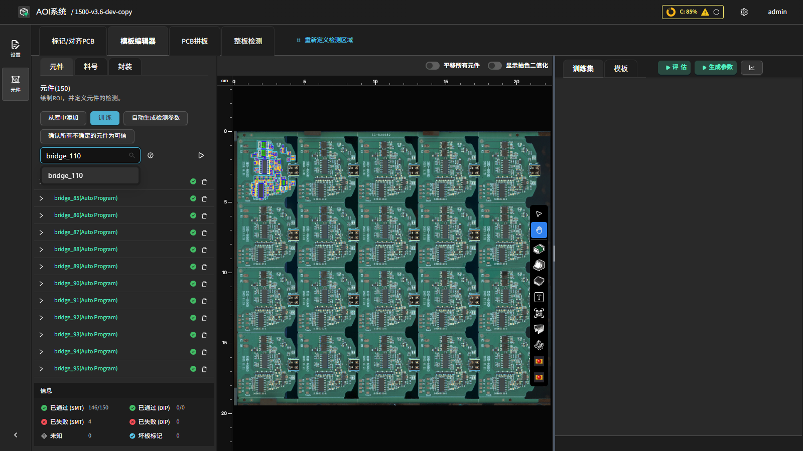

桥接检测（Bridge）
===================

**此页面的用途**

独立检测相邻引脚 / 焊点之间的连锡（短路）。

**如何进入**

模板编辑器中绘制对应 ROI 后，在参数面板中配置该工具的参数。

**操作流程**

**参数说明**

- **桥接颜色公式（Bridge Color Formula）**：选择用于识别连锡的颜色公式（如 ``2B-R-G``）；选择三色时配置 **三色 X / Y / Z / A**。
- **值范围（Value Range）**：``2B-R-G`` 等公式的阈值范围（0–100），落入该范围的像素被检出。
- **灵敏度（Sensitivity）**：桥接颜色检测灵敏度（0–1），值越大检测范围越大。
- **启用可视化（Enable Visualization）**：显示桥接检测中间结果。
