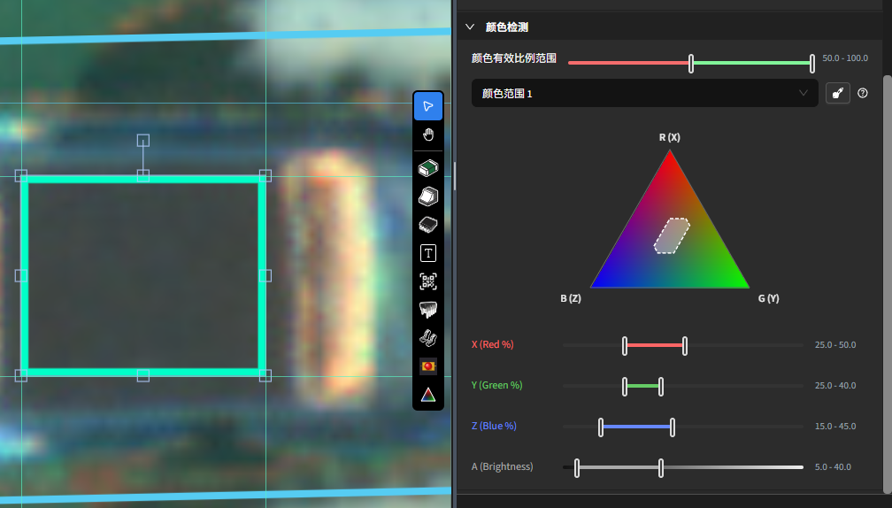

颜色检测（Color）
==================

**此页面的用途**

基于颜色比例校验目标区域颜色特征（如带色标识、色环等）。

**如何进入**

模板编辑器中绘制对应 ROI 后，在参数面板中配置该工具的参数。

**操作流程**

- **颜色有效比例范围（Valid Color Ratio Ranges）**：配置一组或多组颜色范围及其有效比例区间，落入范围内判 OK。
