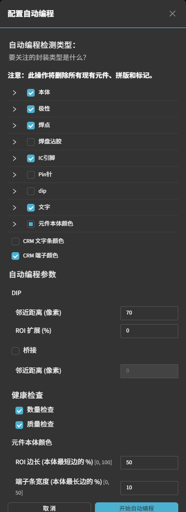

颜色检测（Color）
==================

**此页面的用途**

基于颜色比例校验目标区域颜色特征（如带色标识、色环等）。

**如何进入**

模板编辑器中绘制对应 ROI 后，在参数面板中配置该工具的参数。

**操作流程**

.. image:: ../images/tool_color.png
   :scale: 45%
   :alt: 模板编辑器中的颜色检测元件示例

- **颜色有效比例范围（Valid Color Ratio Ranges）**：配置一组或多组颜色范围及其有效比例区间，落入范围内判 OK。

**CRM 端子颜色（自动编程）**

除在模板编辑器中手动绘制颜色检测框外，**自动编程** 还可为 **CRM（片式元件，如片式电阻）** 自动放置端子颜色检测框：在自动编程配置中勾选 **CRM 端子颜色**，系统会在每个 CRM 元件的两个端子（焊端）处各生成一个颜色检测框，用于校验端子颜色。端子检测框的大小由参数 **端子条宽度 (本体最长边的 %)** 控制（取本体最长边的百分比）。端子颜色检测项与 **元件本体颜色** 相互独立，可分别启用。

