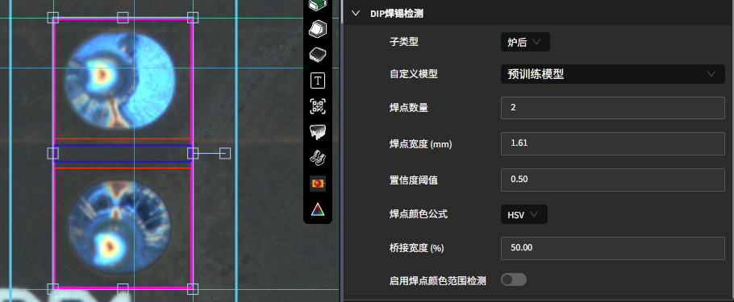

DIP 焊点检测（DIP Solder）
===========================

**此页面的用途**

针对插装（DIP）器件的焊点检测，可结合颜色范围与自定义模型。

**如何进入**

模板编辑器中绘制对应 ROI 后，在参数面板中配置该工具的参数。

**操作流程**

**参数说明**

- **DIP 类型（DIP Type）/ 子类型（Sub Type）**：选择 DIP 焊点形态类别。
- **自定义模型（Custom Model）**：选用为该焊点类型训练的自定义分类模型。
- **置信度阈值（Confidence Threshold）**：模型判定的置信度门限。
- **焊点数量（Solder Count）/ 焊点宽度 (mm)（Solder Width）**：在 ROI 内均分生成焊点子框。
- **桥接宽度 (%)（Bridge Width）**：相邻焊点连锡检测带宽度。
- **启用焊点颜色范围检测（Enable Solder Color Range Criteria）**：开启后按颜色范围辅助判定。
- **焊点颜色公式（Solder Color Formula）**：选择 HSV 或三色（Tricolor）公式；选择三色时配置 **三色 X / Y / Z / A** 系数。
- **焊点颜色中心色调（Solder Color Center Hue）/ 焊点颜色中心饱和度（Solder Color Center Saturation）**：HSV 模式下色相基准点。
- **焊点颜色起始色调（Solder Color Start Hue）/ 焊点颜色结束色调（Solder Color End Hue）**：色相范围的起止角度。
- **焊点颜色起始明度（Solder Color Start Value）/ 焊点颜色结束明度（Solder Color End Value）**：限定有效像素的明度区间。
- **焊点颜色有效比率范围（Solder Color Valid Ratio Range）**：焊点颜色有效比例的 OK 区间。
