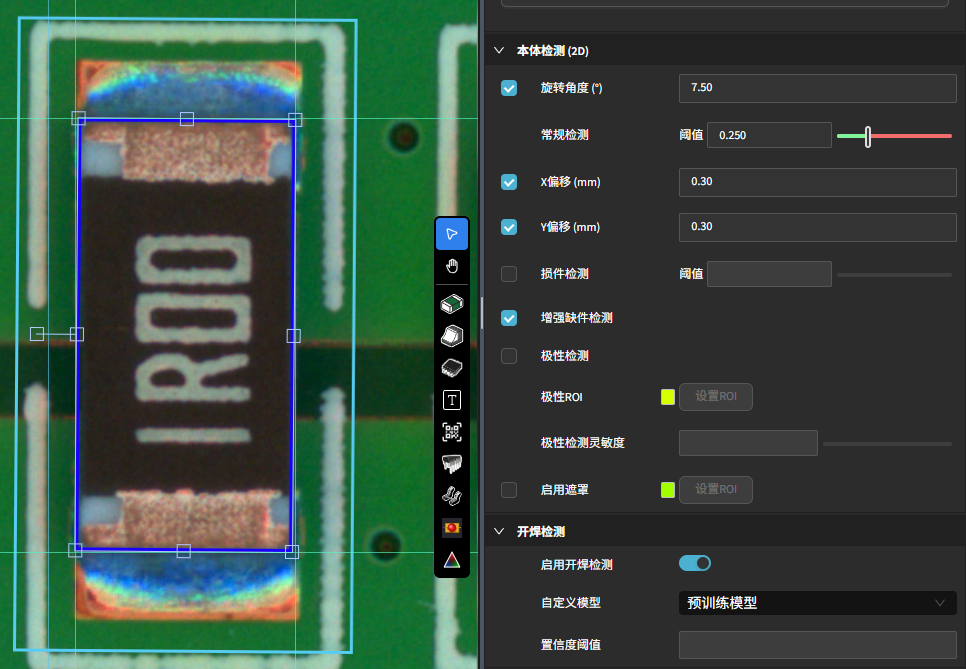

开焊检测（Open Solder）
========================

**此页面的用途**

检测焊点开路 / 未连接（虚焊、空焊）等缺陷。

**如何进入**

模板编辑器中绘制对应 ROI 后，在参数面板中配置该工具的参数。

**操作流程**

- **启用开焊检测（Enable Open Solder Inspection）**：开关该检测项。
- **置信度阈值（Confidence Threshold）**：模型判定门限。
- **自定义模型（Custom Model）/ 自定义模型路径（Custom Model Path）**：选用自定义训练模型。
