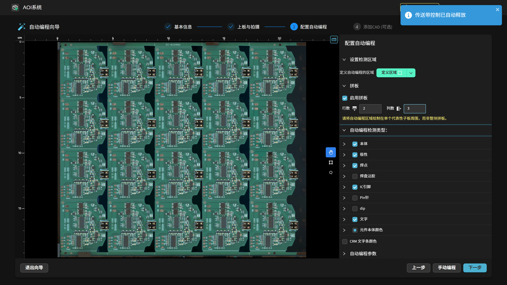
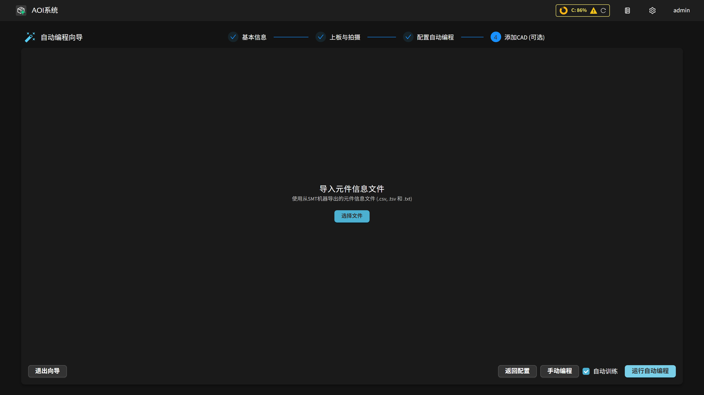

自动编程
=============================

本节说明两种自动编程模式，以及上传 CAD/元件信息文件后的字段映射与坐标对齐流程。

.. note::
   向导的前三步（基本信息、上板与拍摄、配置自动编程）在 :ref:`创建产品` 中已有详细说明。
   本页聚焦于向导第四步"添加CAD (可选)"：上传 CAD 并运行自动编程。

**两种编程模式对比**

1. **全自动编程（无 CAD）** — 完全依赖视觉 + AI 自动识别、分割与建模所有器件，生成初始检测框。
2. **半自动编程（上传 CAD）** — 在视觉预测结果的基础上，将 CAD 行记录与模型识别的元件自动匹配，直接赋值标识 (Designator)、封装 (Package)、料号 (PN)，并支持按封装/料号分组。

上传 CAD 不影响自动编程的速度与基础质量；它提供"结构化属性 + 分组"增益，
使数据集在后续训练/反馈阶段更快积累"同类多样本"，更容易较早获得稳定效果。

无 CAD 情况下仍可在后续通过手动补录和检测反馈机制逐渐丰富数据集。

**第四步：添加CAD (可选)**

完成 **配置自动编程** 步骤后，向导进入第四步 **添加CAD (可选)**。此步骤有三个选项：

- **返回全景采集** — 返回上一步重新拍摄。
- **手动编程** — 跳过自动编程，直接进入产品编程界面。
- **运行自动编程** — 在未上传 CAD 文件时，点击此按钮执行全自动编程。

若已上传 CAD 文件，则显示 **运行自动编程** 按钮，点击后执行半自动编程。

检测区域已在上一步 **配置自动编程** 中定义，本步骤无需再次框选（见 :ref:`创建产品`）。

**运行自动编程** 按钮旁还有 **自动训练** 复选框；它与编程完成后的拼板构建、模型训练自动化详见下文 **编程后的自动处理：拼板构建与模型训练**。

**全自动编程（无 CAD）**

未上传任何文件时，点击 **运行自动编程** 即可开始纯视觉检测编程：

    .. image:: images/upload_cad.png
        :scale: 50%
        :alt: 上传 CAD 文件界面（未上传时点击运行自动编程）

系统会基于 **配置自动编程** 步骤中定义的自动编程检测类型，自动识别并分割所选类别器件，生成初始的检测框。

自动编程约需 30 秒完成。是否提供 CAD 文件不影响编程质量。

    .. image:: images/full_auto_program.png
        :scale: 50%
        :alt: 全自动编程示意

完成后会进入产品编程界面，从这一步开始，需要定义对齐标记、确认检测框、微调参数，详见后续章节。

**半自动编程（上传 CAD）**

**支持的文件格式**

支持导入 SMT 机台导出的标准元件信息文件（`.csv`、`.tsv`、`.txt`）。文件须为 UTF-8 编码。

可以包含以下字段：

- （可选）料号 (PN)
- 封装号 (Package)
- 标识 (Designator / Ref)
- 中心X坐标 (Center X)、中心Y坐标 (Center Y)
- 旋转角度 (Rotation °)
- （可选）层 / 面别字段（如 TOP/BOTTOM）

导入 CAD 的好处：

- 自动匹配并写入标识 / 封装 / 料号，避免后期逐个补录。
- 按封装 / 料号即时分组，初始数据集中"同一类"样本数量有效放大。
- 更早形成可复用的封装级统计（缺陷、尺寸、阈值分布），降低后续参数微调成本。
- 协助发现坐标 / 单位 / 重复记录等 CAD 异常。

**操作步骤**

**步骤一：导入元件信息文件**

在 **添加CAD (可选)** 步骤中，点击 **选择文件** 上传一个 `.csv`（或 `.tsv`、`.txt`）文件。

    .. image:: images/upload_cad.png
        :scale: 50%
        :alt: 导入元件信息文件界面

**步骤二：解析文件与字段映射**

文件上传成功后，进入 **解析文件** 界面。左侧显示文件原始内容，右侧为解析与字段映射面板。

- **第一行索引 / 最后一行索引** — 指定 CSV 数据的起始行号和结束行号（从 1 计数）。
- **忽略底层** — 若仅检测正面（顶层），开启此开关后须填写底层标识符（如 `B`、`BOT`），系统会自动过滤底层行。
- 点击 **预览表格** — 系统按当前设置解析并显示表格内容，每列顶部显示一个下拉菜单。

**字段映射（映射数据）**

在 **映射数据** 区域，为每一列在下拉菜单中指定对应的字段类型：

- **封装号** — 对应 CAD 中的封装名称（Package）。
- **料号** — 对应 CAD 中的料号（Part No.，可选）。
- **中心X坐标** / **中心Y坐标** — X/Y 坐标列（必选）。
- **旋转角度** — 元件旋转角度列。
- **层** — 面别标识列（如已启用忽略底层，需指定此列）。
- **丝印/位号/标识** — 元件位号（Ref Designator）列（必选）。
- **忽略此列** — 对不需要的列选择此项。

    .. image:: images/upload_cad2.png
        :scale: 50%
        :alt: CAD 字段映射示意

**坐标单位** — 在"坐标单位"下拉菜单中选择 **毫米** 或 **密尔** (mil)，须与 CAD 文件一致。

    .. note::
       若运行后提示坐标偏差过大，首先检查坐标单位（mil ↔ mm）是否选择正确。

**使用元件模板**（可选）— 勾选 **使用元件模板** 后，系统会对匹配到已保存元件模板的 CAD 点使用模板定义的区域替代 AI 检测结果。需 CAD 坐标先对齐方可生效。

**仅编程 CAD 中的元件** — 可选。勾选后，AI 检测到但 CAD 文件中不存在的元件将被丢弃，仅保留与 CAD 匹配的元件。默认不勾选。

**CAD 对齐容差 (px)** — 可选。投影后的 CAD 点与检测到的元件之间允许的最大像素距离，超过则在对齐时不视为匹配；数值越大越宽松，越小越严格。默认 30，设为 0 将完全无法匹配。

上述 **使用元件模板**、**仅编程 CAD 中的元件** 与 **CAD 对齐容差 (px)** 选项在 **解析文件** 与 **对齐坐标** 界面（重新分析时）均可设置。

**步骤三：运行半自动编程**

字段映射完成后，点击 **运行自动编程**：

- 系统结合视觉检测结果和 CAD 坐标，自动匹配每个元件并写入标识 / 封装 / 料号。

若自动匹配成功，约 30 秒后进入产品编程界面：

    .. image:: images/done_semi_auto.png
        :scale: 50%
        :alt: 完成自动编程示意

    .. image:: images/done_semi_auto2.png
        :scale: 50%
        :alt: 完成自动编程示意（元件列表）

同类封装的元件会自动分组，方便后续批量调整与训练。更多详情请参见 :ref:`料号封装和分组` 。

    .. image:: images/done_semi_auto3.png
        :scale: 50%
        :alt: 数据集分组后示意

**步骤四（自动对齐失败时）：坐标对齐调整**

若 CAD 坐标与视觉识别结果偏差过大，系统会在匹配失败后自动跳转至 **对齐坐标** 界面：

    .. image:: images/semi_auto_fail.png
        :scale: 70%
        :alt: 半自动编程坐标对齐失败界面

在该界面可使用以下工具手动调整对齐：

- **平移（X / Y 方向）** — 拖动滑条或输入偏移量。
- **旋转** — 输入角度（度）顺时针或逆时针旋转。
- **水平翻转 / 垂直翻转** — 按钮切换镜像方向。

大致对齐后，点击 **重新分析** 重新执行匹配。在 **对齐坐标** 界面也可调整 **CAD 对齐容差 (px)**，或切换 **使用元件模板** / **仅编程 CAD 中的元件** 后再点击 **重新分析**。

.. note::
   首次运行时已完成的器件检测结果会被缓存。只要拍摄图像未变化，**重新分析** 只重新执行坐标对齐，而不再重复耗时的 AI 检测，因此多次手动对齐后的 **重新分析** 通常只需数秒。调整 **CAD 对齐容差 (px)** 或切换上述选项后的 **重新分析** 同样命中缓存。

**编程后的自动处理：拼板构建与模型训练**

点击 **运行自动编程** 后，除生成检测框外，系统还会根据两个相互独立的选项自动完成后续步骤。整个过程中界面保持锁定并显示处理状态（例如"正在构建拼板阵列…"），直到全部处理完成，期间无需操作。

**自动构建拼板阵列** — 若在自动编程配置的 **拼板** 面板中开启了 **启用拼板** 并填写了大于 1 的 **行数** / **列数**，系统会在编程完成后自动以所绘检测区域注册基准子板、自动检测其余子板位置、并执行自动调整拼板对齐。此过程替代了原本需在 :ref:`PCB 拼板` 页手动完成的"管理子板模板 → 自动检测 → 自动调整拼板"操作。

.. important::
   启用拼板时，自动编程检测区域必须绘制在 **单个代表性子板** 周围，而非整块拼板。配置界面也会给出同样的提示。系统以该区域作为单个子板的模板来检测其余子板；若框选整块拼板，将只能检测出一个子板。

若自动检测在尝试次数内未能匹配设定的行 × 列，系统会弹出警告，产品保留为 **单板** 而不注册拼板，随后仍按 **自动训练** 设置继续。此时可在 :ref:`PCB 拼板` 页手动完成拼板。

**自动训练模型** — 由 **运行自动编程** 按钮旁的 **自动训练** 复选框控制（默认勾选，选择会被记住）。勾选后，编程及拼板完成后系统自动依次执行模型训练、检测参数生成与重新评估，无需手动触发；取消勾选则跳过训练，可稍后在产品编程界面手动训练。该选项与拼板相互独立——无论是否拼板，勾选即训练。

.. screenshot-todo: images/auto_program_panelize_detect_failed.png — 自动拼板检测未匹配行 × 列时弹出的警告提示

**常见问题与排查**

1. **CAD 导入后自动对齐失败**：进入坐标对齐界面，使用平移、旋转、翻转工具大致对齐后，点击 **重新分析** 即可。
2. **坐标点位错乱无法对齐**：检查坐标单位（mil ↔ mm），确认选择与 CAD 文件一致。
3. **全自动漏检少量极小器件**：手动补录并训练，或优化光照 / 清晰度后再次运行自动编程。
4. **文件上传失败 / 乱码**：当前不支持 ``.xls`` 文件，需转换为 ``.csv``\ （UTF-8 编码）。使用 Excel 另存时请选择 **CSV UTF-8（逗号分隔）** 格式，不要选普通 CSV。
5. **特殊字符（如 ± 符号）解析失败**：将文件中的非标准字符替换为标准 ASCII 字符（例如 ``±`` → ``+/-``）后重试。
6. **CAD 自动编程时小区域元件漏识别**：自动编程完成后请手动检查并补录漏识别的元件。可考虑下次提供更完整的 CAD 文件以缩小自动识别范围。
7. **拼板自动检测失败**：自动编程时若提示自动拼板检测未匹配设定的行 × 列，产品会保留为单板。请确认检测区域仅框选了单个代表性子板（而非整块拼板）后重试；仍失败时可在 :ref:`PCB 拼板` 页手动拼板。
