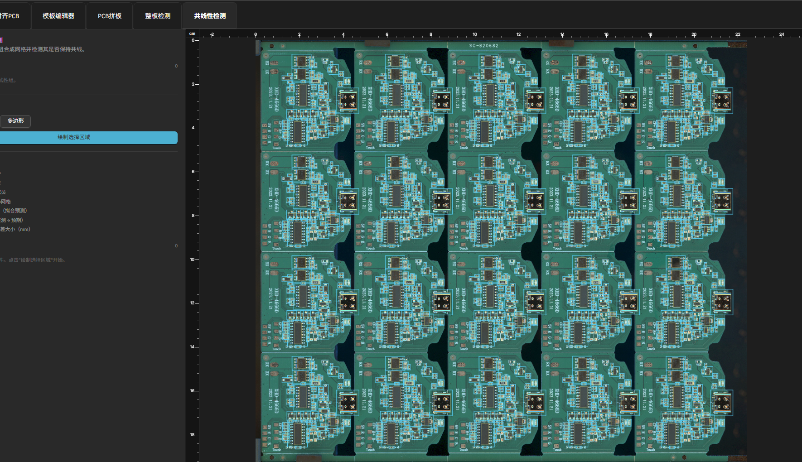

共线性检测（Collinearity Inspection）
========================================

**此页面的用途**

共线性检测用于验证一组贴装元件在 PCB 板上是否保持共线排列。将元件按网格分组后，系统通过拟合点阵模型，检测各元件的实际位置是否在容差范围内与理论位置对齐，适用于连接器引脚行、LED 阵列等对共线精度有要求的场景。

**如何进入**

在示教页面选择产品，切换至 **元件** 标签页，在左侧标签栏点击 **共线性检测** 标签。

**操作流程**

**第一步：查看和管理现有组**

左侧面板顶部显示 **共线性组** 列表，每行呈现组名、网格规格（列数 × 行数）与成员数量。单击某行可高亮该组在右侧视图中的成员；再次单击可取消高亮。每行右侧提供以下操作按钮：

- **定位** — 图标为瞄准器，工具提示"定位"。将右侧视图自动缩放并居中至该组所有成员区域。
- **运行共线性拟合** — 图标为节点连线，工具提示"运行共线性拟合"。对该组执行共线性拟合计算，并在右侧视图上叠加拟合点阵、预期中心与残差标注。拟合结果保存于后端，检测时以此为基准评判元件位置。
- **编辑共线性组** — 图标为铅笔，工具提示"编辑共线性组"。打开编辑对话框，可修改组名称及各项检测参数。
- **移除** — 图标为垃圾桶（红色），工具提示"移除"。弹出确认对话框，确认后永久删除该组及其拟合数据。

**第二步：新建共线性组**

**新建组** 区域位于左侧面板中部。新建操作分为以下步骤：

1. **选择绘制工具** — 在 **矩形** 和 **多边形** 两个按钮中选择一种框选方式：

   - **矩形**：在板图上拖动鼠标绘制矩形选框。
   - **多边形**：逐点单击定义多边形顶点；右键撤销上一个顶点；按 Enter 键完成绘制。

2. **绘制选择区域** — 单击 **绘制选择区域** 按钮，在右侧视图上按所选工具框出目标元件区域。框选完成后，被捕获到的贴装元件将进入精调状态，其他元件自动隐藏。

   .. note::

      仅拥有至少一个贴装特征（``_mount`` 类型）的元件才会被纳入候选范围；无贴装特征的元件不会出现在选区中。

3. **精调选区** — 进入精调模式后，左侧面板提示"左键点击任意矩形可将其从选区移除。完成后点击确认。"在右侧视图上单击某个元件矩形框即可将其移除，并在左侧 **已选元件** 列表中实时更新。若所选元件数少于 3 个，则显示红色提示："共线性组至少需要 3 个元件。"

4. **确认选区** — 选区包含至少 3 个元件后，单击 **确认** 按钮，弹出 **创建共线性组** 对话框。

**第三步：填写组信息（创建或编辑）**

对话框顶部显示当前已选元件数量（只读）。需填写以下字段：

- **组名称** — 必填，最多 64 个字符，用于在列表中标识该组。
- **网格宽度（列数）** — 整数，范围 1–1024，表示元件网格的列数。
- **网格长度（行数）** — 整数，范围 1–1024，表示元件网格的行数。网格宽度 × 网格长度必须等于已选元件总数，否则无法保存。
- **最大列偏差（毫米）** — 浮点数，步长 0.1，默认值 0.5 mm，表示检测时允许的最大列方向偏差。
- **最大行偏差（毫米）** — 浮点数，步长 0.1，默认值 0.5 mm，表示检测时允许的最大行方向偏差。
- **最大角度偏差（度）** — 浮点数，步长 0.1，范围 0–360，默认值 5°，表示检测时允许的最大旋转偏差。
- **拟合所需最小成员数** — 整数，范围 2–1024，默认值 3，表示执行拟合计算时至少需要的可对齐成员数量。当实际可对齐成员数低于此阈值时，检测结果将显示为无法判定。

填写完成后单击 **保存** 创建或更新该组；单击 **取消** 放弃操作。

**第四步：运行拟合**

组创建完成后，在列表行上单击 **运行共线性拟合** 按钮，系统将向后端提交拟合请求。拟合成功后，右侧视图叠加以下信息（参见图例）：

- **拟合点阵网格** — 蓝色虚线，根据网格宽度 × 行数计算出的理论排列。
- **预期中心** — 绿色圆点，拟合模型对每个元件的预期位置。
- **残差** — 红色线段，实测中心与预期中心之间的偏差向量。
- **残差大小** — 黄色数字标注，以毫米为单位显示的残差大小。

**第五步：查看图例**

左侧面板底部的 **图例** 区域始终可见，说明右侧视图中各颜色与形状的含义：

- 蓝色实线矩形 — **可选元件**\ （未加入任何组的候选元件）。
- 黄色虚线矩形 — **贴装特征**\ （元件的 ``_mount`` ROI）。
- 绿色粗线矩形（半透明绿色填充）— **当前组成员**\ （当前选中组的元件）。
- 蓝色虚线 — **拟合点阵网格**。
- 绿色实心圆点 — **预期中心（拟合预测）**。
- 红色线段 — **残差（实测 → 预期）**。
- 黄色数字标注 — **残差大小（mm）**。

**注意事项**

.. note::

   - 组创建后必须单独执行 **运行共线性拟合** 操作，拟合结果才会写入后端。未完成拟合的组在检测时结果显示为"无法判定：组尚未拟合 — 请在示教页运行拟合"。
   - **网格宽度（列数）× 网格长度（行数）** 必须精确等于所选元件数，否则保存时提示"网格宽度×高度必须等于所选元件数量"。
   - **拟合所需最小成员数** 默认为 3。若运行拟合时可对齐的成员数不足，则检测结果显示为"无法判定：可对齐的成员数不足"。
   - 修改现有组的网格参数或偏差阈值后，需重新运行 **运行共线性拟合** 才能使更新后的判定阈值生效。
   - 共线性检测仅适用于 2D 贴装检测场景，不涉及 3D 或在线多传送带模式。
   - 正在查看某个分组（已高亮）时，**绘制选择区域** 按钮不可用；需先在列表中点击该组以取消高亮，方可开始创建新组。

**相关页面**

- :ref:`手动编程与编辑工具`
- :ref:`料号封装和分组`
