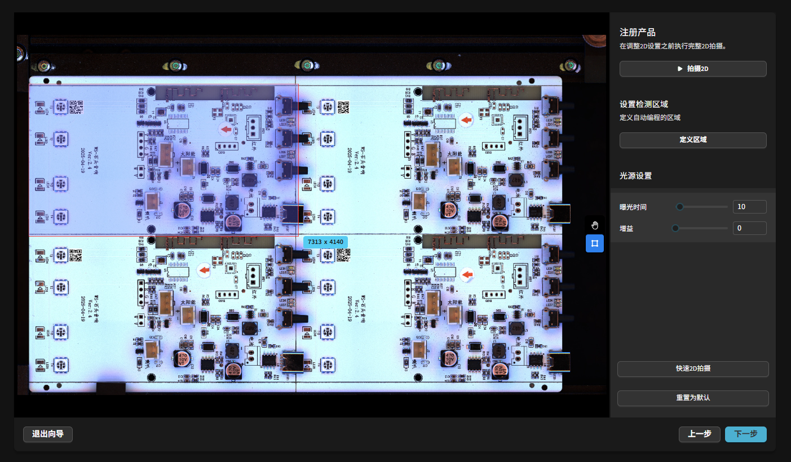
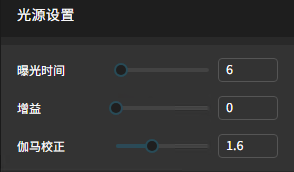

创建产品
================

本节介绍如何在系统中创建一个新的 PCB 产品，包括基础信息录入、尺寸确认、完整图像采集。

基础创建流程
-----------------

1. 在主页点击 **训练PCBA** 进入 **自动编程向导**。

2. 在 **基本信息** 步骤中输入 **产品名称**（需唯一，重复会提示失败），并在 **自动编程检测类型** 中按需勾选关注的检测项；如有需要，可在 **自动编程参数** 中开启桥接检测。完成后点击 **下一步**。

    .. image:: images/create_product_1.png
        :scale: 50%
        :alt: 创建产品-基本信息

自动检测支持类型总览:

.. list-table::
   :header-rows: 1
   :widths: 22 18 18 20 22

   * - 本体
     - 极性
     - 焊料
     - IC 引脚
     - 文字
   * - 电容器（片式电容）
     - 铝电解电容
     - 电阻器（片式）
     - SOIC / SOP / TSOP / TSSOP / MSOP（细间距：检测翘脚、短少、桥连、形变）
     - 电容器（片式）
   * - 电阻器（片式电阻）
     - 钽电容
     - 电容器（片式）
     - QFP（四边引脚：翘起、桥连、缺失、偏移、脚形不规则）
     - 电阻器（片式）
   * - 多层片式电感器
     - LED
     - 铝电解电容（焊脚 / 焊盘润湿）
     - 
     - 多层片式电感器
   * - LED
     - SOT / SOD
     - 钽电容
     - 
     - LED（部分带极性标识）
   * - 排阻（电阻网络）
     - SOIC / SOP / TSOP / TSSOP / MSOP
     - 多层片式电感器
     - 
     - SOT / SOD（型号/极性字符）
   * - 铝电解电容
     - QFP
     - SOT / SOD（小型引脚/贴片焊点）
     - 
     - SOIC / SOP / TSOP / TSSOP / MSOP
   * - 钽电容
     - QFN / DFN
     - LED（两端焊盘）
     - 
     - 排阻（网络标识 / 阵列编号）
   * - 功率电感
     - DFN（含无锡外露型）
     - TO-263 / TO-252（大功率引脚与散热焊盘）
     - 
     - 铝电解电容（容量/电压标识）
   * - Fuse（保险丝）
     - TO-263 / TO-252
     - Fuse（端部焊盘）
     - 
     - 钽电容（容量/极性）
   * - SOT / SOD
     - Fuse（多数无极性）
     - 
     - 
     - 功率电感（电感值标识）
   * - SOIC / SOP / TSOP / TSSOP / MSOP
     - 
     - 
     - 
     - QFP（型号/批次丝印）
   * - QFP
     - 
     - 
     - 
     - QFN（型号/批次丝印，低对比度需适当增亮）
   * - QFN
     - 
     - 
     - 
     - TO-263 / TO-252（型号/批次）
   * - DFN
     - 
     - 
     - 
     - 
   * - TO-263 / TO-252
     - 
     - 
     - 
     - 

.. note::
    自动编程向导需要一次完成, 如果在中途退出，则无法重新回到之前的步骤。如果不小心中途退出，可以删除当前未完成的产品，重新创建一个新的产品。

放置 PCB 与锁定传送带
-------------------------

将 PCB 平整放置于传送带中央，选择传送带并点击“锁定”。确认或输入传送带宽度后点击“进板”，等待 PCB 自动输送至拍摄区域，再点击“下一步”。

    .. image:: images/create_product_3.png
        :scale: 50%
        :alt: 将 PCB 放在传送带上示意

输入或计算尺寸
-----------------

若已知 PCB 尺寸，直接输入宽、高（mm）。

若未知：仅调整相机 X/Y（Z 保持不变）分别拍摄左下与右上；点击“选择像素”依次点 PCB 左下角与右上角像素后，点 **自动计算**，系统推算尺寸供后续完整拍摄。

    .. image:: images/size_calculation.png
        :scale: 50%
        :alt: 自动尺寸计算示意

完整 PCB 拍摄
-----------------

点击“拍摄”后系统联动相机与传送带分区采集并拼接生成完整 PCB 图像。随后点击“定义区域”框选有效区域（通常为整板；若需排除治具边缘，可适当收缩）。请务必使用洁净、无缺陷的良品板（Golden board）。必要时可在该界面调整亮度、曝光、增益、白平衡等参数并重新拍摄。

可以在此处更改相机参数（亮度、曝光、增益、白平衡等）；参数会随着产品创建，在检测时，也会使用产品的拍摄参数拍摄。如效果不佳，可重新拍摄覆盖上一版本。

相机参数
~~~~~~~~~~~~~~~~~~~~~~~~

只需要调整曝光时间，达到合适的亮度即可。

完成后会进入产品编程选项界面，从这一步开始，可以分为全自动编程，半自动编程，和手动编程，详见后续章节。

    .. image:: images/before_program.png
        :scale: 50%

创建产品常见问题与排查
------------------------------

1. 完整拍摄图像拼接异常：检查 PCB 在采集过程中是否发生移动/震动；若确认无移动，可能为相机标定失准，请执行 :ref:`相机现场校准` 后重拍。
2. 创建产品提示“传送带占用”：确认是否有正在运行的检测任务或未释放的产品锁；若无任务仍显示占用，可重启软件刷新状态。
3. 退出向导后无法回到中途步骤：当前版本不支持断点续建，只能删除该未完成产品后重新创建。

