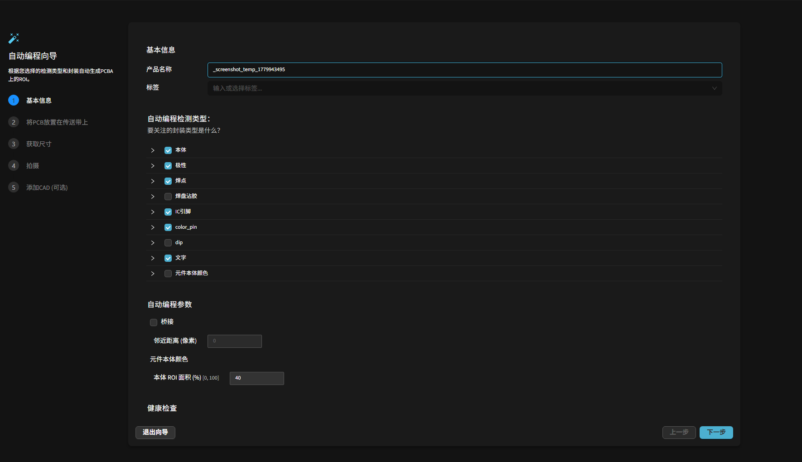
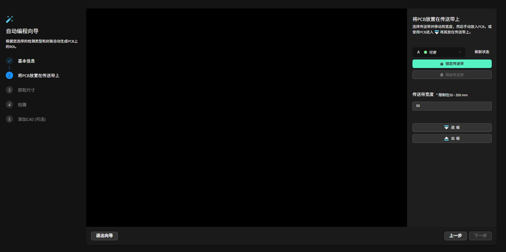
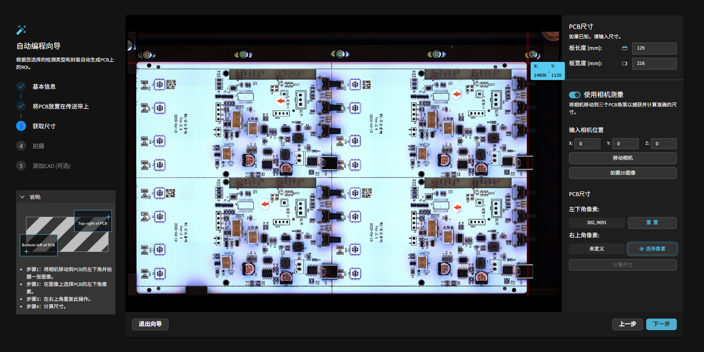

创建产品
================

**此页面的用途**

本页说明如何通过 **自动编程向导** 完整创建一个新的 PCBA 产品，涵盖基本信息录入、传送带放置、PCB 尺寸确认、完整图像采集等步骤。

**如何进入**

在主页点击 **训练PCBA** 按钮，进入 **自动编程向导**。向导将自动停在第一步 **基本信息**。

.. note::
    自动编程向导需要一次完成。如果在中途退出，则无法重新回到之前的步骤。如果不小心中途退出，可以删除当前未完成的产品，重新创建一个新的产品。

**操作流程**

**第一步：填写基本信息**

在 **基本信息** 步骤中完成以下内容：

1. **产品名称** — 在输入框中输入唯一的产品名称。若名称已存在，系统将提示"名称重复"错误，需重新输入。

2. **标签** — 在下拉选择框中选择或输入标签，可用于对产品分类管理；多个标签以逗号分隔。

3. **自动编程检测类型：** — 勾选需要 AI 自动生成 ROI 的检测类型。每种类型下可展开选择具体的封装子类。

   支持的检测类型如下：

   - **本体** — 检测元件是否贴装在位（本体检测）。
   - **极性** — 检测极性方向是否正确。
   - **焊点** — 检测焊点质量（润湿、偏移等）。
   - **IC引脚** — 检测 IC 引脚状态（翘脚、桥连、缺失等），适用于 SOIC / SOP / QFP 等细间距器件。
   - **文字** — 检测元件丝印文字（OCR）。
   - **焊盘沾胶** — 检测焊盘上的红胶污染。
   - **元件本体颜色** — 检测元件本体颜色，适用于 CRM、LED 等有颜色要求的元件。
   - **DIP** — 检测波峰焊后的 DIP 焊点，包含炉后（dip_solder）和炉前（dip_pin）两种封装子类。

   .. note::
      不同类型的封装可展开勾选，例如"本体"类型下包含 Capacitor、Resistor、LED、QFP 等。DIP 类型默认不选中，需手动启用。

4. **自动编程参数** — 根据已勾选的检测类型，展开对应的参数配置（仅当对应类型启用时显示）：

   - **DIP 参数** （DIP 检测启用时显示）：

     - **邻近距离 (像素)** — DIP 焊点间邻近距离阈值（像素），用于判断相邻焊点归属。
     - **ROI 扩展 (%)** — DIP ROI 的边缘向外扩展比例。

   - **桥接** — 勾选复选框以启用桥接检测；取消勾选则禁用。

     - **邻近距离 (像素)** — 桥接检测的邻近距离阈值（像素）；禁用时不可编辑。

   - **焊盘沾胶参数** （焊盘沾胶检测启用时显示）：

     - **ROI 扩展 (%)** — 焊盘沾胶 ROI 的边缘扩展比例，支持负值（缩小 ROI）。

   - **元件本体颜色参数** （元件本体颜色检测启用时显示）：

     - **本体 ROI 面积 (%)** — 元件本体颜色 ROI 占本体区域的面积比例。

5. **健康检查** — 设置自动编程完成后的质量验证选项：

   - **数量检查** — 校验每个元件是否具有期望数量的焊点及 IC 引脚；有 CAD 封装信息时按封装精确匹配引脚数。
   - **质量检查** — 校验焊点对称性、IC 引脚一致性及排阻引脚覆盖率。

完成 **基本信息** 步骤后，点击 **下一步** 继续以下步骤。

**第二步：放置 PCB 与锁定传送带**

将 PCB 平整放置于传送带中央，选择传送带并点击"锁定"。确认或输入传送带宽度后点击"进板"，等待 PCB 自动输送至拍摄区域，再点击"下一步"。

**第三步：输入或计算尺寸**

若已知 PCB 尺寸，直接输入宽、高（mm）。

若未知：仅调整相机 X/Y（Z 保持不变）分别拍摄左下与右上；点击"选择像素"依次点 PCB 左下角与右上角像素后，点 **自动计算**，系统推算尺寸供后续完整拍摄。

**第四步：完整 PCB 拍摄**

点击"拍摄"后系统联动相机与传送带分区采集并拼接生成完整 PCB 图像。随后点击"定义区域"框选有效区域（通常为整板；若需排除治具边缘，可适当收缩）。请务必使用洁净、无缺陷的良品板（Golden board）。必要时可在该界面调整亮度、曝光、增益、白平衡等参数并重新拍摄。

.. image:: images/full_pcb_capture.png
    :scale: 55%
    :alt: 完整 PCB 拍摄

可以在此处更改相机参数（亮度、曝光、增益、白平衡等）；参数会随着产品创建，在检测时，也会使用产品的拍摄参数拍摄。如效果不佳，可重新拍摄覆盖上一版本。

**相机参数**

.. image:: images/2d_camera_settings.png
    :scale: 100%
    :alt: 相机参数示意

只需要调整曝光时间，达到合适的亮度即可。

完成后会进入产品编程选项界面，从这一步开始，可以分为全自动编程、半自动编程和手动编程，详见 :doc:`auto_programming`。

**自动检测支持类型总览**

.. list-table::
   :header-rows: 1
   :widths: 22 18 18 20 22

   * - 本体
     - 极性
     - 焊点
     - IC 引脚
     - 文字
   * - 电容器（片式电容）
     - 铝电解电容
     - 电阻器（片式）
     - SOIC / SOP / TSOP / TSSOP / MSOP（细间距：检测翘脚、短少、桥连、形变）
     - 电容器（片式）
   * - 电阻器（片式电阻）
     - 钽电容
     - 电容器（片式）
     - QFP（四边引脚：翘起、桥连、缺失、偏移、脚形不规则）
     - 电阻器（片式）
   * - 多层片式电感器
     - LED
     - 铝电解电容（焊脚 / 焊盘润湿）
     -
     - 多层片式电感器
   * - LED
     - SOT / SOD
     - 钽电容
     -
     - LED（部分带极性标识）
   * - 排阻（电阻网络）
     - SOIC / SOP / TSOP / TSSOP / MSOP
     - 多层片式电感器
     -
     - SOT / SOD（型号/极性字符）
   * - 铝电解电容
     - QFP
     - SOT / SOD（小型引脚/贴片焊点）
     -
     - SOIC / SOP / TSOP / TSSOP / MSOP
   * - 钽电容
     - QFN / DFN
     - LED（两端焊盘）
     -
     - 排阻（网络标识 / 阵列编号）
   * - 功率电感
     - DFN（含无锡外露型）
     - TO-263 / TO-252（大功率引脚与散热焊盘）
     -
     - 铝电解电容（容量/电压标识）
   * - Fuse（保险丝）
     - TO-263 / TO-252
     - Fuse（端部焊盘）
     -
     - 钽电容（容量/极性）
   * - SOT / SOD
     - Fuse（多数无极性）
     -
     -
     - 功率电感（电感值标识）
   * - SOIC / SOP / TSOP / TSSOP / MSOP
     -
     -
     -
     - QFP（型号/批次丝印）
   * - QFP
     -
     -
     -
     - QFN（型号/批次丝印，低对比度需适当增亮）
   * - QFN
     -
     -
     -
     - TO-263 / TO-252（型号/批次）
   * - DFN
     -
     -
     -
     -
   * - TO-263 / TO-252
     -
     -
     -
     -

**注意事项**

- **产品名称必须唯一**：重复名称将导致创建失败，需修改后重试。
- **向导不支持断点续建**：若中途退出向导，无法返回之前的步骤。请删除未完成的产品后重新创建。
- **DIP 检测默认关闭**：需手动在 **自动编程检测类型：** 中展开并勾选 DIP 子类（炉前或炉后）才会激活 DIP 参数区域。
- **桥接检测默认关闭**：勾选 **桥接** 复选框后，**邻近距离 (像素)** 参数方可编辑；默认值为 0（禁用）。
- **健康检查建议保持开启**：两项健康检查（数量检查、质量检查）默认开启，可帮助在自动编程完成后验证 ROI 质量。

**创建产品常见问题与排查**

1. **完整拍摄图像拼接异常**：检查 PCB 在采集过程中是否发生移动/震动；若确认无移动，可能为相机标定失准，请执行 :ref:`相机现场校准` 后重拍。
2. **创建产品提示"传送带占用"**：确认是否有正在运行的检测任务或未释放的产品锁；若无任务仍显示占用，可重启软件刷新状态。
3. **退出向导后无法回到中途步骤**：当前版本不支持断点续建，只能删除该未完成产品后重新创建。

**相关页面**

- :doc:`auto_programming` — CAD 上传与自动编程步骤（全自动/半自动/手动编程）
