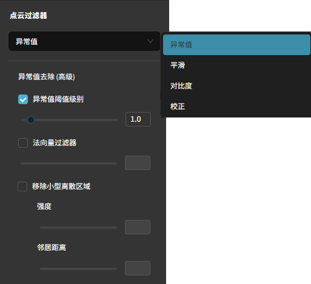

创建产品
================

本节介绍如何在系统中创建一个新的 PCB 产品，包括基础信息录入、尺寸确认、完整图像采集。

基础创建流程
-----------------

1. 在主页点击 **训练 PCB** 进入自动编程向导。

    .. image:: images/create_product_1.png
        :scale: 50%
        :alt: 创建产品第一步

2. 输入产品名称；按需启用/关闭检测模块。名称需唯一，重复会提示失败。

    .. image:: images/create_product_2.png
        :scale: 50%
        :alt: 创建产品第二步

自动检测支持类型总览:

.. list-table::
   :header-rows: 1
   :widths: 22 18 18 20 22

   * - 本体
     - 极性
     - 焊料
     - IC 引脚
     - 文字
   * - 电容器（片式电容）
     - 铝电解电容
     - 电阻器（片式）
     - SOIC / SOP / TSOP / TSSOP / MSOP（细间距：检测翘脚、短少、桥连、形变）
     - 电容器（片式）
   * - 电阻器（片式电阻）
     - 钽电容
     - 电容器（片式）
     - QFP（四边引脚：翘起、桥连、缺失、偏移、脚形不规则）
     - 电阻器（片式）
   * - 多层片式电感器
     - LED
     - 铝电解电容（焊脚 / 焊盘润湿）
     - 
     - 多层片式电感器
   * - LED
     - SOT / SOD
     - 钽电容
     - 
     - LED（部分带极性标识）
   * - 排阻（电阻网络）
     - SOIC / SOP / TSOP / TSSOP / MSOP
     - 多层片式电感器
     - 
     - SOT / SOD（型号/极性字符）
   * - 铝电解电容
     - QFP
     - SOT / SOD（小型引脚/贴片焊点）
     - 
     - SOIC / SOP / TSOP / TSSOP / MSOP
   * - 钽电容
     - QFN / DFN
     - LED（两端焊盘）
     - 
     - 排阻（网络标识 / 阵列编号）
   * - 功率电感
     - DFN（含无锡外露型）
     - TO-263 / TO-252（大功率引脚与散热焊盘）
     - 
     - 铝电解电容（容量/电压标识）
   * - Fuse（保险丝）
     - TO-263 / TO-252
     - Fuse（端部焊盘）
     - 
     - 钽电容（容量/极性）
   * - SOT / SOD
     - Fuse（多数无极性）
     - 
     - 
     - 功率电感（电感值标识）
   * - SOIC / SOP / TSOP / TSSOP / MSOP
     - 
     - 
     - 
     - QFP（型号/批次丝印）
   * - QFP
     - 
     - 
     - 
     - QFN（型号/批次丝印，低对比度需适当增亮）
   * - QFN
     - 
     - 
     - 
     - TO-263 / TO-252（型号/批次）
   * - DFN
     - 
     - 
     - 
     - 
   * - TO-263 / TO-252
     - 
     - 
     - 
     - 

.. note::
    自动编程向导需要一次完成, 如果在中途退出，则无法重新回到之前的步骤。如果不小心中途退出，可以删除当前未完成的产品，重新创建一个新的产品。

放置 PCB 与锁定传送带
-------------------------

将 PCB 平整放置于传送带中央，选择传送带并点击“锁定”。确认或输入传送带宽度后点击“进板”，等待 PCB 自动输送至拍摄区域，再点击“下一步”。

    .. image:: images/create_product_3.png
        :scale: 50%
        :alt: 将 PCB 放在传送带上示意

输入或计算尺寸
-----------------

若已知 PCB 尺寸，直接输入宽、高（mm）。

若未知：仅调整相机 X/Y（Z 保持不变）分别拍摄左下与右上；点击“选择像素”依次点 PCB 左下角与右上角像素后，点 **自动计算**，系统推算尺寸供后续完整拍摄。

    .. image:: images/size_calculation.png
        :scale: 50%
        :alt: 自动尺寸计算示意

完整 PCB 拍摄
-----------------

点击“拍摄”后系统联动相机与传送带分区采集并拼接生成完整 PCB 图像。随后点击“定义区域”框选有效区域（通常为整板；若需排除治具边缘，可适当收缩）。请务必使用洁净、无缺陷的良品板（Golden board）。必要时可在该界面调整亮度、曝光、增益、白平衡等参数并重新拍摄。

.. image:: images/full_pcb_capture.png
	:scale: 55%
	:alt: 完整 PCB 拍摄

可以在此处更改相机参数， （亮度、曝光、增益、白平衡、点云滤波等）；参数会随着产品创建，在检测时，也会使用产品的拍摄参数拍摄。如效果不佳，可重新拍摄覆盖上一版本。

2D 模式下的相机参数
~~~~~~~~~~~~~~~~~~~~~~~~

2D模式下，只需要调整曝光时间，达到合适的亮度即可。

3D 模式下的相机参数
~~~~~~~~~~~~~~~~~~~~~~~~

3D 模式在创建产品阶段主要关注两类设置：采集帧（成像亮度/动态范围）与点云滤波（质量与噪声控制）。

绝大多数场景保持默认即可，相机已在封闭光学箱内预设完成，仅在不同基板颜色导致整体偏暗或偏亮时微调亮度即可。下方提供了完整的参数说明，供参考及高级调试。

采集帧设置（亮度相关）
^^^^^^^^^^^^^^^^^^^^^^^^

- 基本三个参数：曝光值 (Exposure Stop)、亮度 (Brightness / 投影)、增益 (Gain)。
- 每提升 1 级通常亮度近似加倍；同时也可能增加噪点或采集时间。
- 推荐增亮优先级：亮度 → 曝光值 → 增益；降低时反向：增益 → 曝光值 → 亮度。

点云滤波器（质量提升）
^^^^^^^^^^^^^^^^^^^^^^^^

参见：`滤波器 <http://docs.welinkirt.com/daoai-inspectra-user-manual/chinese-2.24.4.0/connect-camera-config/3d/config/filter/index.html>`_

滤波划分为四大类（常用子项括号内）：

1. 异常值 (Outlier)：离群阈值、法向量滤波、移除小型离散区域；去除孤立噪点和悬浮点片。
2. 平滑 (Smoothing)：高斯 / 中值 / Smooth（步进取整）；降低随机噪声或深度微振荡。
3. 对比度 (Contrast)：饱和区域移除、灰度阈值、相位质量滤波；剔除过曝、低亮度或低质量区域。
4. 补偿 (Correction)：填补空洞 (Fill Gaps)、对比度失真补偿；针对小缺口与边缘高对比畸变。

使用建议：

- 优先启用“离群阈值 + 小型离散区域”清理明显杂点，再视需要少量平滑；过度平滑会降低细节（如细引脚边缘）。
- 对金属高光/强反射可先通过多帧降低溢出，再用饱和滤镜剔除残余过曝点。
- Fill Gaps 仅在后续检测依赖完整高度轮廓（如大面积平面基准）且空洞较小/规则时启用，避免误填真实凹陷。

最小化调整策略：先保证亮度范围（采集帧设置）合适，再做轻量去噪。每次改动后重拍一张参考全板，确保未损失关键细节。

完成后会进入产品编程选项界面，从这一步开始，可以分为全自动编程，半自动编程，和手动编程，详见后续章节。

    .. image:: images/before_program.png
        :scale: 50%

常见问题与排查
-----------------

1. 完整拍摄图像拼接异常：检查 PCB 在采集过程中是否发生移动/震动；若确认无移动，可能为相机标定失准，请执行 :ref:`相机现场校准` 后重拍。
2. 创建产品提示“传送带占用”：确认是否有正在运行的检测任务或未释放的产品锁；若无任务仍显示占用，可重启软件刷新状态。
3. 退出向导后无法回到中途步骤：当前版本不支持断点续建，只能删除该未完成产品后重新创建。

