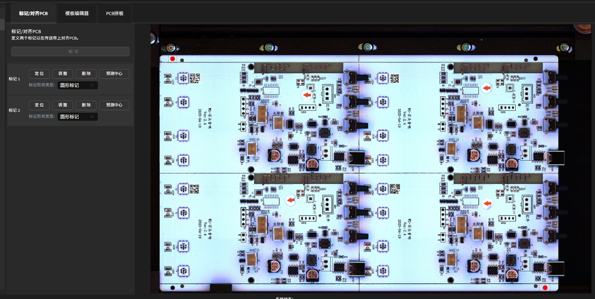
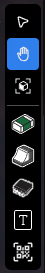
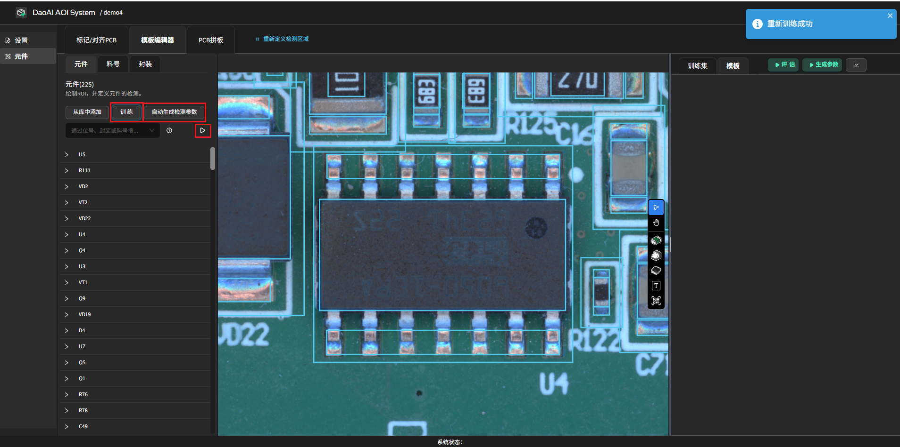
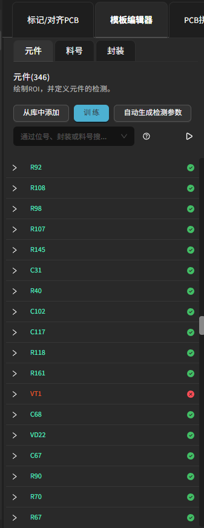
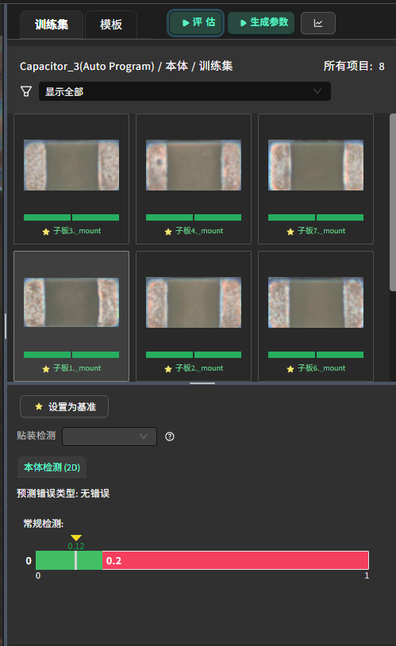
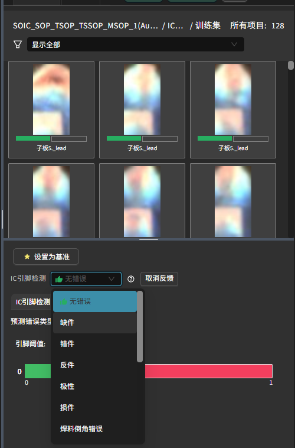

Manual Programming and Editing Tools
======================================

本节概述自动编程完成后从标记对齐、模板审查、手动补录的完整操作讲解。

.. contents::
   :local:
   :depth: 1

标记 / 对齐 PCB
-----------------

用于检测阶段的 PCB 位置对齐。因为在检测阶段，PCB 可能存在位置偏移或轻微旋转，标记对齐可以自动将图像对齐至同一位置，确保检测的准确性。

点击“+ 标记”，框选 PCB 上固定的2个参考标记（圆形、矩形或复杂图案均可）。

框选区域应略大，以保证轻微位移仍能正确定位。确认后点击“预测中心”完成标记定义。

.. note::
    - 未能找到标记可能会导致检测失败

使用技巧
~~~~~~~~~~~~~~~~~~

标记圆形标记时，请注意以下几点：

1. **圆形应具有清晰的形状**：确保标记的圆形边界完整且规则。

2. **圆形边缘应清晰可见**：避免模糊或不明确的边缘，以便准确定位。

3. **圆形不应与其他物体重叠**：确保标记区域内没有其他干扰物体。

4. **搜索区域内不应存在相似的圆形**：避免因多个相似圆形导致的混淆。

以下是一些使用圆形标记的正例和反例：

.. list-table:: 圆形标记示例
   :widths: 25 75
   :header-rows: 1

   * - 示例
     - 描述

   * - .. image:: images/good_circle_1.png
        :scale: 100%
        :alt: 好例 1 - 清晰的形状和边缘
     - **正例 1**: 圆形具有清晰的形状和边缘，并区域内无其他圆形，适合作为标记。

   * - .. image:: images/good_circle_2.png
        :scale: 100%
        :alt: 好例 2 - 多个圆形中对比度更高的圆形清晰可见
     - **正例 2**: 尽管存在多个圆形，但其中一个圆形具有更高的对比度，清晰可见。

   * - .. image:: images/bad_circle_1.png
        :scale: 100%
        :alt: 反例 1 - 模糊的形状（多个圆形中没有主导圆形）
     - **反例 1**: 圆形边缘模糊，多个圆形中没有一个清晰突出的边缘。

   * - .. image:: images/bad_circle_2.png
        :scale: 100%
        :alt: 反例 2 - 边缘不清晰
     - **反例 2**: 圆形边缘不清晰，难以准确定位。

   * - .. image:: images/bad_circle_3.png
        :scale: 100%
        :alt: 反例 3 - 被遮挡
     - **反例 3**: 圆形被遮挡，无法完整识别。

   * - .. image:: images/bad_circle_4.png
        :scale: 100%
        :alt: 反例 4 - 搜索区域内多个相似圆形
     - **反例 4**: 搜索区域内存在多个相似的圆形，容易导致定位混淆。

模板编辑器
-------------

模板编辑器的左侧为自动编程生成的元件列表；若已上传 CAD，元件名称会同时显示丝印/标识。点击料号或封装即可自动分组同类别元件。

    .. image:: images/component_list.png
        :scale: 100%
        :alt: 元件列表示例  

当进入模板编辑器时，若存在不健康元件，系统会弹出警告提示：

    .. image:: images/warning.png
        :scale: 80%
        :alt: 警告示例

点击“确认”后可以继续操作。

可使用搜索栏按名称搜索，或者按评估通过/不通过、健康/不健康过滤：

    .. image:: images/search.png
        :scale: 100%
        :alt: 搜索示例

健康性核对
-----------------

训练前检查：

1. 基础信息：确认，或者按需录入 标识（丝印）、封装、料号（PN）。

    .. image:: images/edit_component_info.png
        :scale: 80%
        :alt: 组件属性填写示例

2. 全板预览：是否存在缺失、漂移、超大/超小框。
3. 局部密集区：是否重叠、是否覆盖相邻器件。
4. 不健康列表：低置信度 / CAD 未匹配 / 尺寸异常。

    - 正确但标为不健康：若位置无误可点击列表边上的 ``?`` 直接确认恢复为健康。

        .. image:: images/unhealthy.png
            :scale: 70%
            :alt: 不健康元件示例

    - CAD 中存在但未检测：若实板缺失则忽略；若实际存在则手动补录。 

        .. image:: images/missing.png
            :scale: 60%
            :alt: 缺失标记示例

    - 自动编程误检时：删除并重新手动补录。

手动编程工具栏
-------------------

右侧工具栏包含：

1. 选择工具：左键拖拽框选多项未分组的检测框，右键唤出菜单，可以分组合并为元件；中键拖拽平移；滚轮缩放。
2. 拖拽工具：按住任意鼠标键平移视图；滚轮缩放；用于纯浏览不影响选择。
3. 3D 视图工具（仅 3D 模式）：框选后弹出局部点云，查看局部点云质量。在右上角可以看到点云颜色的选项，可以切换为绿色，伪彩色，深度等不同的显示模式，方便查看点云细节。

    .. image:: images/3d_view.png
       :scale: 70%
       :alt: 3D 视图示意

4. 本体工具：绘制主体检测框。
5. 焊料工具：绘制焊料检测框。
6. 引脚工具：绘制整排的引脚检测框，框选后，可以右键复制 / 旋转用于其它侧。
7. 文本工具：标注丝印、字符、批次 / 日期等需要 OCR 的区域。
8. 条形码工具：绘制条形码检测区域，用于 PCB 序列号追溯。

关于快捷键，参考 :ref:`编程页面快捷键` 

2D 模式下常见封装编程示例
---------------------------

电容、电阻
~~~~~~~~~~~~~~~~~~

步骤：
   1. 选择“本体工具”框出元件主体区域（紧贴真实外廓，尽量减少空白）。
   2. 选择“焊料工具”分别框出左右（或多端）焊盘/焊点区域；

质量建议：
   - 本体框贴合元件实际形状，避免包含过多空白区域；
   - 焊料框应该紧贴焊料的爬锡区域，不确定时可以使用3D视图工具来确认；
   
   .. image:: images/program_resistor.png
      :scale: 60%
      :alt: 手动编程电容、电阻示意

分组与属性：
使用“选择工具”框选主体与全部焊料框 → 右键 “分组” 生成一个元件，填写：

   - 标识（必填，建议与丝印一致）
   - （可选）料号 / 封装
   - （可选）备注或版本号

点击“创建新元件”完成。

   .. image:: images/add_component.png
      :scale: 80%
      :alt: 手动编程工具栏

QFP 封装 IC 芯片
~~~~~~~~~~~~~~~~~~~~~~~~

步骤：
   1. 选择“本体工具”框出芯片主体（紧贴封装外沿）。
   2. 选择“IC 引脚工具”框出任意一侧整排引脚（覆盖焊盘 + 焊料 + 引脚末端区域）。
   3. 右键“复制”该引脚框，拖动至对侧或其它边；必要时使用右键旋转使其与该边引脚方向一致。

质量建议：
   - 框贴合元件实际形状，避免包含过多空白区域；

        .. image:: images/program_qfc_1.png
            :scale: 50%
            :alt: QFP 封装 IC 芯片

   - (2D) IC 引脚检测需要划分 3 个区域：焊盘、焊料、引脚末端；参见 :ref:`3.2 IC 引脚检测 v2（2D，基于颜色比例）` 以了解区域划分标准。

        .. image:: images/program_qfc_2.png
            :scale: 50%
            :alt: QFP 封装 IC 芯片

分组与属性：
   使用“选择工具”框选主体与全部焊料框 → 右键 “分组” 生成一个元件，填写：

   - 标识（必填，建议与丝印一致）
   - （可选）料号 / 封装
   - （可选）备注或版本号

点击“创建新元件”完成。

   .. image:: images/add_component.png
      :scale: 80%
      :alt: 手动编程工具栏

SOP/TSSOP 封装的存储芯片或驱动芯片
~~~~~~~~~~~~~~~~~~~~~~~~~~~~~~~~~~~~

与 QFP 类似：本体工具框主体 → IC 引脚工具框一侧引脚后复制到另一侧 → 分组创建元件。

   .. image:: images/program_sop.png
      :scale: 80%
      :alt: SOP/TSSOP 封装示例

3D 模式下常见封装编程示例
---------------------------

电容、电阻
~~~~~~~~~~~~~~~~~~

步骤：
   1. 选择“本体工具”框出元件主体区域（紧贴真实外廓，尽量减少空白）。
   2. 选择“焊料工具”分别框出左右（或多端）焊盘/焊点区域；

质量建议：

    - 主体框应贴合元件实际形状，避免包含过多空白区域；
   
        .. image:: images/program_resistor_3d.png
            :scale: 60%
            :alt: 手动编程电容、电阻示意
    
    - 焊料框应该紧贴焊料的爬锡区域，虚线部分延展ROI一边延展到基板上，一边延展到元件表面上，不确定时可以使用3D视图工具来确认。

        .. image:: images/program_resistor_solder_3d.png
            :scale: 60%
            :alt: 手动编程电容、电阻焊料示意
        
        .. image:: images/program_resistor_solder_3d_pointcloud.png
            :scale: 60%
            :alt: 手动编程电容、电阻焊料示意

分组与属性：
使用“选择工具”框选主体与全部焊料框 → 右键 “分组” 生成一个元件，填写：

   - 标识（必填，建议与丝印一致）
   - （可选）料号 / 封装
   - （可选）备注或版本号

点击“创建新元件”完成。

   .. image:: images/add_component.png
      :scale: 80%
      :alt: 手动编程工具栏

QFP 封装 IC 芯片
~~~~~~~~~~~~~~~~~~~~~~~~

步骤：
   1. 选择“本体工具”框出芯片主体（紧贴封装外沿）。
   2. 选择“IC 引脚工具”框出任意一侧整排引脚（覆盖焊盘 + 焊料 + 引脚末端区域）。
   3. 右键“复制”该引脚框，拖动至对侧或其它边；必要时使用右键旋转使其与该边引脚方向一致。

质量建议：
   - 本体框贴合元件实际形状，避免包含过多空白区域；

        .. image:: images/program_qfc_3d.png
            :scale: 80%
            :alt: QFP 封装 IC 芯片
   
   - (3D) IC 引脚检测需要定义在爬锡区域部分，然后延展ROI延展至部分基板上

        .. image:: images/program_qfc_1_3d.png
            :scale: 80%
            :alt: QFP 封装 IC 芯片

        .. image:: images/program_qfc_2_3d.png
            :scale: 50%
            :alt: QFP 封装 IC 芯片

分组与属性：
   使用“选择工具”框选主体与全部焊料框 → 右键 “分组” 生成一个元件，填写：

   - 标识（必填，建议与丝印一致）
   - （可选）料号 / 封装
   - （可选）备注或版本号

点击“创建新元件”完成。

   .. image:: images/add_component.png
      :scale: 80%
      :alt: 手动编程工具栏

SOP/TSSOP 封装的存储芯片或驱动芯片
~~~~~~~~~~~~~~~~~~~~~~~~~~~~~~~~~~~~

与 QFP 类似：本体工具框主体 → IC 引脚工具框一侧引脚后复制到另一侧 → 分组创建元件。

   .. image:: images/program_sop_3d.png
      :scale: 80%
      :alt: SOP/TSSOP 封装示例

   .. image:: images/program_sop_3d_2.png
      :scale: 80%
      :alt: SOP/TSSOP 封装示例

私有库
-----------------

编程好的元件可以添加至私有库，方便后续在其它产品中复用。

步骤：
    1. 选择已编程好的元件，右键唤出菜单，点击“添加到私有库”。

        .. image:: images/add_private_library.png
            :scale: 80%
            :alt: 私有库示意

    2. 在弹出的对话框中填写元件的封装、料号，点击“添加到私有库”完成添加。
        .. image:: images/add_private_library2.png
            :scale: 80%
            :alt: 私有库示意

    3. 在“私有库”页面可以选择元件模板, 点击 ``使用此模板`` 来添加到视图，或者删除库里的元件。

        .. image:: images/add_from_private_library.png
            :scale: 80%
            :alt: 私有库示意

导出与导入：
    - **导出**：点击“私有库导出”按钮，将当前私有库中的元件信息导出为一个 ``.csv`` 文件。
    - **导入**：点击“私有库导入”按钮，选择一个 ``.csv`` 文件，即可将文件中的元件信息导入到私有库中。

训练与评估
---------------------

确认全部元件后点击 ``训练`` ，耗时 ~1 分钟；

自动参数生成
~~~~~~~~~~~~~~~~~~

完成训练后，可以点击 ``自动生成检测参数`` 来基于所有元件的训练集数据分布生成检测参数。

.. image:: images/auto_param.png
   :scale: 100%
   :alt: 训练示意

也可以选中一个元件，然后在右侧的设置栏中，点击 ``生成参数`` 来只为该元件生成检测参数。此外，如果手动修改了参数，也可以通过点击 ``生成参数`` 按钮，快速恢复到系统推荐的默认值。

.. image:: images/auto_param_component.png
   :scale: 80%
   :alt: 训练示意

评估
~~~~~~~~~~~~~~~~~~

点击元件列表下的“评估全部”按钮，对所有元件进行评估，（绿=模型预测正确 / 红=模型预测与实际不符）。

也可以选中一个元件，然后在右侧的设置栏中，点击 ``评估`` 来只对该元件进行评估。

.. image:: images/auto_param_component.png
   :scale: 80%

后续：不健康项可参考 :ref:`检测参数` 章节按需微调；修改或补录后重新训练+评估即可迭代。

训练集和模板
--------------------

在界面右侧，可以查看当前选中的检测项的训练集。可以用鼠标在显示窗口中选择检测框，或者在左侧的元件列表中选择元件，训练集会自动切换到该元件下。

训练集里代表了该元件的所有图片，当初次建模时，数据集里只会有基准的标准数据。可以根据封装或者拼版的方式，归类同类型的元件丰富训练集。

后续在检测阶段，反馈过的图片也会自动添加到训练集中，便于后续调整优化模型, 参考 :ref:`反馈与模型迭代`

评估结果的颜色指示
~~~~~~~~~~~~~~~~~~~~~~

每个图片下方都有两个颜色指示条：

   .. image:: images/legend.png
      :scale: 100%
      :alt: 颜色条示意

   - 左侧颜色条代表 **Ground Truth**（真实值）。
   - 右侧颜色条代表 **评估结果**：

      - **绿色** 表示 OK。
      - **红色** 表示 NG。
      - 未评估时没有颜色显示。

此外，左侧的元件列表颜色与评估结果对应：

   .. image:: images/component_list_eval.png
      :scale: 80%
      :alt: 元件列表评估示意

- 当训练集里所有数据的评估结果与 Ground Truth 完全匹配时，元件列表会显示 **绿色**。
- 如果存在与 Ground Truth 不匹配的评估结果，元件列表会显示 **红色**。

取消反馈
~~~~~~~~~~~~~~~~~~

在什么情况下需要取消反馈？当某个数据的质量或可信度出现问题时，就应该选择取消反馈。例如：

- 图片因对齐错误或放置错误导致异常错位。
- 图片因成像问题（如模糊或质量差）而无法提供可靠信息。
- 数据分布异常，偏离正常的缺陷分布。

此时，取消反馈可以避免这些低质量数据干扰模型的整体评估结果。

在数据集中选择图片后，可以在下方选择“反馈”或“取消反馈”。

- **反馈**：将当前图片的评估结果标记为参考值，用于后续训练。
- **取消反馈**：移除当前图片的反馈标记。

查看评估分数
~~~~~~~~~~~~~~~~~~

.. image:: images/eval_score.png
    :scale: 70%
    :alt: 评估分数示意

评估完成后，训练集下半部分会显示评估结果，如图所示：

界面中会显示一个 0-1 的分数条，并通过阈值线将绿色和红色区域区分开来：

- 如果模型的分数低于阈值，落在绿色区域内，则评估结果为 **OK**。
- 如果模型的分数高于阈值，落在红色区域内，则评估结果为 **NG**。

- **当前分数**：模型对该图片的预测分数。分数越接近 0，表示越接近正常样本；分数越接近 1，表示越接近异常样本。
- **阈值**：用于判定 OK/NG 的分数界限。

用户可以根据评估分数调整参数，详情请参考 :ref:`检测参数`，以优化检测效果。

