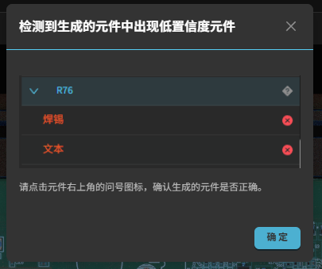
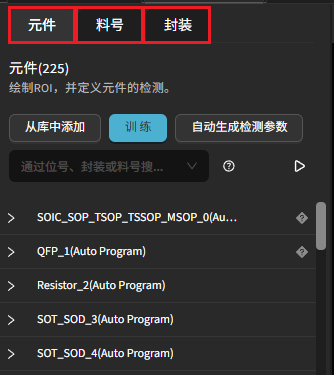
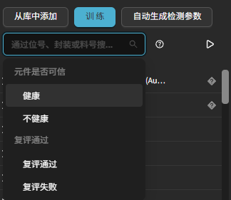
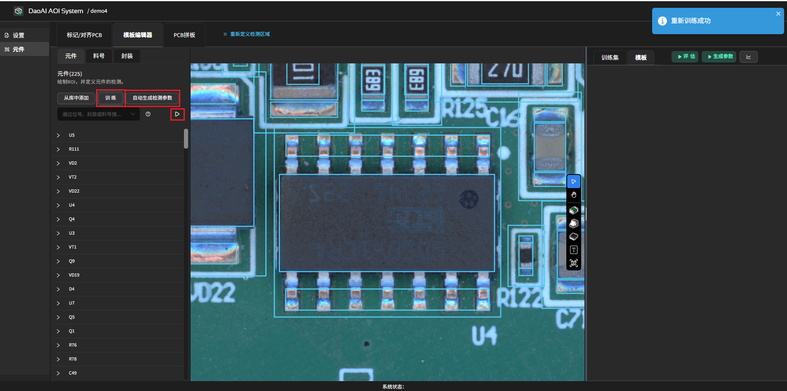
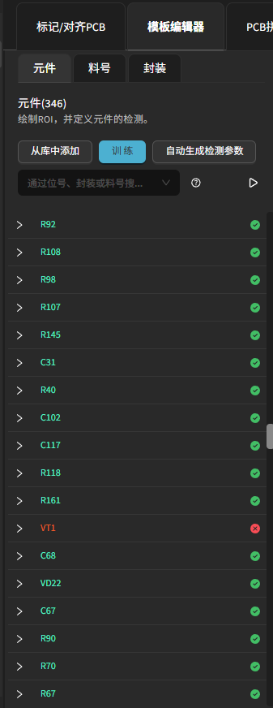

手动编程与编辑工具
=====================

本节概述自动编程完成后从标记对齐、模板审查、手动补录的完整操作讲解。

.. contents::
   :local:
   :depth: 1

标记 / 对齐 PCB（简介）
-------------------------

标记 / 对齐 PCB 的完整说明（mark 点添加、AI 算法与模板匹配切换、独特标记、二值化抽色等）请参见 :doc:`mark_align_pcb` 页面。

模板编辑器
-----------

**进入模板编辑器**

在编程页面（Teach）左侧标签栏切换至 **元件** 标签后，主视图即为模板编辑器（Template Editor）。模板编辑器左侧为元件列表面板，右侧为画布区域。

进入模板编辑器时，若产品存在不健康元件，系统会弹出警告提示：

点击"确认"后可以继续操作。

**画布区域顶栏开关**

画布顶栏提供两个功能开关：

- **平移所有元件（Translate All Components）**：启用后，拖动画布上任意元件将同步平移产品内所有元件及其特征，适用于全局位置校正。
- **显示抽色二值化（Show Color Range Binary Mask）**：启用后，在当前选中特征上叠加显示颜色范围二值化掩码，辅助颜色参数调整。

**绘制工具栏**

画布右侧为垂直排列的绘制工具栏。工具说明如下（括号内为快捷键）：

- **选择（Select，快捷键 V）**：左键点击或框选画布上的特征/元件；左键拖拽空白区域可框选多个未分组的检测框；中键拖拽平移；滚轮缩放。右键在选中对象上唤出右键菜单。
- **平移/缩放（Pan/Zoom，快捷键 H）**：按住任意鼠标键平移视图；滚轮缩放；用于纯浏览，不影响选择操作。
- **添加本体检测（Add Body Feature，快捷键 1）**：绘制主体（本体/贴装）检测框。
- **添加焊锡检测（Add Solder Feature，快捷键 2）**：绘制焊点/焊锡检测框。
- **添加IC引脚检测（Add Lead Feature，快捷键 3）**：绘制整排的IC引脚检测框，框选后可右键复制/旋转用于其它边。
- **添加文本检测（Add Text Feature，快捷键 4）**：标注丝印、字符、批次/日期等需要 OCR 识别的区域。
- **添加条形码检测（Add Barcode Feature，快捷键 5）**：绘制条形码检测区域，用于 PCB 序列号追溯。
- **添加DIP焊点特征（Add DIP Solder Feature）**：绘制 DIP 插件焊点检测框。
- **添加桥接检测（Add Bridge Feature）**：绘制焊桥（solder bridge）检测区域。
- **焊盘沾胶检测（Red Glue on Pad Feature，快捷键 8）**：绘制焊盘沾红胶检测区域。
- **颜色检测（Color Inspection Feature，快捷键 9）**：绘制通用颜色区域检测框。

各检测工具的具体检测参数说明见 :ref:`检测工具参考` 中各工具页面。

**AI 检测 ROI（AI-detect ROI）**

框选一块区域后，可点击工具栏下方的 **AI检测ROI** 按钮，选择默认检测类型（本体、焊锡、IC 引脚等），由 AI 自动识别并在所选区域内生成检测框（ROI），减少逐个手动绘制的工作量。该操作仅作用于所选区域，不会影响其他元件。

**重新定义检测区域**

当自动编程结果整体不理想（漏识别区域较多、检测框生成质量差）时，可点击页面上方的 **重新定义检测区域** 按钮，重新框选 PCB 上的有效检测区域。点击此按钮会触发一次完整的"重做自动编程"流程：

1. 删除现有的 **全部检测框**\ （含 mark 点 / 独特标记）。
2. 在新框选的区域上重新执行自动编程，生成新的检测框集合。
3. 自动触发 **自动生成检测参数** 与 **评估全部** 步骤。

.. warning::

   **重新定义检测区域** 是破坏性操作：现有所有 mark 点、检测框与人工调整都会被清空。如仅需在局部区域补充检测框，请改用 **AI 检测 ROI**。

关于画布快捷键，参考 :ref:`编程页面快捷键`。

元件列表
---------

**分组模式**

元件列表面板顶部提供三个分组选项卡：

- **元件（Component）**：以单个元件（位号/标识）为粒度显示列表，每行对应一个独立元件。这是默认模式。
- **料号（Part）**：按 ``part_no`` （料号）合并同类元件，显示该料号下的元件总数及汇总状态。
- **封装（Package）**：按 ``package_no`` （封装型号）分组合并，适合批量查看同封装的检测状态。

点击列表中的某一条目，画布会自动定位并高亮对应元件或特征。

**搜索与过滤**

列表上方提供搜索栏，支持按位号（标识）、料号、封装号进行文字搜索。搜索栏还提供以下过滤标签（可多选）：

- **健康（Healthy）/ 不健康（Unhealthy）**：按元件健康状态过滤（互斥）。
- **复评通过（Reevaluation Pass）/ 复评失败（Reevaluation Fail）**：按训练集重新评估结果过滤（互斥）。
- **仅坏板标记（Badmark only）/ 排除坏板标记（Exclude badmark）**：按是否为坏板标记元件过滤（互斥）。
- 其它可用过滤标签（如 **未分组特征** 等）出现在同一搜索栏下拉中。

**显示内容**

若已上传 CAD，元件名称会同时显示丝印/标识。列表每行显示该元件的检测状态（通过/不通过/未训练/健康状态等）。

画布交互
---------

**选择、变换与绘制模式**

模板编辑器画布有三类主要操作模式，通过右侧工具栏切换：

- **选择模式（Select，V）**：点击或框选对象；不可直接拖动调整大小/位置（特征框处于锁定可点击但不可拖动状态）。选中后可通过右键菜单操作。
- **变换模式（Pan/Zoom，H）**：纯视图平移/缩放，不影响任何对象选择。
- **绘制模式**：选中任意绘制工具（本体/焊锡/IC引脚等）后，左键在空白区域拖拽即可绘制新检测框；绘制完成后自动切换为可编辑状态。在绘制模式下，已有对象可被选中并拖拽调整（变换模式，鼠标变为调整手柄）。

**右键菜单**

在画布上右键点击选中的对象，会弹出上下文菜单，菜单项根据当前选中类型而不同：

**选中单个已分组元件时：**

- **复制元件（Copy Component）**：进入粘贴预览模式，可在指定位置粘贴副本。
- **取消分组特征（Ungroup Features）**：解散元件分组，将其下所有特征还原为未分组状态（仅对 array_index 0 或未编入拼板的元件可见）。
- **向右旋转90°（Rotate 90° Right）**
- **向左旋转90°（Rotate 90° Left）**
- **旋转180°（Rotate 180°）**
- **删除元件（Remove Component）**：删除元件及其所有特征。
- **添加到私有库（Add to Private Library）/ 保存到私有库（Save to Private Library）**：将该元件模板保存至私有模板库，供其它产品复用。

**选中多个元件时（框选多元件）：**

- **标记为NG（Mark as NG）**、**取消NG标记（Unmark as NG）**：批量操作子阵列中元件的 NG 状态。
- **跳过检测（Skip inspection）（N）**、**清除跳过检测（Clear skip inspection）（N）**：批量设置或清除跳过检测标记（坏板标记元件除外）。详见 :ref:`元件配置` 中的"跳过检测"说明。
- **复制元件（Copy Component）（N）**
- **删除（Remove）（N）**

**选中已分组元件内的某个特征时：**

- **向右旋转90°（Rotate 90° Right）**
- **向左旋转90°（Rotate 90° Left）**
- **旋转180°（Rotate 180°）**
- **应用参数到同类型（Apply Params to Same Type）**：将当前特征的检测参数批量同步到该产品所有同类型特征。
- **删除（Remove）**

**选中一组未分组特征时（featureGroup）：**

- **旋转**：向右旋转90°、向左旋转90°、旋转180°（仅选中单个特征时显示）
- **将选中的特征分组为新元件（Group selection as new component）**：打开分组对话框，填写标识等信息后创建新元件。
- **组合为坏板标记（Combine into badmark）**：在满足条件时显示（所选特征不含跨子板实例且不属于共享面板区域）。选中单个未分组特征时同样显示此项。
- **复制（Copy）（N）**
- **删除（Delete）（N）**

**右键空白画布时：**

- **粘贴元件（Paste Component）（N）**：若剪贴板中有已复制的元件，在右键位置粘贴。

.. note::
   **组合为坏板标记** 功能仅对未分组特征生效。已属于某元件的特征需在 :ref:`元件配置` 的元件信息面板中通过"元件类型"选择器将其设为坏板标记。

整板检测（简介）
------------------

整板检测（包含 / 排除区域、表面污染检测等）的完整说明请参见 :doc:`whole_board_inspection` 页面。

检测设置（子板判废逻辑）
--------------------------

检测设置（比例模式 / badmark 模式 / 子板判废逻辑）的完整说明见 :ref:`产品设置（Recipe）` 页面的"检测设置"部分。

健康性核对
-----------

训练前检查：

1. 基础信息：确认，或者按需录入 标识（丝印）、封装、料号（PN）。

    .. image:: images/edit_component_info.png
        :scale: 80%
        :alt: 组件属性填写示例

2. 全板预览：是否存在缺失、漂移、超大/超小框。
3. 局部密集区：是否重叠、是否覆盖相邻器件。
4. 不健康列表：低置信度 / CAD 未匹配 / 尺寸异常。

    - 正确但标为不健康：若位置无误可点击列表边上的 ``?`` 直接确认恢复为健康。

        .. image:: images/unhealthy.png
            :scale: 70%
            :alt: 不健康元件示例

    - CAD 中存在但未检测：若实板缺失则忽略；若实际存在则手动补录。

        .. image:: images/missing.png
            :scale: 60%
            :alt: 缺失标记示例

    - 自动编程误检时：删除并重新手动补录。

**确认所有不确定的元件为可信**

页面顶部工具栏提供 **确认所有不确定的元件为可信** 按钮。当自动编程完成后，部分元件可能被标记为"不确定"（橙色或灰色提示，表示自动编程对该元件分类信心不足）。逐一手动确认这类元件会很耗时。点击此按钮会一次性把列表中所有"不确定"的元件批量确认为可信，并按当前自动编程结果保留它们的检测框与属性。

.. tip::

   建议在使用前先按 **不确定** 状态筛选元件列表，快速浏览这些元件的检测框是否合理；如果发现明显错误的元件，先单独删除或修改再点击批量确认，避免把错误的检测框一并保留。

.. _编程页面快捷键:

手动编程工具栏
--------------

右侧工具栏包含：

1. 选择工具：左键拖拽框选多项未分组的检测框，右键唤出菜单，可以分组合并为元件；中键拖拽平移；滚轮缩放。
2. 拖拽工具：按住任意鼠标键平移视图；滚轮缩放；用于纯浏览不影响选择。
3. 本体工具：绘制主体检测框。
4. 焊料工具：绘制焊料检测框。
5. 引脚工具：绘制整排的引脚检测框，框选后，可以右键复制 / 旋转用于其它侧。
6. 文本工具：标注丝印、字符、批次 / 日期等需要 OCR 的区域。
7. 条形码工具：绘制条形码检测区域，用于 PCB 序列号追溯。

关于快捷键，参考 :ref:`编程页面快捷键`

常见封装编程示例
-----------------

电容、电阻
~~~~~~~~~~~~~~~~~~

步骤：
   1. 选择"本体工具"框出元件主体区域（紧贴真实外廓，尽量减少空白）。
   2. 选择"焊料工具"分别框出左右（或多端）焊盘/焊点区域；

质量建议：
   - 本体框贴合元件实际形状，避免包含过多空白区域；
   - 焊料框应该紧贴焊料的爬锡区域；

   .. image:: images/program_resistor.png
      :scale: 60%
      :alt: 手动编程电容、电阻示意

分组与属性：
使用"选择工具"框选主体与全部焊料框 → 右键 "将选中的特征分组为新元件" 生成一个元件，填写：

   - 标识（必填，建议与丝印一致）
   - （可选）料号 / 封装
   - （可选）备注或版本号

点击"创建新元件"完成。

   .. image:: images/add_component.png
      :scale: 80%
      :alt: 手动编程工具栏

QFP 封装 IC 芯片
~~~~~~~~~~~~~~~~~

步骤：
   1. 选择"本体工具"框出芯片主体（紧贴封装外沿）。
   2. 选择"IC 引脚工具"框出任意一侧整排引脚（覆盖焊盘 + 焊料 + 引脚末端区域）。
   3. 右键"复制"该引脚框，拖动至对侧或其它边；必要时使用右键旋转使其与该边引脚方向一致。

质量建议：
   - 框贴合元件实际形状，避免包含过多空白区域；

        .. image:: images/program_qfc_1.png
            :scale: 50%
            :alt: QFP 封装 IC 芯片

   - (2D) IC 引脚检测需要划分 3 个区域：焊盘、焊料、引脚末端；参见 :ref:`IC 引脚检测 2D v2（Lead 2D v2，基于颜色比例）` 以了解区域划分标准。

        .. image:: images/program_qfc_2.png
            :scale: 50%
            :alt: QFP 封装 IC 芯片

分组与属性：
   使用"选择工具"框选主体与全部焊料框 → 右键 "将选中的特征分组为新元件" 生成一个元件，填写：

   - 标识（必填，建议与丝印一致）
   - （可选）料号 / 封装
   - （可选）备注或版本号

点击"创建新元件"完成。

   .. image:: images/add_component.png
      :scale: 80%
      :alt: 手动编程工具栏

SOP/TSSOP 封装的存储芯片或驱动芯片
~~~~~~~~~~~~~~~~~~~~~~~~~~~~~~~~~~~~~

与 QFP 类似：本体工具框主体 → IC 引脚工具框一侧引脚后复制到另一侧 → 分组创建元件。

   .. image:: images/program_sop.png
      :scale: 80%
      :alt: SOP/TSSOP 封装示例

私有库
~~~~~~~~~~~~~~~~~~

编程好的元件可以添加至私有库，方便后续在其它产品中复用。

步骤：
    1. 选择已编程好的元件，右键唤出菜单，点击"添加到私有库"。

        .. image:: images/add_private_library.png
            :scale: 80%
            :alt: 私有库示意

    2. 在弹出的对话框中填写元件的封装、料号，点击"添加到私有库"完成添加。
        .. image:: images/add_private_library2.png
            :scale: 80%
            :alt: 私有库示意

    3. 在"私有库"页面可以选择元件模板, 点击 ``使用此模板`` 来添加到视图，或者删除库里的元件。

        .. image:: images/add_from_private_library.png
            :scale: 80%
            :alt: 私有库示意

训练与评估
~~~~~~~~~~~

确认全部元件后点击 ``训练`` ，耗时 ~1 分钟；完成后点击 ``自动生成检测参数`` 来基于所有元件的训练集数据分布生成检测参数。

点击下方的"评估全部"按钮，对所有元件进行评估，（绿=模型预测正确 / 红=模型预测与实际不符）。

.. tip::

   **训练常见问题：**

   - **训练成功后开始测试又显示需要训练**：再点一次 *训练* 按钮；检查列表中是否有空元件（缺少检测算法）。
   - **第一次训练耗时很长（约 10 分钟）**：i7-8 代工控机首次训练约 2.5 分钟属正常，第二次及之后会显著加快。等待训练正常结束即可。
   - **训练失败原因不明**：检查训练集中是否有反馈图片越界（被切掉一部分），删除该图重新训练；若是停电 / 异常关机后出现，数据库可能损坏，可重新创建产品后再训练。

后续：不健康项可参考 :ref:`检测参数` 章节按需微调；修改或补录后重新训练+评估即可迭代。

**导入 CAD**

页面顶部工具栏提供 **导入 CAD** 按钮，等价于自动编程向导第 5 步的 CAD 上传功能。可在产品已编程后再次导入 CAD，把丝印 / 料号 / 封装 / 坐标 / 旋转角度等批量更新到现有元件上，无需重新走一次自动编程。详细的 CAD 文件格式与字段映射请参见 :ref:`自动编程`。

**元件对齐 开关**

模板编辑器右上角的 **元件模板（Component Template）** 面板内提供 **元件对齐** 开关。开启时，使用该模板的所有元件在检测时会执行 AI 对齐（在允许偏移范围内自动校正位置）；关闭时跳过 AI 对齐、按金板坐标直接定位。建议大体积或贴装稳定的元件保持开启；可变体（替代料）或经常偏斜的元件根据现场效果决定。详见 :ref:`元件配置`。

**相关页面**

- :doc:`mark_align_pcb`
- :doc:`whole_board_inspection`
- :ref:`检测工具参考`