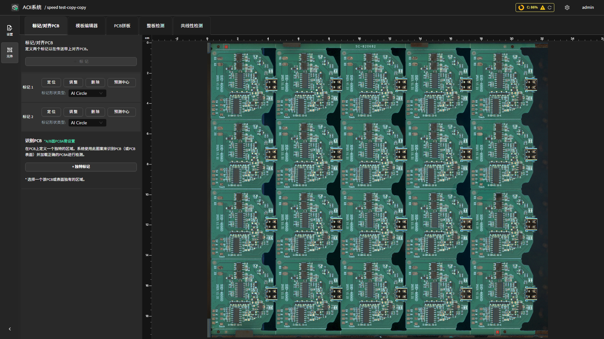
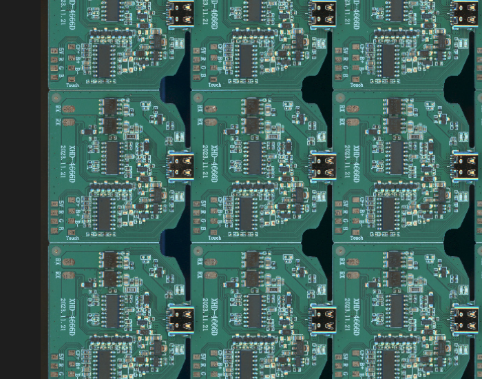

标记 / 对齐 PCB
==========================

为产品定义 **Mark 点** 与 **独特标记**，让系统在每次检测前都能稳定定位 PCB 的实际位置：

- **Mark 点（参考标记）**：补偿来料偏移与拼板单元之间的微小错位。
- **独特标记（Unique Marker）**：在 A/B 面双产品检测中自动区分两块不同的 PCB。

.. contents::
   :local:
   :depth: 2

如何进入
--------------------------

进入产品的 :guilabel:`产品编程页面（Teach）`，点击顶部第一个标签页 :guilabel:`标记 / 对齐 PCB`。

Mark 点（参考标记点）
--------------------------

点击工具栏的 :guilabel:`+ 标记`，在拍摄图像上框选 PCB 上固定、易识别的参考标记点（圆形 mark、矩形 mark、或复杂的丝印图案均可）。绘制完成后会出现在左侧标记列表中。

标记形状（Shape Type）
~~~~~~~~~~~~~~~~~~~~~~~~~~~~

每个 mark 点支持三种定位方式。优先用 AI 算法（圆形 / 矩形），失败时再退到模板匹配：

.. list-table::
   :header-rows: 1
   :widths: 24 44 32

   * - 形状类型
     - 定位原理
     - 何时使用
   * - **圆形标记 (Circle)**
     - AI 算法在图像中搜索 **圆形** 特征来定位
     - mark 为圆形，首选
   * - **矩形标记 (Rectangle)**
     - AI 算法在图像中搜索 **矩形** 特征来定位
     - mark 为矩形，首选
   * - **模板标记 (Template)**
     - 把框内图像存为 **模板**，检测时用模板匹配找最相似的位置
     - mark 不规则，或表面有油墨 / 氧化 / 反光导致 AI 失败时的退路

.. tip::

   模板标记对旋转、缩放、光照变化比 AI 算法更敏感，要求 mark 外观稳定；因此 **优先圆形 / 矩形，AI 失败再改模板标记**。

其他属性
~~~~~~~~~~~~~~~~~~~~~~~~~~~~

- **二值化抽色（Mark Binarization）**：mark 点底色不稳定时启用，先把 mark 抽成二值掩膜再匹配。开启后会出现 **三色范围** 参数（X / Y / Z / A），点击 :guilabel:`显示色范围 Mask` 可实时预览抽色效果。
- **定位（Locate）**：让相机移动到当前 mark 点的金板位置，便于核对位置是否正确。
- **预测中心（Predict Center）**：系统重新分析框内图像，自动微调 mark 点中心，消除手画时的轻微偏差。
- **精修（Refine）**：手动微调 mark 点框的位置与大小。

.. note::

   二维定位需要 **2 个 mark 点**，分别置于 PCB 的对角位置。当前版本 **最多 2 个**，不能再添加更多。

独特标记（Unique Marker）
--------------------------

仅在 **A/B 面双产品检测** 场景下需要。点击 :guilabel:`+ 独特标记`，在每个产品上框选一处与另一面差异明显的区域（例如缺口、专属丝印、特殊器件），该区域将作为产品识别特征。

独特标记支持三种 **分类方法**：

.. list-table::
   :header-rows: 1
   :widths: 20 44 36

   * - 分类方法
     - 原理
     - 适合场景
   * - **GENERIC**
     - 通用 AI 分类器
     - 大多数差异明显的场景
   * - **OCV**
     - 基于字符外观对比
     - 两个产品有不同但相近的丝印文字
   * - **OCR**
     - 基于字符识别
     - 字符清晰、可读

.. important::

   每个产品在 A/B 面模式下需要 **正好一个** 独特标记。若所选区域在两面区分度不足，启动检测时系统会返回 **HTTP 428** 错误并提示重选区域。

使用建议与常见问题
--------------------------

.. tip::

   **常见 Mark 点定位问题与处理：**

   - **检测时找不到 Mark 点、报错退出**：先切到 AI 算法（圆形 / 矩形）更稳定；若表面有油墨、氧化、污渍导致 AI 找圆失败，改用 **模板标记**。
   - **找到了但定位不准 / 误报多**：检查板子是否放反（对称 mark 可能巧合找到但定位错误）；两个 mark 点都画在稳定不易磨损处，且尽量分布在对角，利于精确解算旋转角。
   - **AB 面切换后找不到 Mark 点**：先确认板子方向；若单测 B 面能找到、AB 一起测找不到，多半是独特标记区分度不足，回本页重选差异更明显的区域。
   - **热板 / 冷板差异导致间歇误报**：在元件配置中适当放大 **允许偏移距离** 与 **允许旋转角度**，吸收温度形变。

.. note::

   **Mark 点选择建议：**

   - 优先选 PCB 上 **固定、不易磨损、不易被遮挡** 的圆形或矩形丝印参考点。
   - 避免选 **元件本身**，因为可能贴歪或缺料；也避免 **靠近板边**，拼接时可能被裁切。
   - 避免选 **对称分布** 的 mark 点（板子放反时可能被错误识别）。
   - 每块 PCB 选 **2 个** mark 点（当前上限），分别置于对角，覆盖整板范围。

相关页面
--------------------------

- :doc:`auto_programming`
- :doc:`manual_programming`
- :doc:`pcb_array`
