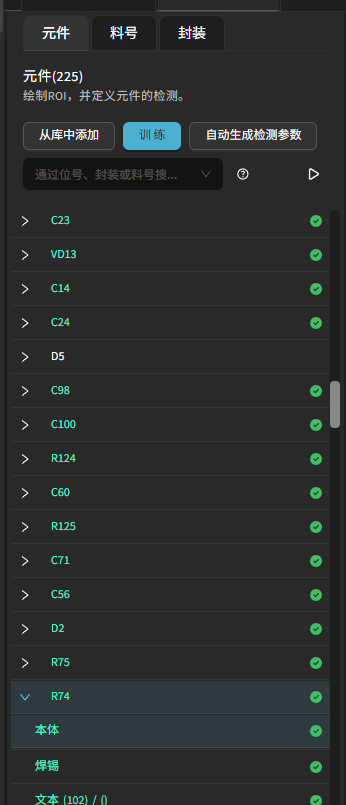
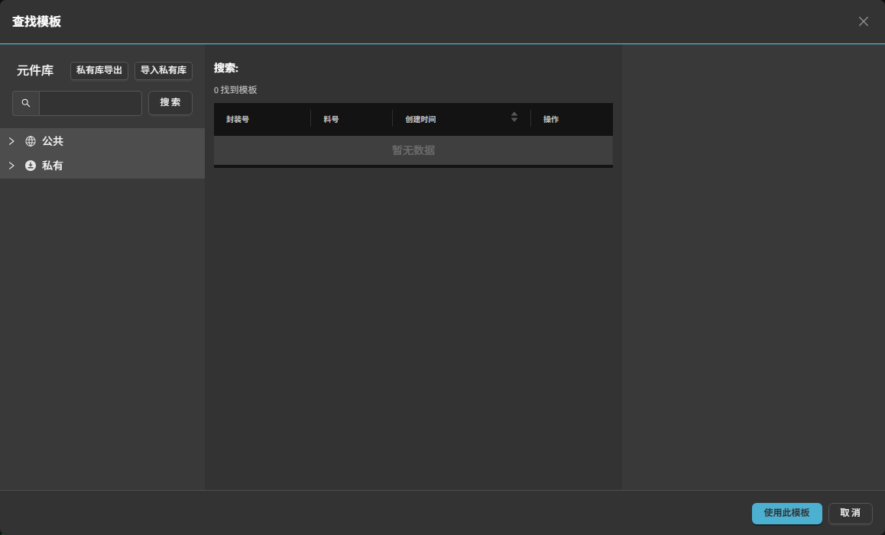

料号封装和分组
================

本章介绍如何通过”封装 (Package) + 料号 (PN)” 建立结构化的元件分组与复用体系：当多个元件具有相同封装或同时共享封装+料号时，可自动归入同一分组；其检测参数、训练样本与评估结果可在组内聚合。

核心概念
---------

* **封装 (Package)** ：几何/焊盘布局形态。是分组的第一层级（顶层）。
* **料号 (PN)** ：同一封装下的具体物料型号（可包含品牌/规格差异）。
* **分组 (Grouping)** ：系统按照”封装 → 料号 → 单个元件”建立层级，支持按料号、封装、单个元件进行查看。
* **共享参数** ：同组的检测参数（如检测阈值）可一次设置，所有成员继承。

添加封装与料号
-----------------

添加方式：
    1. 自动编程导入 CAD：
        - CAD 表格中含有丝印/标识、封装、料号、坐标、角度等字段。
        - 在自动编程向导中导入后：创建封装条目 → 关联料号 → 建立封装/料号层级 → 将元件挂接。
        - 缺失字段（如料号）时会按封装先分组，可后续手动补录。

    2. 手动添加：
        - 在模板编辑器中，从元件列表视图下，选中一个元件，在右侧设置栏打开模板。

            .. image:: images/edit_component_package_info.png
                :scale: 80%
                :alt: 组件属性填写示例

        - 按需编辑其封装、料号字段。点击保存即可。
        - 可选：将该标准化元件 **保存到私有库**，便于下次复用。或者可以从私有库的元件替换当前产品的元件（见”从库中添加”一节）。

启用或关闭分组参与
---------------------

每个元件具有 **连接封装** 与 **连接料号** 两个开关（默认开启）。

    .. image:: images/edit_component_package_info2.png
        :scale: 80%
        :alt: 组件属性填写示例

* **连接封装**：决定该元件是否加入其封装分组的统计与参数继承。
* **连接料号**：决定该元件是否参与对应料号的二级分组汇总。

典型使用场景：

* 临时单独调参：可暂时关闭某个异常样本的继承，单独修改；确认后再重新加入。
* 关闭链接分组：当发现某个元件与当前分组内的元件区别较大时，如颜色不同、几何不同时，可以选择取消其链接。

分组层级与视图
-----------------

系统层级：封装 → 料号 → 元件。

左侧元件列表支持三种视图，通过顶部选项卡切换：

* **元件**：平铺所有单体，适合逐件核对。展开某行后，可查看该元件的各检测类型。
* **料号**：列表显示所有料号，将共享同一料号且已连接的元件折叠为一组；展开后可操作组内的所有检测类型。料号未填写的元件显示为”未知料号”。
* **封装**：列表显示所有封装，将共享同一封装且已连接的元件折叠为一组；展开后可操作组内的所有检测类型。封装未填写的元件显示为”未知封装”。

在封装/料号视图下：

    .. image:: images/component_package_view.png
        :scale: 80%
        :alt: 组件属性填写示例

    .. image:: images/component_package_graph.png
        :scale: 80%
        :alt: 结果图表示例

* 选中某封装或料号 → 右侧可汇总显示该组全部成员的统计（训练集数据的数量、评估结果和图表）。
* 训练/评估后，可切换”封装”视图查看整体质量；定位某封装异常集中度。
* 进入数据集浏览时，可过滤”当前封装”快速聚焦样本一致性（如焊料外形、引脚偏移模式）。

从库中添加
-----------

点击元件列表上方的 **从库中添加** 按钮，打开 **查找模板** 对话框。

对话框左侧为 **元件库** 导航栏，包含两个折叠分区：

* **公共**：系统内置的封装模板，按类别浏览或搜索。
* **私有**：用户自行保存的模板，按封装编号列出。可通过 **私有库导出** 和 **导入私有库** 按钮备份或迁移私有库。

中间区域为模板搜索结果列表，列出匹配的模板条目，显示以下列：

* **封装**：模板的封装编号。
* **料号**：模板的料号。
* **创建时间**：模板创建时间。
* 操作列：私有库模板可 **删除**；公共模板不可删除。

点击列表中某行可在右侧预览区查看 **元件信息**，包括封装、料号、描述、元件宽度（mm）和元件长度（mm），同时显示该模板的图形预览。

确认后点击 **使用此模板**，将模板应用到当前选中位置的元件。

保存到私有库
--------------

在模板编辑器中完成元件的封装、料号配置后，可将其保存至私有库以供后续产品复用：

在右侧元件属性面板中，找到 **保存到私有库** 按钮并点击，系统将当前元件的封装定义（包括检测区域及参数）保存为私有模板，下次可通过”从库中添加”检索并应用。

.. screenshot-todo: 元件属性面板中”保存到私有库”按钮位置截图

