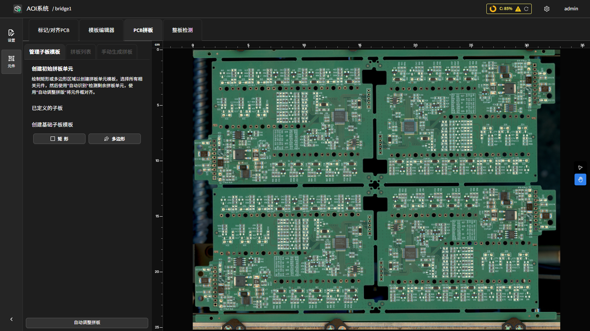
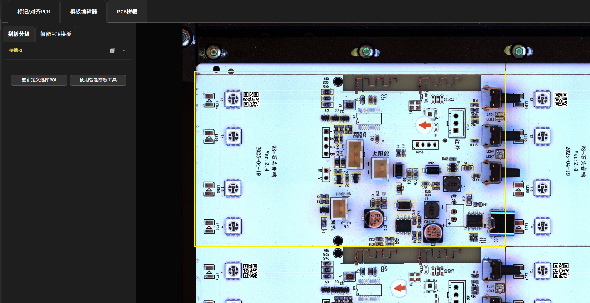

PCB 拼板
================

本章介绍 PCB 拼板功能，包括管理子板模板、拼板列表管理、手动生成拼板、自动检测与自动调整、NG 子板标记等操作。

界面结构
---------

在产品编程页面顶部点击 **PCB 拼板** 标签页，进入拼板管理界面。

界面左侧为功能标签页，包含三个标签：

- **管理子板模板** — 定义拼板基础单元的选择区域（Selection ROI），并支持自动检测子板位置。
- **拼板列表** — 查看与管理已注册的各子板模板及其所有子板实例。
- **手动生成拼板** — 通过标记点辅助手动指定子板排列（高级功能）。

左侧底部始终显示 **自动调整拼板** 按钮，可对已注册子板的位置进行图像对齐校正。

管理子板模板
-------------

**管理子板模板** 标签页用于定义子板的选择区域（Selection ROI）。选择区域决定哪些元件属于该子板，是拼板功能的基础。

**创建初始拼板单元**

**绘制矩形或多边形区域以创建拼板单元模板，选择所有相关元件，然后使用"自动识别"检测剩余拼板单元，使用"自动调整拼板"将元件框对齐。**

1. 点击 **矩形** 按钮，在右侧画布上框选第一个子板所在的区域；或点击 **多边形** 按钮，在场景上绘制多边形（左键添加顶点，右键删除上一个顶点，双击左键完成绘制）。

   .. image:: images/pcb_array_manage_base_panel.png
      :scale: 70%
      :alt: 管理子板模板标签页：拼板单元矩形 / 多边形绘制工具与已定义子板列表

2. 绘制完成后，系统弹出对话框 **请输入子版模版标签**，输入该子板模板的名称（默认为 ``b0``），点击 **确认** 保存。

3. 新定义的子板模板出现在 **已定义的子板** 列表中，显示标签名称与 **实例** 数量。

**已定义的子板** 列表中，每个条目旁有 **手动生成拼板** 按钮，点击后切换至 **手动生成拼板** 标签页以进一步操作该子板模板。

**自动检测（自动识别子板位置）**

当至少存在一个已定义的子板模板后，页面下方显示 **自动检测** 按钮：

1. 点击 **自动检测** 按钮，展开配置区域。
2. 调整 **接受度** 滑块（0–100，默认 70），数值越高表示匹配精度要求越严格。
3. 点击 **预览** 查看检测到的子板位置预览效果。
4. 预览满意后，点击 **保存** 完成自动检测并注册所有检测到的子板位置；点击 **取消** 放弃本次检测。

拼板列表
---------

**拼板列表** 标签页展示所有已注册的子板模板及其下属子板实例，支持对各子板进行管理操作。标签页仅在至少存在一个已注册子板时可用。

界面以树形结构显示：每个 **子板模板（BasePanelRow）** 下列出其所有子板实例。

**子板模板行操作**

每个子板模板行显示标签名称与实例数量，提供以下操作：

- **复制** — 在当前模板下新增一个子板实例（位置偏移约 15 像素）。
- **手动生成拼板** — 切换至 **手动生成拼板** 标签页，对该模板进行手动子板布局。
- **···（菜单）** — 展开下拉菜单，选择 **删除** 可移除该子板模板及其全部子板实例。

**子板实例行操作**

每个子板实例行显示该子板的标签名称（如 ``b0-1``）。若子板已标记为 NG，标签以红色显示并附有 ``(NG)`` 后缀。操作包括：

- **铅笔图标** — 点击可内联编辑该子板的标签名称，编辑完成后按 Enter 或点击 **保存** 提交。
- **···（菜单）** — 展开下拉菜单，提供：

  - **删除** — 移除该子板实例。
  - **标记为NG** / **取消NG标记** — 将该子板标记或取消标记为废板。标记后系统对该子板的所有元件设置 NG 状态。

  .. image:: images/pcb_array_del.png
      :scale: 50%
      :alt: 删除拼板单元示意

  .. image:: images/pcb_array_panel_list.png
     :scale: 70%
     :alt: 拼板列表标签页：子板树形结构与 NG 标记入口

底部提供 **+ 添加子板模板** 按钮，点击后跳回 **管理子板模板** 标签页创建新的子板模板。

自动调整拼板
-------------

界面左侧底部的 **自动调整拼板** 按钮对已注册的所有子板执行图像对齐校正：

- 系统对每个子板实例的元件框进行图像对齐，重新估算各子板的变换参数。
- 调整完成后，各子板的元件框会更新为校正后的位置（同步状态被设为独立，即后续对基础子板的编辑不再自动同步至已校正的子板）。

参数继承与同步原则
-------------------

* 默认情况下，所有子板的检测参数（如 ROI、阈值、检测项）均继承基础子板的设置。

* 通过 **同步 ROI** 选项：

    .. image:: images/pcb_array_sync_roi.png
       :scale: 50%
       :alt: 同步 ROI 设置示意

    - （默认开启）开启时，对基础子板的调整会同步到同一模板下的所有子板实例。
    - 关闭后，可对每个子板单独调整该元件的 ROI，适用于局部差异或特殊需求。

* 数据管理：数据集自动按元件分组，统计所有子板的检测结果。

条形码检测工具
---------------

* 支持在拼板场景下识别每个子板的序列号、批次号等条码信息。

* 操作流程：

    1. 在模板编辑器中，先为基础子板添加条形码检测框，并分组为新元件。
    2. 创建拼板后，系统会自动将该条形码检测框复制到所有子板。
    3. 检测时，系统可分别识别每个子板上的条码内容，并自动作为序列号归档。

* 应用场景：追溯生产批次、定位异常子板、自动分组统计。

判废板阈值设置
---------------

* 可在系统配置中为拼板设置整体判废板阈值。参考 :ref:`系统JSON配置`，编辑 ``wasted_array_board_failure_ratio`` 参数并保存。
* 检测过程中，若任一子板的元件 NG 率超过该阈值，则该子板会被判定为废板并报出。

跳过此元件的检测
-----------------

**元件配置（ComponentInfo）** 面板提供 **跳过此元件的检测** 开关。开启后，该元件在检测时会被完全跳过：不参与推理、不出结果、也不计入 ``failure_ratio``\ （包括子板判废逻辑）。

* 适用场景：操作员临时排除已知有问题的元件，或排除当前没必要检测的元件。
* 拼板行为：跳过设置会自动传播到 **同一元件在所有子板上的副本**。无需在每个子板上重复操作。
* 与坏板标记互斥：若元件已设置为 **坏板标记元件**，跳过开关会被锁定为关闭、不可修改。需要先取消坏板标记设置才能开启跳过。

也可在模板编辑器中框选多个元件，使用右键菜单的 **跳过检测 / 清除跳过检测** 批量操作。

判定为跳过的元件在画布上会以 **半透明灰色虚线框** 显示，便于一眼区分。
