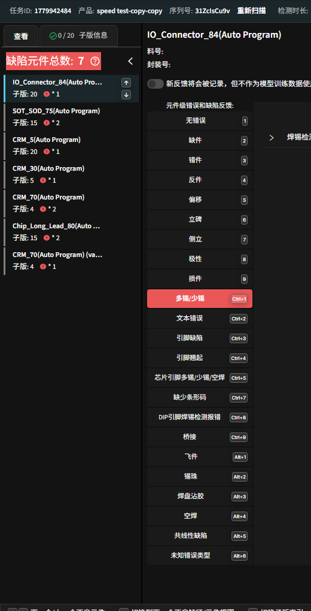
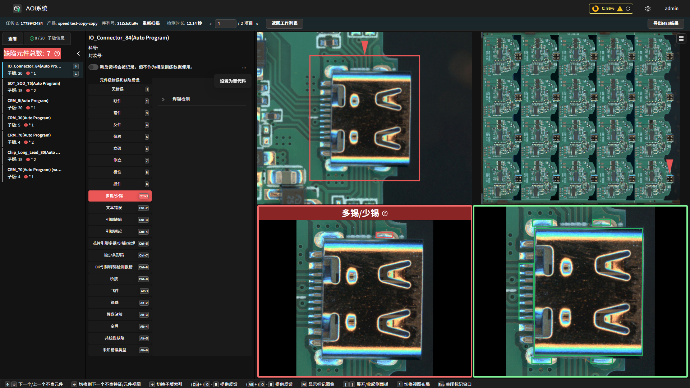
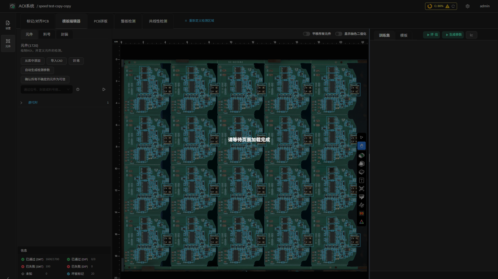
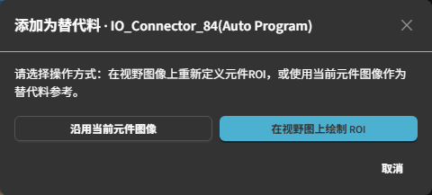
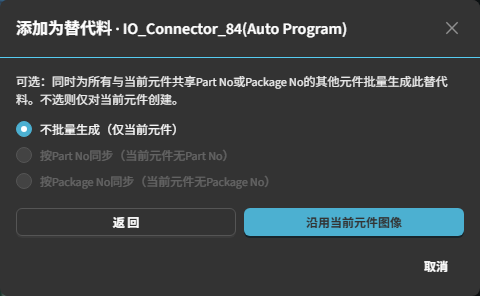
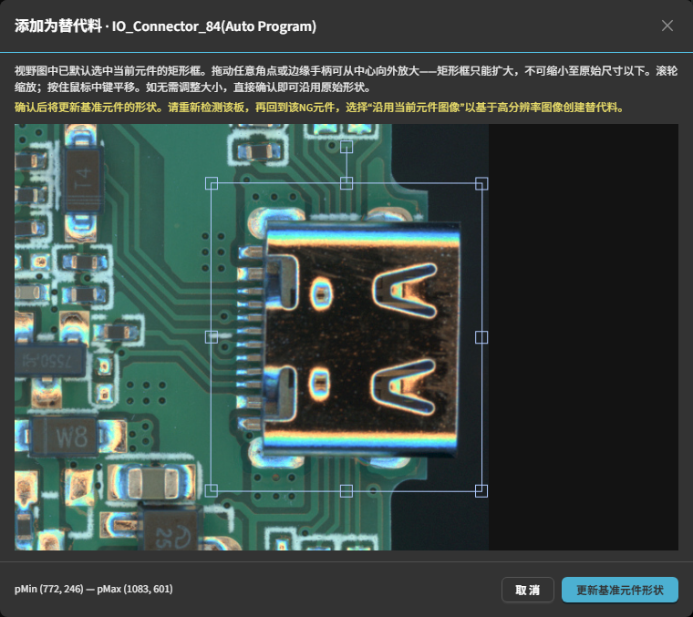

变体 / 替代元件（Variation / Alternative Components）
=====================================================

**此页面的用途**

替代料（替代元件）是指同一元件位置上，被系统认可的多种合法外观形态。当检测流程将某一外观实际合格的元件误判为 NG 时，操作员可在复检页面将其标记为替代料，从而让系统在今后的检测中接受该外观。典型场景：同一丝印位置更换了不同封装或不同供应商的物料，但旧训练图像尚未涵盖新外观。

替代料与主元件共享同一元件位置（designator），在模板编辑器中以独立行显示，可单独查看其特征。创建替代料后需重新训练模型，才能在后续检测任务中生效。

**如何进入**

替代料功能有两个入口：

**入口一：复检页面（创建替代料）**

在离线复检页面（``/inspection/review``）中，当某元件被判定为 NG 时：

1. 在右侧 NG 元件列表中选中该元件。
2. 点击元件标题行右上角的 **...** 按钮，展开下拉菜单。
3. 点击 **设置为替代料**，打开替代料选择器对话框。

**入口二：模板编辑器（查看与管理替代料）**

进入产品编程页面 → **元件** 标签页，即可在元件列表中查看已存在的替代料。选中某替代料行后，右侧 **替代料** 折叠面板将显示其料号和封装信息，并提供重命名与批量复制功能。

**操作流程**

**第一步：在复检页面触发替代料创建**

在复检页面选中误判为 NG 的元件后，点击 **...** → **设置为替代料**，弹出 **添加为替代料** 对话框（``review.setAsAlternativeChoiceTitle``）。

对话框说明：请选择操作方式：在视野图像上重新定义元件 ROI，或使用当前元件图像作为替代料参考。

**第二步：选择创建方式**

对话框提供两种方式：

- **沿用当前元件图像** ：直接使用当前检测抓取的元件图像作为替代料的参考图像，进入下一步选择批量同步范围。适用于图像质量良好、无需调整取样区域的情况。

- **在视野图上绘制 ROI** ：重新在视野图上框选元件范围，用于调整采样区域以获取更高质量的参考图像。该路径不会立即创建替代料，而是先更新基准元件形状，再要求重新检测。

  .. note::

     如果该元件已在本轮复检中完成过"绘制 ROI"操作（系统会高亮显示相应行），则 **在视野图上绘制 ROI** 按钮将被禁用，并提示：您已为该元件重新定义过 ROI，请选择"沿用当前元件图像"以基于重新检测的图像创建替代料。此时应直接选择 **沿用当前元件图像**。

**第三步A：沿用当前元件图像 — 选择批量同步范围**

选择 **沿用当前元件图像** 后，对话框进入第二步，显示批量同步（fan-out）选项。操作员可选择同步范围：

- **不批量生成（仅当前元件）** ：仅为当前元件创建替代料，不影响其他元件。

- **按Part No同步** ：同时为所有与当前元件共享相同料号的其他元件批量生成此替代料。若当前元件无料号，则该选项禁用。

- **按Package No同步** ：同时为所有与当前元件共享相同封装号的其他元件批量生成此替代料。若当前元件无封装号，则该选项禁用。

选择范围后，点击 **沿用当前元件图像** 按钮提交。替代料创建成功后，系统会弹出提示，告知需前往模板编辑页重新训练。

**第三步B：在视野图上绘制 ROI — 更新基准元件形状**

选择 **在视野图上绘制 ROI** 后，打开 **添加为替代料** 对话框，显示该 NG 元件的视野图像。

操作说明：

1. 视野图中已默认预选当前元件的矩形框（红色虚线）。拖动角点或边缘手柄，从中心向外放大矩形框，使其完全覆盖目标元件轮廓——矩形框只能扩大，不可缩小至原始尺寸以下。
2. 如无需调整大小，可直接确认以沿用原始形状。
3. 点击 **更新基准元件形状** 按钮提交。

提交后，系统更新基准元件形状，并自动重载当前检测会话的产品定义。此时页面提示：基准元件形状已更新，请重新检测该板，再选择"沿用当前元件图像"以创建替代料。

**重新检测后的后续步骤：**

4. 重新触发该板的检测。
5. 复检时再次选中该元件，点击 **...** → **设置为替代料**，进入选择器对话框。
6. 此时该元件行左侧会显示黄色标记，提示已在此前重新定义过 ROI。选择 **沿用当前元件图像**，继续按"第三步 A"流程完成替代料创建。

**第四步：在模板编辑器中管理替代料**

替代料创建成功后，可在模板编辑器的元件列表中查看和管理：

选中某替代料行后，右侧展示 **替代料** 折叠面板，包含以下功能：

- **料号（Part No.）输入框 + 保存按钮** ：修改该替代料组的料号，点击保存后将更新所有共享该料号的相关元件。

- **封装号（Package No.）输入框 + 保存按钮** ：修改该替代料组的封装号，点击保存后将更新所有共享该封装号的相关元件。

- **复制到相同料号** ：将当前替代料批量复制到所有共享相同料号的元件。料号为空时该按钮禁用。

- **复制到相同封装** ：将当前替代料批量复制到所有共享相同封装号的元件。封装号为空时该按钮禁用。

.. screenshot-todo: images/variation_component_info.png — 模板编辑器右侧"替代料"面板，显示料号/封装号输入框及复制按钮

**第五步：重新训练模型**

替代料创建后，需在模板编辑器中触发重新训练，新建的替代料才能在后续检测任务中生效。替代料创建成功时，系统会弹出警告提示：替代料已创建。此替代料不会在当前检测任务中生效——请前往模板编辑页编辑特征并触发重新训练。

同时，若当前有正在运行的检测任务，系统会弹出对话框，询问是否停止当前任务。建议在重新训练前停止运行中的检测会话，以确保新训练后的模型能在下次检测时正确生效。

**注意事项**

.. note::

   - **替代料创建后不会自动触发重新训练。** 必须前往模板编辑页手动触发重新训练，替代料才会对后续检测生效。运行中的检测任务需停止后再重新启动，方可使用新模型。
   - **"在视野图上绘制 ROI"路径需两步完成：** 绘制并提交时仅更新基准元件形状，不立即创建替代料；需重新检测该板后，再通过"沿用当前元件图像"完成替代料的创建。
   - **批量同步（fan-out）只能选择一种范围（料号或封装号，二选一或不选）。** 若同一元件的料号或封装号字段为空，对应的同步选项将被禁用。
   - **替代料在模板编辑器中以独立行显示**，与原始主元件分开，不影响主元件的特征配置。
   - **本页面仅描述离线复检流程。** 联机多后端（ReviewOnline）场景及 MES 集成不在本页范围之内。

**相关页面**

- :doc:`manual_programming`
