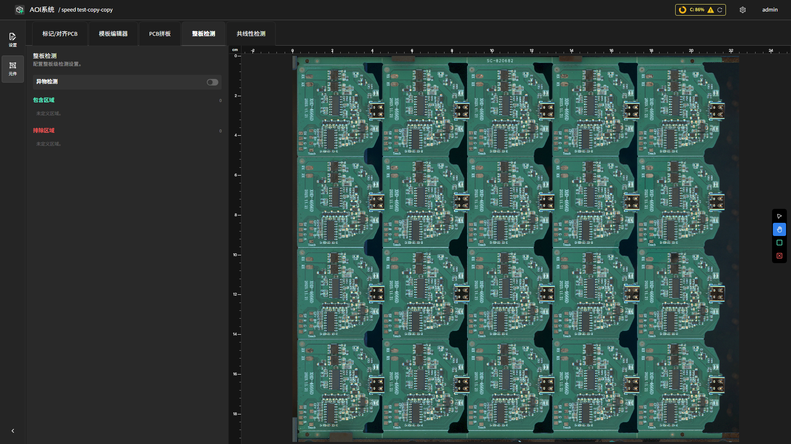

整板检测
===========

**此页面的用途**

针对 PCB **整体表面** 的检测（不依赖具体元件）。常用于检测元件之间、丝印边缘等区域的污渍、异物、残留物等表面缺陷，作为对单元件检测的补充。整板检测的 ROI 不再以单个元件为单位，而是以 **包含 / 排除区域** 为单位划定。

**如何进入**

进入 **产品编程页面**（Teach），点击顶部标签页 **整板检测**。

**操作流程**

**1. 启用检测项**

页面右侧提供检测项列表。当前支持的检测项：

- **表面污染检测（Surface Contamination）**：基于 AI 模型，识别 PCB 表面的污渍、油渍、毛刺、异物等污染缺陷。每个检测项可独立启用 / 关闭。

需要时勾选对应检测项的开关。

**2. 绘制检测区域**

整板检测使用两类区域定义有效检测范围：

- **包含区域（Include Regions，绿色）**：明确要检测的区域。若 **未定义任何包含区域**，系统默认将整块 PCB 作为检测范围。
- **排除区域（Exclude Regions，红色）**：在检测范围内主动排除的区域。常用于跳过治具边缘、丝印商标、二维码贴纸等不希望被误判为污渍的位置。

在画布上点击工具栏对应按钮即可开始绘制：

- 选中绿色 **添加包含区域** 按钮 → 在画布上拖动框选包含区域。
- 选中红色 **添加排除区域** 按钮 → 在画布上拖动框选排除区域。

每个区域绘制完成后会出现在右侧的 **区域列表** 中。点击列表项可：

- **定位（Locate）**：让相机移动到该区域，便于核对位置。
- **删除**：移除该区域。

**3. 保存配置**

所有改动会自动保存到当前产品的整板检测配置中，无需手动点击保存按钮。检测时系统会自动按当前配置执行。

**表面污染检测（Surface Contamination）**

表面污染检测以 AI 模型为核心。开启该检测项后：

- 系统在每次检测时会对所有 **包含区域 - 排除区域** 内的像素做表面缺陷推理；
- AI 给出的污染区域会在复检页面上以高亮显示，便于人工确认；
- 模型的可检范围会随产品配置与训练数据迭代而调整。

**注意事项**

.. note::

   整板检测与单元件检测 **同时启用、各自独立判定**。整板检测发现的污染区域不会改变单元件的 OK/NG 状态，但在复检页面上会与元件 NG 一并列出，便于操作员同时处理。

**相关页面**

- :doc:`manual_programming`
- :doc:`/complete_user_guide/inspection/index`
