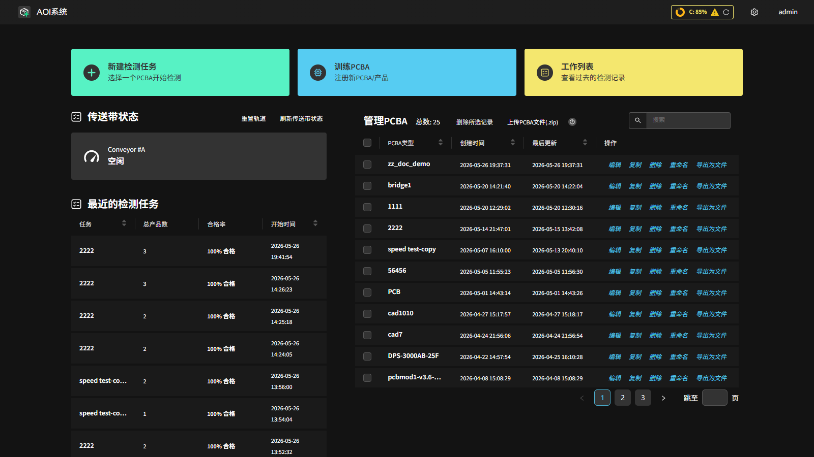

主页
=================

登录后进入 **主页**，这是系统的入口，集中提供三大功能入口、传送带状态、最近检测任务与产品（PCBA）管理。

功能入口
-----------------

页面顶部为三个主要入口卡片：

- **新建检测任务**：选择一个 PCBA 开始检测（详见 :ref:`检测与反馈`）。
- **训练PCBA**：注册新的 PCBA / 产品并进入自动编程向导（详见 :ref:`创建产品`）。
- **工作列表**：查看过去的检测记录与数据分析报告（详见 :ref:`查看检测历史（数据分析报告）`）。

传送带状态
-----------------

**传送带状态** 区域显示每条传送带（如 Conveyor #A）的实时状态：**空闲**、**运行检测任务中**、**编程中** 或 **定义 PCB 中**。常用操作：

- **重置轨道**：复位传送带 / 清除当前占用（当出现异常占用或需要中断时使用）。
- **刷新传送带状态**：手动刷新各传送带的最新状态。
- **传送带方向**：在 **正向** / **反向** 之间切换进板方向。

最近的检测任务
-----------------

列出最近执行的检测任务及其总产品数、合格率与开始时间，便于快速回看近期生产情况。点击可进入对应记录。

产品（PCBA）管理
-----------------

右侧 **管理 PCBA** 列表展示所有已创建的产品，包含 PCBA 类型、创建时间、最近更新时间等列。每行提供以下操作：

- **编辑**：进入该产品的编程页面（标记对齐、模板编辑器、拼板、整板检测等）。
- **复制**：基于现有产品创建一个副本。
- **重命名**：修改产品名称。
- **删除**：删除该产品及其数据。
- **导出为文件**：将该产品导出为文件，便于备份或迁移到其它机台。

其它：

- **上传 PCBA 文件 (.zip)**：从导出的 ``.zip`` 文件导入产品。
- **搜索 / 标签过滤**：通过搜索栏按名称查找，或使用标签（tag）对产品分类与过滤。
