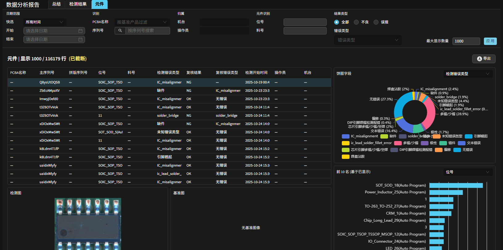
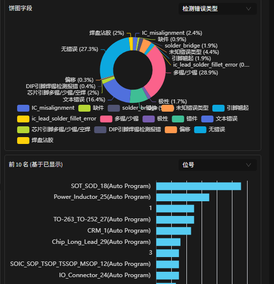
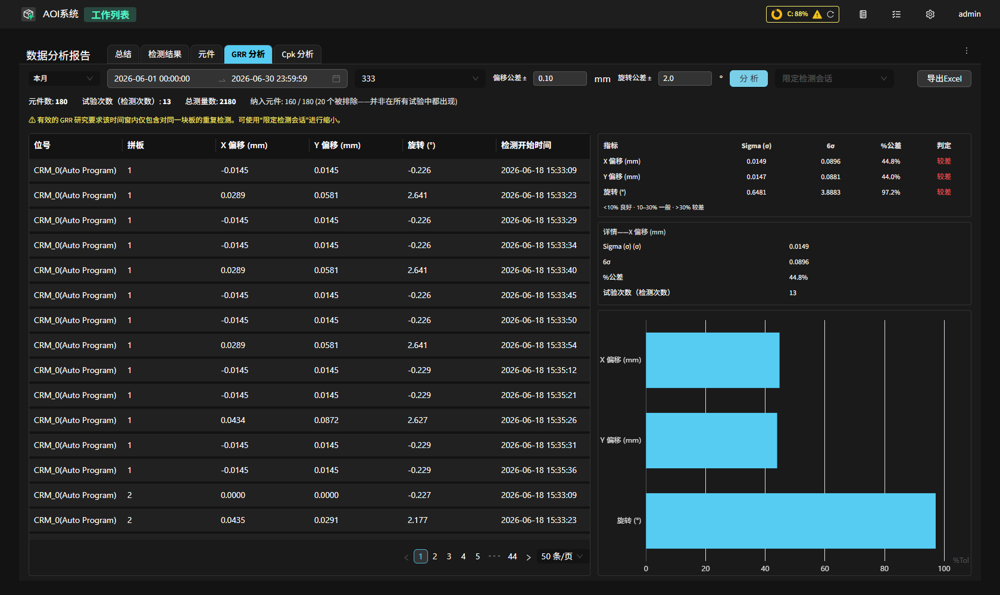
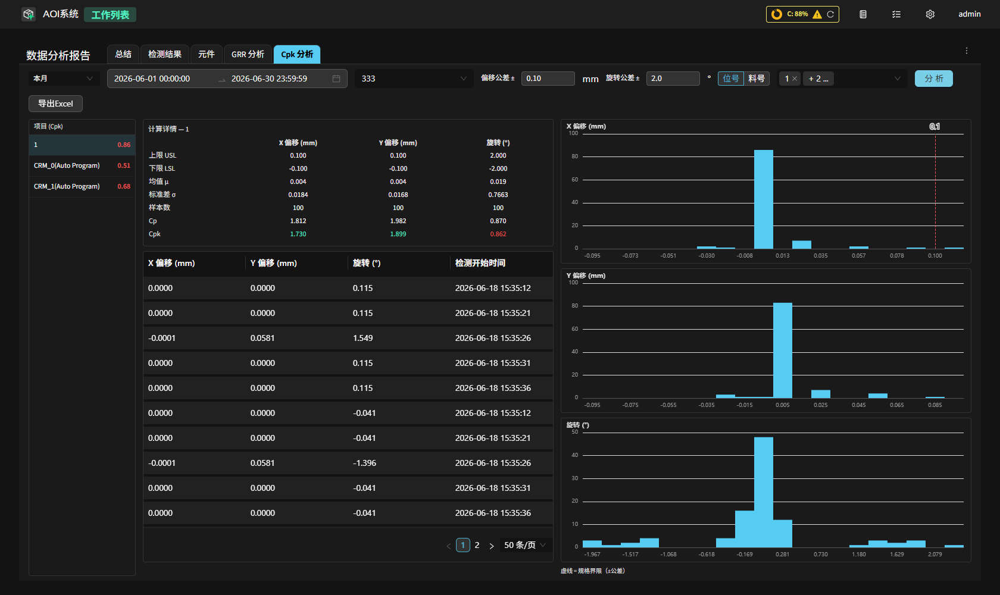

查看检测历史（数据分析报告）
============================================

在主页点击 **工作列表** 进入 **数据分析报告** （路由 ``/worklist``）。页面提供 **总结**、**检测结果**、**元件**、**GRR 分析**、**Cpk 分析** 五个标签页，内容区随选中标签页切换。其中 **总结** / **检测结果** / **元件** 共享顶部的过滤栏；**GRR 分析** 与 **Cpk 分析** 各自带有独立的筛选行，不受顶部过滤栏影响。

**五个标签页**

- **总结**：总览统计指标、不良/良品比环形图与前十不良元件柱状图。
- **检测结果**：逐条列出每次整板检测记录，可进入复检、导出报告。
- **元件**：按元件维度汇总检测结果，支持 **全部** / **不良** / **误报** 切换，并提供饼图、柱状图与图像查看。
- **GRR 分析**：评估测量系统重复性（量具重复性与再现性），用于对同一块板重复检测的研究，可导出 Excel。
- **Cpk 分析**：评估贴装工艺相对于给定公差的过程能力（Cp / Cpk），可导出 Excel。

**过滤栏**

过滤栏按功能分组。除 **序列号** 外，筛选条件修改后需点击底部的 **应用** 按钮才会重新查询；**序列号** 按 Enter 或扫码即时生效。

- **日期范围**：**快选** 下拉（今天 / 昨天 / 本周 / 本月 / 今年 / 所有时间 / 自定义）与 **开始**、**结束** 日期。直接修改日期会自动切换为 **自定义**；选择预设会覆盖起止日期；**所有时间** 清除日期限制。
- **识别**：**PCBA名称** 下拉选择已训练的基准产品；**序列号** 按板件序列号过滤。
- **归属**：**机台**、**操作员**。两者均为自动补全输入框，会建议历史会话中出现过的值，也可自由输入。
- **元件识别** \ （仅 **元件** 标签页）：**位号**、**料号** 文本输入框。
- **结果类型** \ （仅 **元件** 标签页）：模式单选 **全部** / **不良** / **误报**，以及 **错误类型** 多选列表。

过滤栏底部为 **最大显示数量** 输入框（默认 1000）与 **应用** 按钮；修改数量上限同样在点击 **应用** 后生效。

**总结 标签页**

**总结** 标签页由三个并列面板组成。

**总览面板**
   显示所选范围内的整体统计数据，分为两个区域：

   - **PCBA**：检测总数、良好板数及占比、不良板数及占比。
   - **报警元件**：报警元件总数，以及经反馈确认的 **不良** 元件数及 PPM、被 **误判** 的元件数及 PPM、每板平均缺陷数 **DPU**。

   面板底部显示当前查询的时间范围。

**不良/良品比 面板**
   以环形图展示合格与不良板件的数量与百分比。

**前十不良元件 面板**
   选定具体基准产品后，展示该产品下报警次数最多的前 10 个元件横向柱状图；未选择产品时提示先选择产品。

.. note::
   **总结** 标签页同样受过滤栏 **机台** / **操作员** 过滤的影响，统计范围与其他标签页保持一致。

**检测结果 标签页**

逐条列出每次整板检测记录。表头旁显示 **显示 X / Y 行** 指示器；当匹配行数超过 **最大显示数量** 时，追加"已截断"提示，表格只展示最近的若干行。各列含义：

.. list-table:: 检测结果列
   :header-rows: 1
   :widths: 24 76

   * - 列
     - 含义
   * - PCBA名称
     - 本次检测所用基准产品名称。
   * - 主序列号
     - 整板条码 / 序列号。
   * - 拼版序列号
     - 子板序列号（非拼板产品为空）。
   * - 检测结果
     - 整板的 AI 检测判定。
   * - 不良元件数量
     - 经反馈确认为不良的元件数。
   * - 误报数
     - 系统报警但反馈为良品的元件数（报警数减去确认不良数）。
   * - 复核结果
     - 操作员复核后的整板结论，由前端按下述规则推导。
   * - 检测开始时间
     - 本次检测的开始时间。
   * - 检测时长
     - 本次检测的耗时。
   * - 操作员 / 机台
     - 本次检测所属会话记录的操作员与 AOI 机台。
   * - 操作
     - **导出报告**（在新标签页打开详细报告）、**删除记录**。

列表顶部提供 **导出CSV** 与 **删除选中记录**，支持多选批量删除。

.. note::
   **复核结果（整板）**：仅当该板已被操作员复核且反馈后无不良元件时显示 **良好**；否则（含尚未复核的 AI 判不良板）显示 **不良**。该口径比主页良率更严格——未经人工复核的不良板一律计为 **不良**。

**元件 标签页**

**元件** 标签页取代了旧版的 **不良元件** 与 **误判元件** 两个标签页，以单一列表呈现元件级结果，并通过 **结果类型** 的 **全部** / **不良** / **误报** 单选切换查看范围。

页面左侧上方为元件表格、下方为图像查看区，右侧为图表区。表头旁同样显示 **显示 X / Y 行** 指示器。表格各列：**PCBA名称**、**主序列号**、**拼版序列号**、**位号**、**料号**、**检测错误类型**、**复核结果**、**复核错误类型**、**检测开始时间**、**操作员**、**机台**。

.. note::
   **复核结果（元件）**：当元件检测通过，或反馈错误类型为"无错误"时显示 **良好**；否则显示 **不良**。

**右侧图表区**

- **饼图**：通过 **饼图字段** 下拉选择统计维度，可选 检测错误类型 / 复核错误类型 / 机台 / PCBA名称 / 复核结果，按当前筛选行集聚合占比。
- **柱状图**：通过下拉选择统计维度，可选 位号 / 料号 / 主序列号，展示出现频次 **前 10 名**。当结果被截断时标题显示为 **前 10 名 (基于已显示)**，提示统计仅基于已显示的行。
- 两个图表均随过滤条件与 **全部** / **不良** / **误报** 切换实时重新聚合。

**底部图像查看区**

单击表格中任意一行，下方图像区显示该元件的 **检测图** 与 **基准图**：检测图为实际检测裁剪图，基准图为 golden 参考图。未选择行时显示"选择一行以查看图像"；无基准图时显示"无基准图像"。

**导出**

**元件** 标签页提供 **导出CSV** 与 **导出Excel** 两种方式。导出的 Excel 含一个数据表，以及一张图表工作表——内嵌当前饼图、柱状图的图像与对应的分类计数表（图表按导出时的字段选择生成）。两种导出均不含元件图片。

**GRR 分析 标签页**

**GRR 分析** 用于评估测量系统的重复性（量具重复性与再现性，Gauge R&R）——即对 **同一块板重复检测多次** 时，元件贴装偏移测量值的离散程度。仅当检测任务开启了 **GRR / Cpk 测量研究** 开关（见 :ref:`新建检测任务`）后，系统才会记录每个元件的带符号 X/Y 偏移与旋转，供本标签页分析；历史检测若未开启该开关则没有可分析的数据。

操作步骤：

1. 选择 **日期范围** 与 **PCBA名称**；如需限定到单次检测会话，使用 **限定检测会话**。点击 **分析**。
2. 左侧表格逐行列出每个（元件 × 检测）的 **X 偏移 (mm)**、**Y 偏移 (mm)**、**旋转 (°)**、**拼板** 与时间。
3. 右侧 **详情** 面板按 **指标**（X 偏移 / Y 偏移 / 旋转）给出 **Sigma (σ)**、**6σ**、**%公差** 与 **判定**，判定阈值为 ``<10%`` 良好、``10–30%`` 一般、``>30%`` 较差。
4. 顶部计数显示 **元件数**、**试验次数（检测次数）**、**总测量数** 与 **纳入元件**；未在所有试验中都出现的元件会被排除，并以"N 个被排除——并非在所有试验中都出现"提示。
5. 点击导出按钮可导出 Excel。

.. note::
   有效的 GRR 研究要求所选时间窗内 **仅包含对同一块板的重复检测**；若窗口内混入了不同板，σ 与 %公差会被放大。可使用 **限定检测会话** 缩小范围。GRR 至少需要对同一块板检测 2 次、且每次检测中都出现至少 2 个相同元件，否则相应指标显示 N/A。

**Cpk 分析 标签页**

**Cpk 分析** 评估贴装工艺相对于给定公差的 **过程能力**（Cp / Cpk），同样依赖检测任务开启 **GRR / Cpk 测量研究** 后记录的偏移数据。

操作步骤：

1. 选择 **日期范围** 与 **PCBA名称**，设置 **偏移公差** 与 **旋转公差**（必须为正数，否则 **分析** 与导出按钮不可用），并按 **位号** 或 **料号** 选择要分析的项目。点击 **分析**。
2. 左侧 **项目 (Cpk)** 列表逐项显示其最差 Cpk 值；点击某项进入详情。
3. 中部 **计算详情** 给出该项各指标的 **上限 USL**、**下限 LSL**、**均值 μ**、**标准差 σ**、**样本数**、**Cp** 与 **Cpk**，并附测量数据表。
4. 右侧并列三张直方图（X 偏移 / Y 偏移 / 旋转），并以虚线标出 ±公差 规格界限。
5. 点击导出按钮可导出 Excel。

.. note::
   当样本数过少（少于 2 个）或测量值完全一致（σ = 0）时，Cp / Cpk 显示为 N/A。

**注意事项**

.. note::
   - **机台 / 操作员 的来源将在后续版本接入**；历史检测会话这两列可能为空，空值显示为"—"，且按 **机台** / **操作员** 过滤会排除这些未归属的记录。
   - **元件** 标签页的图表与表格基于同一批已获取的行集聚合；当行数超过 **最大显示数量** 时，表格与图表均只反映已显示的行（柱状图标题会提示 **前 10 名 (基于已显示)**）。
   - **子板良率（FPY）与坏板标记**：对于拼板产品，良率可在 **整板** 与 **子板** 口径间切换，按实际检测的子板数统计；非拼板产品的子板口径显示为 N/A。被标记为 **坏板标记** 的元件用于驱动子板好 / 坏判定，但 **不计入** 复核 NG 列表，也不计入数据分析报告的 总数 / 告警 / NG 统计。子板的自动判废逻辑在 :ref:`检测设置（子板判废逻辑）` 中配置。
