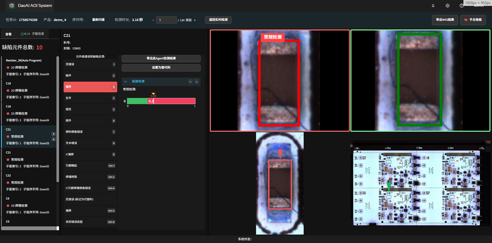
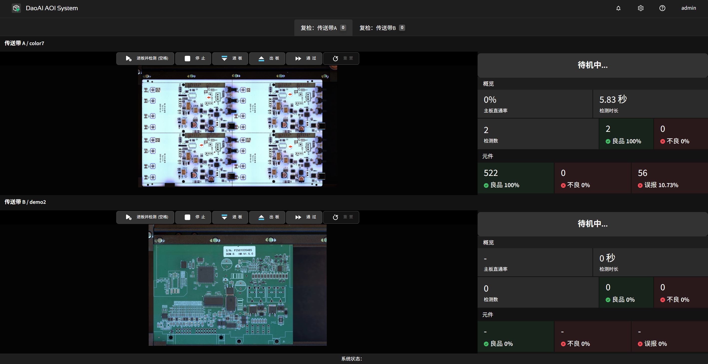

检测与反馈
==================

本章说明如何在系统中创建并执行检测任务、查看历史记录与反馈数据，以及通过反馈迭代模型的基本流程。

.. contents::
   :local:
   :depth: 1

新建检测任务
-----------------

完成 PCB 产品创建并训练后，返回主页开始检测任务：

1. 点击“新建检测任务”。
    .. image:: images/start_inspection.png
        :scale: 50%
        :alt: 新建检测任务
        
2. 在任务配置中选择目标 PCB 产品、对应的传送带（conveyor）以及启动模式：单次触发 / 自动连续。
   
   - 建议在调试阶段使用 **单次触发** 模式以便逐板查看；正式生产可以使用 **自动连续** 模式。
    
    .. image:: images/start_mode.png
        :scale: 80%
        :alt: 启动模式选择

连续检测错误处理
-----------------

在连续检测模式下，遇到错误时系统是否自动停止由 `pause_when_ng` 配置项控制（参考 :ref:`系统JSON配置`）。说明如下：

- `true`：检测到 NG（不良）或发生异常时，系统会自动暂停当前任务并停留在出错的子板位置，便于现场人工查看、定位并处理该子板；同时该条记录会被标记为不良并写入任务数据。此选项适用于需要逐板确认或即时干预的生产场景。
- `false`：发生 NG 时系统不会中断生产，会按既定节拍继续运行并记录该子板为不良（或按设定分拣策略处理）。此模式适用于对产线吞吐要求较高且容许事后抽查或自动分拣的场景。

检测页面概览
-----------------

进入检测页面后，界面元素与操作：

- **空格**：进板并立即开始检测。
- **左侧控制按钮**：进板 | 出板 | 通过 | 复位，用于手动控制生产节拍。
- **右侧信息栏**：实时显示检测计数、良率与缺陷统计信息。

.. image:: images/inspect_review_page.png
   :scale: 50%
   :alt: 检测复审页面

检测到缺陷时，系统会自动跳转到缺陷详情视图，可查看放大图、定位框、缺陷类型和判定依据，并可立即进行人工反馈（判为良品/不良/忽略等）。

双轨检测系统
-------------------

对于配置了双轨检测的系统，检测页面会同时显示左右两条传送带的并行检测视图；操作与单轨系统类似，但在视图切换与记录检索上增加了分轨能力：

1. 按 `Enter` 会查询未读的检测记录，默认优先显示左轨，随后显示右轨（两轨独立计数与统计）。
2. 通过上方标签页在“左轨 / 右轨”间切换，分别查看各自的历史记录与缺陷详情。

节拍与停机策略（双轨差异）
~~~~~~~~~~~~~~~~~~~~~~~~~~~~~~~~

- 两轨默认异步运行：一侧出现 NG 或异常时，仅暂停对应轨道的当前板；另一侧按既定节拍继续（具体行为受 `pause_when_ng` 等配置影响，参见 :ref:`系统JSON配置`）。
- 可选同步模式（如需对齐板序）：两轨在同一节拍下进出板，适用于对同时位检测或对比分析有要求的产线；同步模式下出现异常时，通常会同时停机以保持序列一致。

导出与对接（分轨）
~~~~~~~~~~~~~~~~~~~~

- MES/报告导出可按轨道分文件夹或在文件名中加入轨道标识，便于后续系统对接与数据稽核（参见 :ref:`导出 MES 路径`）。
- 若进行质量统计与报表分析，建议分别展示左右轨的良率与缺陷分布，并提供汇总视图方便总览产线表现。

现场提示
~~~~~~~~~~~~

- 相机与对齐：若左右轨对应不同相机或视角，建议分别完成现场校准与样板验证，确保色域与阈值在各自轨道下稳定。
- 资源与吞吐：双轨会更充分利用采集与推理资源；当 GPU/CPU 接近饱和时，系统可能触发节流以稳定帧率，可根据产线优先级调整策略。

快捷键
-----------------

检测页面快捷键 (缺陷详情视图)
~~~~~~~~~~~~~~~~~~~~~~~~~~~~~~

- `1–0`（数字键）：在缺陷详情视图中快速反馈对应的预设类别；按住 `Ctrl` + 数字键 可访问扩展类别（例如 `Ctrl`+`1` 表示类别 11）。
- `上 / 下`（方向键）：切换上一条 / 下一条缺陷记录。
- `左 / 右`（方向键）：在同一元件的不同缺陷类型之间切换（例如主体与引脚的缺陷视图）。
- `Enter`：返回上一个检测记录；若当前为最新记录，则返回检测概览页面。
- `空格`：进板并开始检测。

编程页面快捷键
~~~~~~~~~~~~~~~~~~~~~~~~~~~~~~~~~~

.. image:: images/program_page.png
   :scale: 50%
   :alt: 编程页面

- `Ctrl+C` / `Ctrl+V`：复制并粘贴当前元件（包含所有检测框与属性）。
- `W` / `A` / `S` / `D`：在选中检测框时微调框的位置；在选中移动工具时移动视图。
- `V`：切换到选择工具。
- `H`：切换到移动（拖拽）工具。
- `1`：切换到主体工具。
- `2`：切换到焊料工具。
- `3`：切换到 IC 引脚工具。
- `4`：切换到 OCR（文本）工具。
- `5`：切换到条形码工具。

缺陷详情与快速反馈
-------------------------

在缺陷详情页中：

- 查看放大图与定位框，确认缺陷区域与具体判别依据。
- 使用快捷键或界面按钮进行快速反馈（例如标记为误报、确认不良、忽略等）。
- 反馈会写入该产品的数据集，供后续训练与参数调整使用。

所有缺陷类别（界面显示）
    下面列举基于界面右侧缺陷反馈面板的缺陷类别（按显示顺序编号）：

    1. 无错误
    2. 缺件
    3. 错件
    4. 反件
    5. 极性错误
    6. 损件
    7. 焊料倒角错误
    8. 文本错误
    9. IC 偏移
    10. 引脚翘起（快捷键：`Ctrl`+`1`）
    11. 焊锡桥联（快捷键：`Ctrl`+`2`）
    12. IC 引脚焊锡倒角错误（快捷键：`Ctrl`+`3`）
    13. 无错误（标记为代替料）
    14. 倾移 / 偏移（快捷键：`Ctrl`+`5`）
    15. 未知错误类型（快捷键：`Ctrl`+`6`）

说明：

    - 列表序号对应界面上的反馈项顺序，具体项目及快捷键可由系统管理员在产品配置或前端界面中定制。
    - 在缺陷详情视图中，可使用数字键 `1–0` 快速反馈常用类别；对于扩展类别（界面上带有 `Ctrl+` 的项），可按 `Ctrl` + 对应数字触发。

标注为替代料
~~~~~~~~~~~~~~~~~~~~~~

当某些元件在外观或形态上与模板存在较大差异，但经工程确认仍属可接受时，可将该元件标记为“替代料”。系统会在反馈中记录此标注，并在后续的数据汇总与模型训练中将其作为独立类别纳入考虑，以便区分替代料与真实缺陷、降低误报并支持模型适配。

.. image:: images/add_substitute.png
   :scale: 50%
   :alt: 标注为替代料

查看检测历史（工作列表）
-----------------------------------

在主页点击“工作列表”进入历史任务页面，列表展示每个任务的创建时间、合格/不合格数量、良率与缺陷统计。点击任意任务可查看该任务的详情与单次检测记录。

.. image:: images/worklist.png
   :scale: 50%
   :alt: 工作列表概览

任务详情页会列出该次检测的所有条目；点击单次记录可进入缺陷详情：查看放大图、定位框、缺陷标签与判定依据，并可执行人工反馈，反馈结果将回写到数据集。

.. image:: images/worklist1.png
   :scale: 50%
   :alt: 任务详情概览

.. image:: images/worklist2.png
   :scale: 50%
   :alt: 缺陷记录与反馈

反馈与模型迭代
---------------------------------------

提交的反馈会加入到产品的数据集中。推荐的迭代流程：

1. 进行一批次的检测， 在工作列表里查看 并提供反馈，反馈后的数据可以加到数据集中。

2. 回到产品编程页面，执行训练来更新模型（训练通常耗时约 1 分钟，视硬件而定）。

3. 执行“评估全部”以检查各元件状态并针对仍为不合格的项微调参数。参考 :ref:`检测参数` 章节以了解具体的调参方法。

