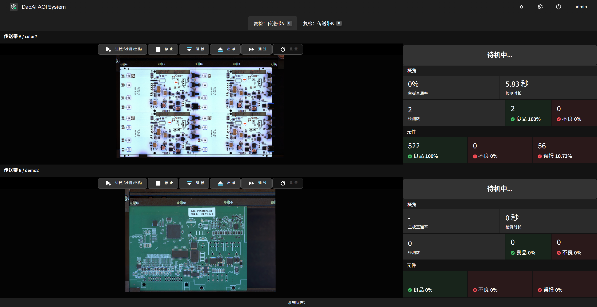
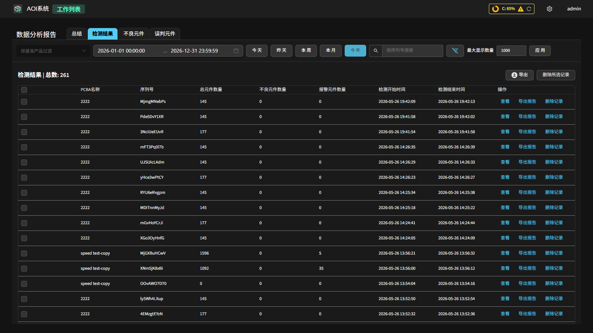

检测与反馈
==================

本章说明如何在系统中创建并执行检测任务、在实时检测页面中监控生产、通过复检页面审核缺陷并提交反馈，以及通过反馈迭代模型的基本流程。

.. contents::
   :local:
   :depth: 1

新建检测任务
-----------------

完成 PCB 产品创建并训练后，返回主页，点击 **新建检测任务**。弹窗标题为 **新检测任务**，在其中完成以下配置：

**传送带**
   选择对应的传送带（Conveyor A / B 等）。下拉选项旁会显示绿色（可用）或红色（占用中）状态点。

**选择一个 PCBA**
   从列表中选择目标 PCB 产品。可通过标签筛选缩小选项。点击 **刷新产品列表** 可拉取最新产品数据。

**选择任务模式**
   三种可选模式：

   - **自动连续运行任务**：适用于正式产线，板件进板后自动触发检测并循环。
   - **通过按钮触发运行任务**：每次检测须由操作员手动点击触发，适合调试阶段逐板查看。
   - **当检测到缺陷时自动停止检测以进行手动检查**：（等同于 ``pause_when_ng=true``）检测到不合格时自动暂停并跳转至复检。

**以演示模式运行**
   勾选后系统以演示模式启动。演示模式下，检测任务自动运行，当检测到缺陷时系统会在复检页面停留约 7 秒后自动返回实时检测页面并继续。按 ``Esc`` 可退出演示模式；演示模式下无法通过按钮手动触发检测。演示模式无需实物或硬件，可用于培训或流程验证。

**A/B 面检测（双产品模式）**
   若同时选择两个 PCBA，系统启用 A/B 面检测。此时每个产品均须在编程页面定义恰好一个 **独特标记** （unique marker），用于区分正面与反面。若两个产品的独特标记过于相似，系统将拒绝启动并提示错误。

完成配置后点击 **开始检测**，系统进行预检（模型状态检查、传送带权限获取）后自动跳转至实时检测页面。

.. image:: images/start_inspection.png
   :scale: 50%
   :alt: 新建检测任务

连续检测错误处理
-----------------

在连续检测模式下，遇到错误时系统是否自动停止由 ``pause_when_ng`` 配置项控制（参考 :ref:`系统JSON配置`）。说明如下：

- ``true``：检测到 NG（不良）或发生异常时，系统会自动暂停当前任务并停留在出错的子板位置，便于现场人工查看、定位并处理该子板；同时该条记录会被标记为不良并写入任务数据。此选项适用于需要逐板确认或即时干预的生产场景。
- ``false``：发生 NG 时系统不会中断生产，会按既定节拍继续运行并记录该子板为不良（或按设定分拣策略处理）。此模式适用于对产线吞吐要求较高且容许事后抽查或自动分拣的场景。

实时检测页面（Live）
---------------------------------

进入 ``/inspection/live`` 后，界面分为左侧传送带控制菜单、中央图像区和右侧统计信息栏三部分。

.. image:: images/inspect_page.png
   :scale: 50%
   :alt: 检测页面

**传送带控制菜单**
   页面左侧的竖排图标菜单，提供以下操作按钮（从上到下）：

   1. **进板并检测** （空格键）：进板后立即触发一次检测。
   2. **连续** / **停止连续**：开启或关闭自动连续检测模式。
   3. **检测**：仅触发一次检测，不进板。
   4. **停止**：停止当前检测任务。
   5. **进板**：仅让板件进入传送带，不触发检测。
   6. **出板**：将板件弹出传送带。
   7. **通过**：令板件直接通过（不检测）。
   8. **重置** （当前不可用）：重置传送带状态。

   进板类操作（**进板并检测**、**进板**、**出板**、**通过**）需要传送带访问令牌，若令牌未获取则按钮置灰。

**产品统计（产品统计）**
   右侧面板中部。显示当前任务内已检测板件的合格（**合格**）与不合格（**不合格**）计数，并附环形饼图。

**元件统计（元件统计）**
   产品统计下方（由 ``Live.jsx`` 注入 ``InspectionStatsPanel`` 的子内容）。按元件维度显示 **检测数**、**良率**、**不良率**、**误报率** 等指标。

**检测时长（检测时长）**
   显示上一块板的检测耗时（秒）。未完成任何检测时显示 ``-``。

**FPY（直通率）切换**
   统计面板上方有一个 Segmented 切换控件，选项为 **整板** 和 **子板**：

   - **整板**：以整块 PCB 为单位计算直通率（合格板 / 已检测板），标签显示 **主板直通率**。
   - **子板**：以子板为单位计算（仅适用于拼板产品），标签显示 **子板直通率**；非拼板产品显示 **N/A**。

   此设置通过 Redux（``state.setting.fpyMode``）持久化，切换后在页面刷新后仍保留。详见全局说明：:ref:`检测设置（子板判废逻辑）`。

**合格覆盖层（Pass Overlay）**
   检测结果为合格时，图像区上方会显示绿色全屏提示横幅，显示 **合格**。

**报废子板提示（检测到不合格子版）**
   拼板产品检测到有子板被判为废板时，界面会显示红色警告区域，包含以下信息：

   - 标题：**检测到不合格子版**
   - 说明：**检测到的缺陷数量超出阈值。**
   - 已启用比例模式时显示：**子版缺陷率阈值** 及当前阈值值。
   - 已启用坏板标记模式时额外显示斜体提示：**此产品已启用坏板标记模式 — 坏板判定可能由坏板标记检查决定，而非失败比例。**
   - 表格列出废板子板的编号（``#``）和元件NG率（**元件NG率**）。

.. image:: images/inspect_review_page.png
   :scale: 50%
   :alt: 检测复审页面

检测到缺陷时，系统会自动跳转到缺陷详情视图，可查看放大图、定位框、缺陷类型和判定依据，并可立即进行人工反馈。

双轨检测系统
-------------------

对于配置了双轨检测的系统，检测页面会同时显示左右两条传送带的并行检测视图；操作与单轨系统类似，但在视图切换与记录检索上增加了分轨能力：

1. 按 ``Enter`` 会查询未读的检测记录，默认优先显示左轨，随后显示右轨（两轨独立计数与统计）。
2. 通过上方标签页在"左轨 / 右轨"间切换，分别查看各自的历史记录与缺陷详情。

复检页面（Review）
---------------------------------

复检页面（``/inspection/review``）用于审核检测结果、提交缺陷反馈和创建替代料。页面布局为：左侧不良元件列表、中央图像查看区、右侧反馈与特征错误面板。

.. screenshot-todo: Review page overview screenshot

**左侧：不良元件列表（NG Component List）**
   滚动列表，显示当前检测记录中所有被判为不合格的元件（设计位号）及其错误数量。点击某行选中该元件，图像区随即跳转到该元件的缺陷视图。已标注"已重新定义ROI"的行会显示黄色左边框提示。

**中央：图像查看区**
   上半区显示整板缩略图（基准 + 检测结果叠加），下半区显示所选元件的放大缺陷图、定位框、基准图像。可通过 ``\`` 键循环切换 **网格视图（上下平分）** / **聚焦下排** / **聚焦上排** 三种布局。

**右侧上方：元件级错误和缺陷反馈**
   显示系统配置的所有反馈类别（由 ``systemMetadata.error_type_to_code`` 决定），每张卡片右下角标注对应快捷键（见下方快捷键说明）。点击卡片或按快捷键即可提交元件级反馈。当前系统预测的错误类别高亮显示（红色背景）；已提交过反馈的条目会出现拇指图标。

**右侧下方：特征错误（Feature Error）面板**
   可折叠，显示所选元件各特征（本体、焊料、引脚等）的详细检测结果，并可分别提交特征级反馈、添加模糊匹配或添加替代料参考。

**子版信息（Array Info）**
   拼板产品时显示，列出当前板各子板的状态及元件NG率。使用 ``→`` 键可切换到下一个子板索引。

**导航与反馈按钮**
   - **返回实时检测**：回到 ``/inspection/live`` 页面。
   - **返回工作列表**：回到数据分析报告页面。

**添加为替代料**
   当某元件外观与基准差异较大但属可接受情形（如封装变化、引脚形态变化等），可在右侧面板点击 **添加为替代料** 或按 ``F`` 键。系统提供两种操作方式：

   - **沿用当前元件图像**：使用当前检测图像直接创建替代料。
   - **在视野图上绘制 ROI**：在 FOV 图上重新圈定元件区域后再创建替代料。

   创建完成后系统提示是否停止正在运行的检测任务——新建替代料需在模板编辑页重新训练后方能生效。有关替代料的完整说明，请参见 :doc:`../features/variations`。

**标注复检完成**
   完成反馈后，可将当前检测记录标注为已复检，供后续数据分析使用。

.. _快捷键:

复检快捷键
-----------------

复检页面底部的 **快捷键说明栏** 显示常用快捷键（不含上下文相关快捷键）：

.. list-table::
   :widths: 30 70
   :header-rows: 1

   * - 按键
     - 功能
   * - ``↑`` / ``↓``
     - 下一个/上一个不良元件
   * - ``←``
     - 切换到下一个不良特征/元件视图
   * - ``→``
     - 切换子版索引
   * - ``1``–``9``
     - 提供反馈（对应反馈列表第 1–9 项）
   * - ``Ctrl`` + ``1``–``9``
     - 提供反馈（第 10–18 项）
   * - ``Alt`` + ``1``–``9``
     - 提供反馈（第 19–27 项）
   * - ``Ctrl+Alt`` + ``1``–``9``
     - 提供反馈（第 28–36 项）
   * - ``M``
     - 显示标记图像
   * - ``[`` / ``]``
     - 展开/收起侧面板
   * - ``\``
     - 切换视图布局（网格 / 聚焦下排 / 聚焦上排）
   * - ``Esc``
     - 关闭标记窗口

.. note::
   ``F`` 键为上下文快捷键，**不在底部快捷键说明栏中显示**：选中 OCR/文字特征时，在右侧特征面板内按 ``F`` 可添加模糊匹配或替代料，仅当 OCR/文字特征处于选中状态时有效。

.. note::
   反馈快捷键仅识别 ``1``–``9``，不识别 ``0``。对应关系如下：``1``–``9`` 选第 1–9 项；``Ctrl+1``–``9`` 选第 10–18 项（偏移 +9）；``Alt+1``–``9`` 选第 19–27 项（偏移 +18）；``Ctrl+Alt+1``–``9`` 选第 28–36 项（偏移 +27）。键盘最多可寻址 36 项。具体对应的反馈类别由系统管理员在产品或系统配置中设定（``error_type_to_code``）。

查看检测历史（数据分析报告）
-----------------------------------

在主页点击 **工作列表** 进入 **数据分析报告** （路由 ``/worklist``）。页面顶部有四个标签页，下方为过滤栏，内容区随选中标签页切换。

**四个标签页**

- **总结**：总览统计指标、NG/OK 环形图及前十不良元件柱状图。
- **检测结果**：逐条列出每次检测记录，支持进入复检。
- **不良元件**：按元件维度汇总不良结果，便于定位高发问题元件。
- **误判元件**：按元件维度汇总误报结果，用于优化模型减少误报。

**过滤栏**

过滤栏位于标签页下方，所有标签页共用以下过滤项：

- **按基准产品过滤**：下拉选择指定产品（仅限已训练的基准产品），不选则显示全部产品数据。
- **时间范围**：日期时间区间选择器（**从** / **到**）。可直接输入或点击以下快捷按钮自动填充：**今天** / **昨天** / **本周** / **本月** / **今年**。
- **按序列号搜索**：按板件序列号（S/N）过滤。
- **最大显示数量**：限制列表最多显示的条目数（默认 1000），输入后点击应用生效（**总结** 标签页无此项）。
- 在 **不良元件** 和 **误判元件** 标签页下，过滤栏额外显示 **按位号/料号搜索** 输入框，可按元件位号或料号过滤。

.. image:: images/worklist.png
   :scale: 50%
   :alt: 数据分析报告-总结

**总结 标签页**

**总结** 标签页由三个并列面板组成：

**总览（Overview）面板**
   显示所选时间范围内的整体统计数据，分为两个区域：

   - **PCBA** （整板维度）：检测总数、良好 **良好** 板数及占比、不良 **不良** 板数及占比。
   - **报警元件** （元件维度）：报警元件总数 （``defective_component_count``），以及：

     - **不良**：经反馈确认为不良的元件数及其 PPM 值；
     - **误判**：被误报（系统预测不良但反馈为良好）的元件数及其 PPM 值；
     - **DPU**：每板平均缺陷数（Defects Per Unit）。

   面板底部显示当前查询的时间范围（**从** … **到** …）。

**不良/良品比 面板**
   以环形图（Donut Chart）直观展示合格（**合格**）与不良（**不良**）板件的数量与百分比；图例显示绿色（合格）和红色（不良）色块。

**前十不良元件 面板**
   当选定了具体基准产品时，展示该产品下报警次数最多的前 10 个元件，以横向柱状图呈现（X 轴为元件数量，Y 轴为元件位号）。未选择基准产品时显示提示文字，要求先选择产品。

**检测结果 标签页**

**检测结果** 标签页以列表形式列出每一条检测记录，各列含义如下：

- **PCBA名称**：本次检测所用基准产品名称。
- **序列号（S/N）**：板件序列号（无序列号时为空）。
- **总元件数量**：本次检测中参与检测的元件总数。
- **不良元件数量**：经反馈确认为不良的元件数。
- **报警元件数量**：系统报警（含待复检）的元件总数。
- **检测开始时间** / **检测结束时间**：本次检测的开始和结束时间戳。
- **操作**：每行提供以下操作按钮：

  - **查看**：跳转至复检页面，在左侧查看该次检测的不良元件列表，在中部与右侧查看整板缩略图、缺陷放大图、定位框、缺陷类型与判定依据，并可直接提交反馈。
  - **导出报告**：在新标签页打开该条记录的详细报告页面。
  - **删除记录**：删除该条检测记录。

列表顶部提供 **导出 CSV** 和 **删除选中记录** 操作，支持多选后批量删除。

.. image:: images/worklist2.png
   :scale: 50%
   :alt: 复检详情与反馈

在复检详情中，左侧列出该次检测的不良元件，中部与右侧展示整板及缺陷的放大图、定位框、缺陷类型与判定依据，并可直接反馈；反馈结果将回写到数据集。

**不良元件 / 误判元件 标签页**

**不良元件** 和 **误判元件** 标签页结构相同，均以列表形式展示元件级别的汇总结果，各列含义如下：

- **图片**：元件的检测截图缩略图。
- **位号**：元件设计位号（Designator）。
- **料号（Part No.）**：元件料号（未设置时显示 N/A）。
- **拼版序列号**：子板序列号（非拼板产品显示 N/A）。
- **主序列号**：整板序列号（无时显示 N/A）。
- **拼版索引**：元件所属子板的序号（非拼板产品为空）。
- **状态**：**良品** （系统判定通过）或 **不良** （系统判定不良）。
- **不良类型**：经反馈确认的不良类型（未提供反馈时显示 N/A）。
- **预测错误**：系统预测的错误类型（无预测时显示 N/A）。

列表顶部显示元件总数并提供 **导出 CSV** 按钮。

两个标签页的区别：**不良元件** 显示系统预测不良且反馈确认为不良的元件；**误判元件** 显示系统预测不良但反馈标记为良品（即误报）的元件，用于分析误报来源。

.. note::
   **子板良率（FPY）与坏板标记**：对于拼板产品，良率可在 **整板** 与 **子板** 口径间切换，按实际检测的子板数统计；非拼板产品的子板口径显示为 N/A。被标记为 **坏板标记** 的元件用于驱动子板好 / 坏判定，但 **不计入** 复检 NG 列表，也不计入数据分析报告的 总数 / 告警 / NG 统计。子板的自动判废逻辑（比例模式 / 坏板标记模式）在 :ref:`检测设置（子板判废逻辑）` 中配置。

反馈与模型迭代
---------------------------------------

提交的反馈会加入到产品的数据集中。推荐的迭代流程：

1. 进行一批次的检测，在工作列表里查看并提供反馈，反馈后的数据可以加到数据集中。

2. 回到产品编程页面，执行训练来更新模型（训练通常耗时约 1 分钟，视硬件而定）。

3. 执行"评估全部"以检查各元件状态并针对仍为不合格的项微调参数。参考 :ref:`检测参数` 章节以了解具体的调参方法。
