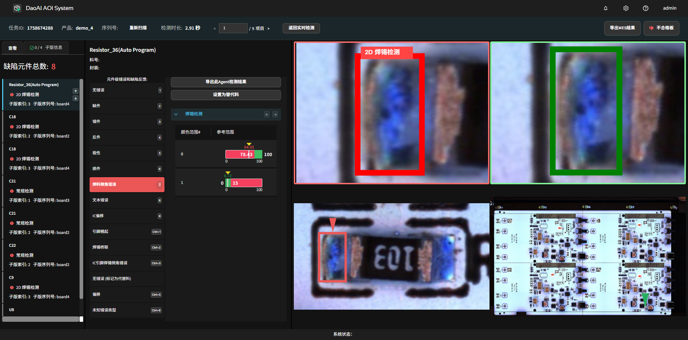
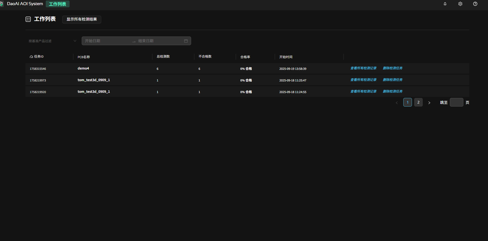
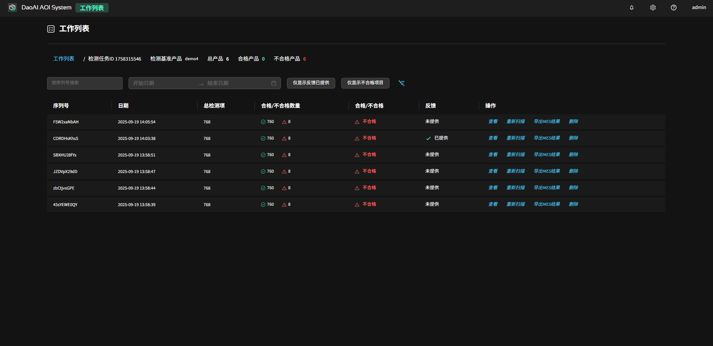

检测与反馈
==================

本章说明如何在系统中创建并执行检测任务、查看历史记录与反馈数据，以及通过反馈迭代模型的基本流程。

.. contents::
   :local:
   :depth: 1

新建检测任务
-----------------

完成 PCB 产品创建并训练后，返回主页开始检测任务：

1. 点击“新建检测任务”。
    .. image:: images/start_inspection.png
        :scale: 50%
        :alt: 新建检测任务
        
2. 在任务配置中选择目标 PCB 产品、对应的传送带（conveyor）以及启动模式：单次触发 / 自动连续。
   
   - 建议在调试阶段使用 **单次触发** 模式以便逐板查看；正式生产可以使用 **自动连续** 模式。
    
      .. image:: images/start_mode.png
         :scale: 80%
         :alt: 启动模式选择

连续检测错误处理
-----------------

在连续检测模式下，遇到错误时系统是否自动停止由 `pause_when_ng` 配置项控制（参考 :ref:`系统JSON配置`）。说明如下：

- `true`：检测到 NG（不良）或发生异常时，系统会自动暂停当前任务并停留在出错的子板位置，便于现场人工查看、定位并处理该子板；同时该条记录会被标记为不良并写入任务数据。此选项适用于需要逐板确认或即时干预的生产场景。
- `false`：发生 NG 时系统不会中断生产，会按既定节拍继续运行并记录该子板为不良（或按设定分拣策略处理）。此模式适用于对产线吞吐要求较高且容许事后抽查或自动分拣的场景。

检测页面概览
-----------------

进入检测页面后，界面元素与操作：

.. image:: images/start_inspection_2.png
   :scale: 50%
   :alt: 检测页面

- **空格**：进板并立即开始检测。
- **左侧控制按钮**：进板 | 出板 | 通过 | 复位，用于手动控制生产节拍。
- **右侧信息栏**：实时显示检测计数、良率与缺陷统计信息。

检测到缺陷时，系统会自动跳转到缺陷详情视图，可查看放大图、定位框、缺陷类型和判定依据，并可立即进行人工反馈（判为良品/不良/忽略等）。

快捷键
-----------------

检测页面快捷键（缺陷详情视图）
~~~~~~~~~~~~~~~~~~~~~~~~~~~~~~

- `1–0` （数字键）：在缺陷详情视图中快速选择并反馈对应的预设缺陷类别；按住 `Ctrl` + 数字键 可访问扩展类别（例如 `Ctrl`+`1` 表示类别 11）。
- `上 / 下` （方向键）：切换上一条 / 下一条缺陷记录。
- `左` （方向键）：在同一元件的不同缺陷类型之间切换（例如主体与引脚的缺陷视图）。
- `右` （方向键）：切换子版索引。
- `Enter` ：返回上一条检测记录；若当前为最新记录，则返回检测概览页面。
- `空格` ：进板并立即开始检测。

快速反馈快捷键
~~~~~~~~~~~~~~~~~~~~~~

以下为系统预设的缺陷反馈类别及其对应编号：

   1. 无错误
   2. 缺件
   3. 错件
   4. 反件
   5. 极性错误
   6. 损件
   7. 焊料倒角错误
   8. 文本错误
   9. IC 偏移
   10. 引脚翘起（快捷键：`Ctrl`+`1`）
   11. 焊锡桥联（快捷键：`Ctrl`+`2`）
   12. IC 引脚焊锡倒角错误（快捷键：`Ctrl`+`3`）
   13. 无错误（标记为代替料）
   14. 倾移 / 偏移（快捷键：`Ctrl`+`5`）
   15. 未知错误类型（快捷键：`Ctrl`+`6`）

说明：

    - 列表序号对应界面上的反馈项顺序，具体项目及快捷键可由系统管理员在产品配置或前端界面中定制。
    - 在缺陷详情视图中，可使用数字键 `1–0` 快速反馈常用类别；对于扩展类别（界面上带有 `Ctrl+` 的项），可按 `Ctrl` + 对应数字触发。

编程页面快捷键
~~~~~~~~~~~~~~~~~~~~~~~~~~~~~~~~~~

.. image:: images/program_page.png
   :scale: 50%
   :alt: 编程页面

- `Ctrl+C` / `Ctrl+V`：复制并粘贴当前元件（包含所有检测框与属性）。
- `W` / `A` / `S` / `D`：在选中检测框时微调框的位置；在选中移动工具时移动视图。
- `V`：切换到选择工具。
- `H`：切换到移动（拖拽）工具。
- `1`：切换到主体工具。
- `2`：切换到焊料工具。
- `3`：切换到 IC 引脚工具。
- `4`：切换到 OCR（文本）工具。
- `5`：切换到条形码工具。

查看检测历史（工作列表）
-----------------------------------

在主页点击“工作列表”进入历史任务页面。

首先会看到按时间范围聚合的总览统计视图：可以通过时间筛选查看 今天 / 昨天 / 本周 / 本月 / 今年 / 自定义时间段内的总检测板数、良率、NG 数量以及主要缺陷分布，帮助快速评估整条产线在该时间段内的整体健康状况。

在左上方下拉框中选择某个产品后，页面会切换为该产品的统计视图：展示在选定时间范围内的 PCBA 总数、良好 / 不良数量及比例、不良与误判元件的 PPM、DPU 指标，以及右侧“前十不良元件”的分布情况，便于按产品维度快速定位主要问题器件和整体良率水平。

切换到 **检测结果** 标签页时，会按时间范围列出每一次检测任务的记录：
包括 PCB 名称、序列号、总元件数、不良元件数、报警元件数以及检测起止时间等。

当前列表可导出为 XLSX / PDF 报告；点击列表内右侧的“查看”还可进入对应板次的检测详情页，
在详情中逐条查看缺陷并集中完成反馈，实现“先检测，后统一复审”。

.. image:: images/worklist3.png
   :scale: 50%
   :alt: 缺陷记录与反馈

切换到 **不良元件/误判元件** 标签页时，系统会将选定时间范围内的所有不良元件汇总成列表：
包含元件缩略图、位号、料号、拼版索引、状态、不良类型以及预测错误原因等字段，便于从元件维度排查问题。

该列表支持导出为 CSV / XLSX 报表，其中 XLSX 导出会附带元件图片，方便离线分析与共享。

.. image:: images/worklist4.png
   :scale: 50%
   :alt: 缺陷记录与反馈

反馈与模型迭代
---------------------------------------

正确、稳定的反馈是确保模型迭代效果的关键。

AI 更新按钮
~~~~~~~~~~~~~~~~~~~~

.. image:: images/AI_update_button.png
   :scale: 50%
   :alt: AI 更新按钮

在完成反馈后，可以点击 **AI 更新** 按钮。系统会基于最新的反馈数据自动微调模型参数，无需中断当前检测任务，从而持续提升检测效果。

反馈数据记录开关
~~~~~~~~~~~~~~~~~~~~~~

开启该开关后，新产生的反馈会被记录下来，并作为模型训练数据使用，自动加入对应产品的数据集；关闭后，系统仅在工作记录中保存反馈结果，不再将其写入训练集。

.. image:: images/feedback_toggle.png
   :scale: 50%

标注为替代料
~~~~~~~~~~~~~~~~~~~~~~

当某些元件在外观或形态上与模板存在较大差异，但经工程确认仍属可接受时，可将该元件标记为“替代料”。系统会在反馈中记录此标注，并在后续的数据汇总与模型训练中将其作为独立类别纳入考虑，以便区分替代料与真实缺陷、降低误报并支持模型适配。

1. **进行检测并提供反馈**

   - 在检测页面中，逐条检查检测结果。
   - 对于真实错误，准确反馈对应的错误类型。
   - 对于非真实错误（如因对齐错误或成像模糊导致的误报），不要反馈，直接跳过即可。
   - 确保反馈的准确性，始终只针对真实的检测结果提供反馈。
   - 完成本轮检查后，适时停止检测任务。

2. **检查训练集**

   - 在产品编程页面，模板编辑器中查看已反馈的数据，确保反馈的样本具有代表性且质量可靠。
   - 删除或调整明显错误的反馈记录，避免因错误反馈导致模型性能下降。

3. **重新训练模型**

   - 点击“训练”按钮来更新模型。

4. **自动更新参数并评估**

   - 执行“评估全部”以检查各元件的状态。
   - 系统会根据训练结果自动更新检测参数。
   - 针对仍为不合格的项，参考 :ref:`检测参数` 章节，手动微调参数以优化检测效果。

通过以上流程，可以有效避免因错误反馈导致的模型性能下降，同时确保模型能够持续优化，适应生产需求。

训练集质量如何影响结果（关键指南 + 对比示例）
~~~~~~~~~~~~~~~~~~~~~~~~~~~~~~~~~~~~~~~~~~~~~~~~~~~~~~~~~~~

高质量训练数据应满足以下条件：

   #. **对齐准确**: 确保元器件在图像中的位置居中，无偏移，旋转以及歪斜。

   #. **图像清晰**： 确保图像无模糊，拖影，噪声以及压缩失帧。

   #. **光照统一**： 确保图像无明暗变化，反光或阴影；还需保持拍摄条件保持一致性。

   #. **无缺陷的**： 确保所有元器件均为完好无损状态，无破损、污渍，偏移，虚焊或其他影响检测的缺陷。

   #. **一致性好**： 确保同类图像中的元器件在背景、色调和尺寸等方面保持一致性，以提高检测的准确性 。

**案例对比：训练集质量对检测结果的影响：**

- 以下实验展示了不同质量训练集对检测得分的直接影响。

  - **高质量训练集**
   在下列高质量电阻训练集中

   .. image:: images/high_quality_Resistor_dataset.png
      :scale: 50%
      :alt: 高质量训练集示例

   我们使用一张偏移50% （异常得分结果为 0.244）和一张电阻缺失（异常得分结果为0.42）的训练图像进行训练。
   检测结果的图像得分分布如下：

    .. image:: images/high_quality_Resistor_result.png
       :scale: 70%
       :alt: 高质量训练集检测结果

   结果显示，偏移50%的图像得分接近0.25，缺失电阻的图像得分接近0.43，均高于原有的数据集，并成功检测出超出阈值的异常。

  - **低质量训练集**：
   在下列低质量电阻训练集中

   .. image:: images/low_quality_Resistor_dataset.png
      :scale: 50%
      :alt: 低质量训练集示例

   我们同样使用一张偏移50% （异常得分结果为 0.244）和一张电阻缺失（异常得分结果为0.247）的训练图像进行训练。
   检测结果的图像得分分布如下：

    .. image:: images/low_quality_Resistor_result.png
       :scale: 70%
       :alt: 低质量训练集检测结果

   结果显示，有缺陷的数据集和我们使用的低质量训练集相交，导致区分度降低，异常得分未能显著高于正常数据，影响了检测效果。

**总结:** 高质量的训练集是AI检测系统性能的基础。
在保持光照、对齐、清晰度和样本一致性的前提下，模型才能稳定地学习到正确的特征分布，从而在实际检测中实现更高的准确率与更低的误报率。

