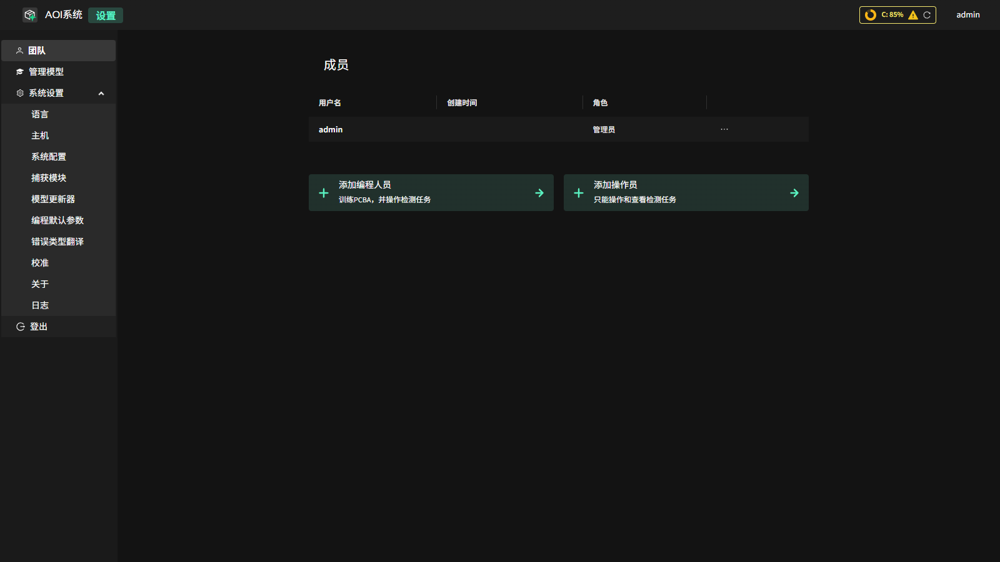
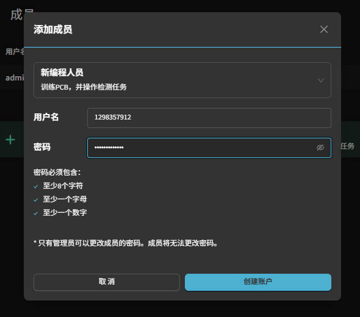
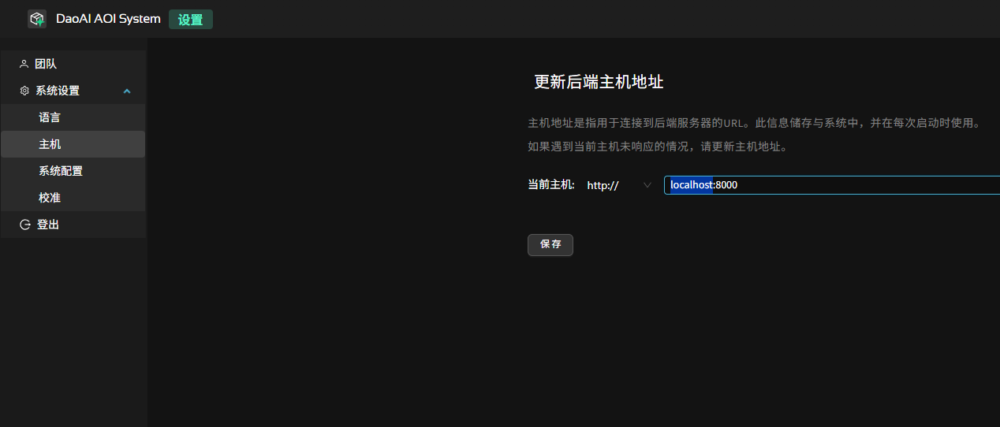
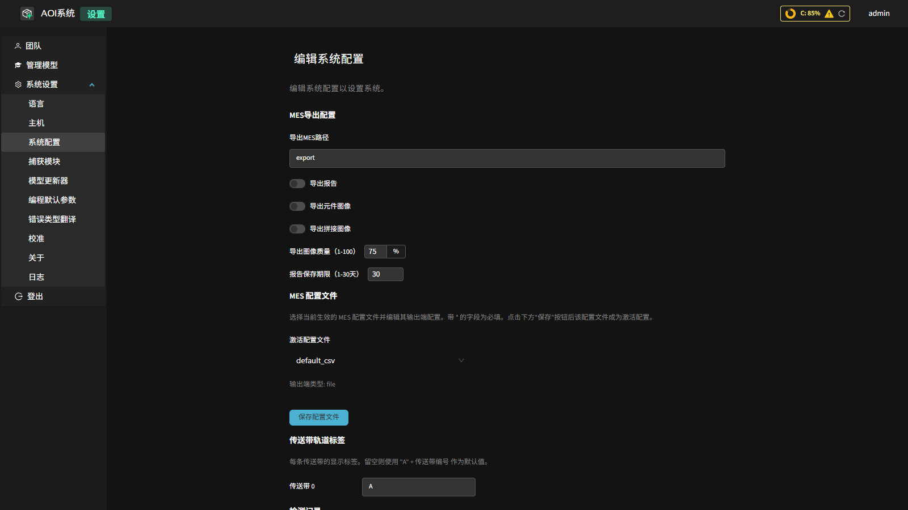
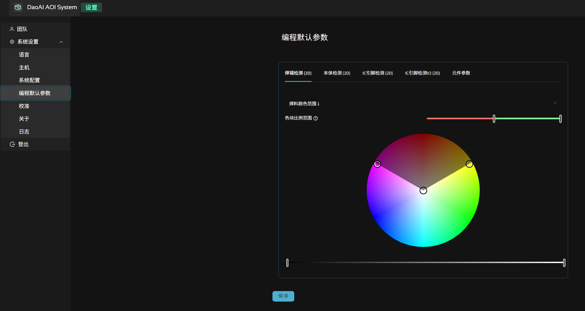
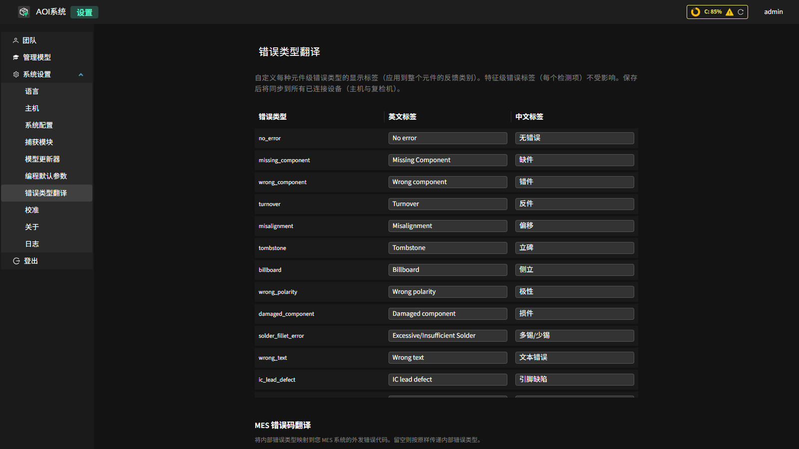
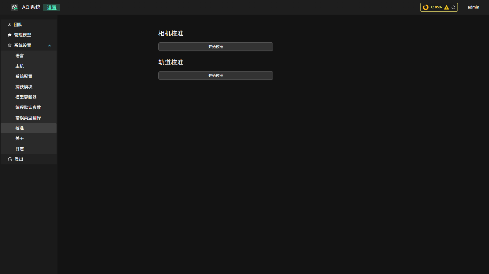
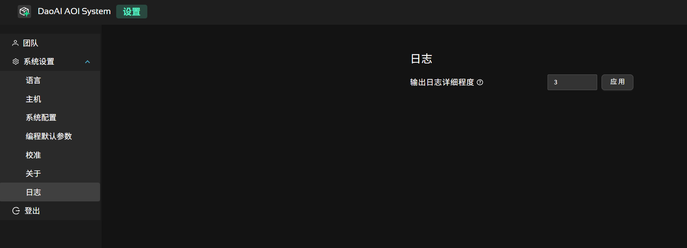
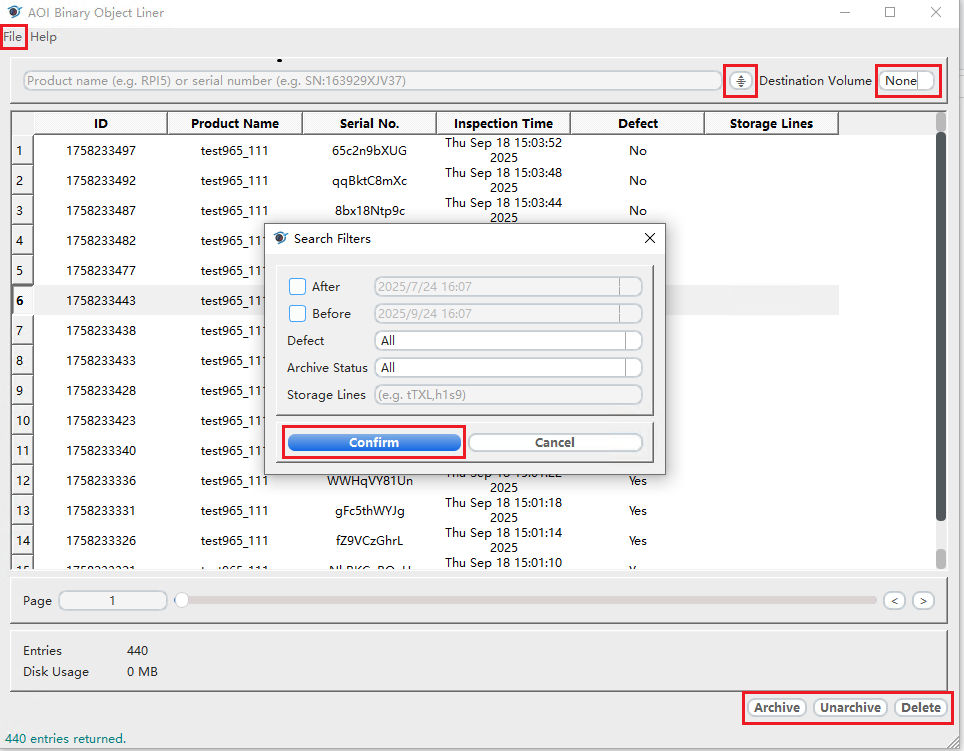
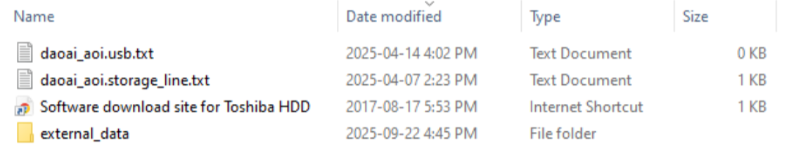

系统管理
=================

本章节介绍系统级通用配置。点击右上角 **齿轮图标** 进入 **设置**，左侧导航栏分为以下主项：**团队**（仅 Admin 可见）、**管理模型**、**系统设置**（含 语言、主机、系统配置、捕获模块、模型更新器、编程默认参数、错误类型翻译、标签、校准、关于、日志）以及 **登出**。

.. note::
	若为首次部署且尚未创建其他账号，请使用部署时提供的 `admin` 初始账号登录完成基础配置。

用户与角色权限
----------------------

系统内置三类角色（当前版本账号创建后不支持在界面内修改角色或禁用 / 启用，只能新增与删除）：

.. list-table:: 角色与权限对照
   :header-rows: 1
   :widths: 12 30 28

   * - 角色
     - 权限范围
     - 典型使用场景
   * - Admin
     - 全部功能（含成员/角色管理）
     - 工程负责人 / 系统管理员
   * - 编程员
     - PCB 产品创建、编程、训练、检测
     - 视觉 / 工艺工程师进行模板与参数维护
   * - 操作员
     - 仅执行检测任务与缺陷反馈
     - 产线操作人员、巡检员

账号操作（仅 Admin）：

1. 进入：右上角齿轮 → **设置** → 左侧 **团队**。
2. 新增账号：点击"添加编程人员"或"添加操作员"快捷入口 → 填写 用户名（唯一）/ 初始密码 / 角色 → 保存。
3. 删除账号：在列表对应行点击省略号菜单 → **删除** → 确认。

.. note::
    操作完成或离开工位时，请立即在"设置"中登出，防止他人误用会话。

多语言设置
------------------

系统支持界面多语言（当前已支持：中文 / English）。多语言切换只影响 UI 字符串，不改变已创建的 PCB 产品名称与元件标识。

切换步骤：

1. 登录后点击右上角齿轮进入 **设置**。
2. 在左侧 **系统设置** → **语言** 中找到"系统语言"。
3. 下拉选择目标语言（中文 / English）后，界面自动应用。

.. image:: ../../introduce/quick_start/images/change_language.png
	:scale: 60%
	:alt: 切换语言示意

.. note::
	语言切换不会重启后端；若浏览器多标签页打开本系统，请全部刷新以保持一致。

后端地址管理
------------------

用于让当前浏览器前端连接指定的后端服务实例，并在多个部署环境（本地 / 测试 / 生产 / 备用节点）之间快速切换。

常见使用场景：

1. 产线上使用笔记本或平板（Wi‑Fi）直接访问机台后端，无需占用后端主机显示器。
2. 质检 / 工程 人员可在不同工位快速切换到测试或生产环境查看训练 / 检测状态。
3. 支持远程协助：暂时指向测试服务器复现问题，再切回生产。
4. 集中管理：同一前端界面可按需切换不同产线后端，统一查看检测结果、启动训练或执行任务，无需分别登录多台主机。

切换步骤：

1. 点击右上角齿轮 → **设置**，在左侧选择 **系统设置** → **主机**。
2. 在"当前主机"输入框中查看 / 修改后端地址（默认为 `localhost:8000`）；可通过协议前缀下拉框选择 `http://` 或 `https://`。
3. 输入新的服务地址（含端口，如 `10.0.0.12:8000`）。
4. 点击"保存"，页面自动重新连接。

.. _系统JSON配置:

系统配置
-------------

进入路径：右上角齿轮 → **设置** → **系统设置** → **系统配置**。

页面标题为"编辑系统配置"，包含以下几个配置区块（Admin / 编程员 可见）：

**MES导出配置**

用于配置将检测结果导出至 MES 系统的行为。

.. list-table:: MES 导出选项说明
   :header-rows: 1
   :widths: 24 58 18

   * - 选项
     - 说明
     - 值
   * - 导出MES路径
     - 用于保存导出的 MES 文件与相关资源；请确保目标目录存在且有写入权限。
     - 导出路径的绝对地址
   * - 导出报告
     - 导出包含检测概览、统计与缺陷摘要的报告文件，便于对外流转与存档。
     - 开启/关闭
   * - 导出元件图像
     - 针对每个缺陷元件导出裁剪的局部图像，便于 MES 或质检系统联动查看细节。
     - 开启/关闭
   * - 导出拼接图像
     - 导出整板拼接大图，用于复核现场光照、对齐与整体检测效果。
     - 开启/关闭
   * - 导出图像质量（1-100）
     - 控制导出 JPEG 等有损格式的压缩质量；数值越大图像越清晰、文件体积越大。
     - 1–100
   * - 报告保存期限（1-30天）
     - 在导出目录中为报告与图像设置保留天数；超过期限的历史文件可由系统定期清理，节省空间。
     - 1–30 天

**检测记录**

管理检测结果数据的保留与清理策略。

.. list-table:: 检测记录选项说明
   :header-rows: 1
   :widths: 28 52 20

   * - 选项
     - 说明
     - 值/示例
   * - 检测结果保留天数
     - 超过此天数的历史检测结果将在定时清理时被删除。
     - 天数（默认 90）
   * - 磁盘空间不足警告阈值（GiB）
     - 剩余磁盘空间低于此值时系统启动警告；设为 0 可禁用。
     - GiB（默认 30）
   * - 大文件存储位置
     - 检测图像等大文件的存储卷；若默认盘空间不足可切换至其他卷，修改后需重启生效。
     - 目录路径（留空为默认）
   * - 定时清理
     - 启用后，系统将在指定时间自动清理超期检测记录。
     - 开启/关闭
   * - 定时清理时间
     - 定时清理任务的执行时刻（格式 HH:MM，24 小时制）。
     - 如 ``01:00``
   * - 立即清除检测记录
     - 点击后立即触发清理任务，将超过保留天数的检测记录删除。适用于需要快速释放磁盘空间的场景。
     - 按钮

**合格结果二次确认**

启用后，实时检测页面检测到合格（OK）时弹出确认窗口，由操作员手动判定合格或不合格。

捕获模块
--------------------

进入路径：右上角齿轮 → **设置** → **系统设置** → **捕获模块**。

页面标题为"捕获模块"（Admin / 编程员 可见），提供采集与传感器的关键参数编辑，修改后保存并自动重载页面。

**图像拼接配置** \ （对应 ``capture_agent/capture_agent_config.json`` 中的 ``image_stitching_config``）

.. list-table:: 图像拼接配置字段
   :header-rows: 1
   :widths: 32 68

   * - 字段（界面标签）
     - 说明
   * - 最大偏移像素 X（max_offset_pixel_x）
     - 图像拼接时水平方向允许的最大像素偏移量。
   * - 最大偏移像素 Y（max_offset_pixel_y）
     - 图像拼接时垂直方向允许的最大像素偏移量。
   * - 重叠（overlap）
     - 相邻采集帧之间的重叠区域大小。
   * - 使用可变重叠（use_variable_overlap）
     - 开关。启用后拼接算法将动态调整重叠区域大小。

**捕获路径** \ （dev only）（对应 ``capture_agent/capture_agent_config.json`` 中的 ``steps[0].path``）

- **步骤路径（steps path）**：采集输出目录；虚拟相机模式下系统从此目录读取图像。仅开发调试使用。

**传感器配置（2D）** \ （对应 ``capture_agent/sensor_config.json`` 中 ``sensors[0].camera_configs[0].config_2d``）

.. list-table:: 传感器 2D 配置字段
   :header-rows: 1
   :widths: 28 72

   * - 字段（界面标签）
     - 说明
   * - 增益（gain）
     - 传感器增益值；过高会引入噪声，过低则图像偏暗。
   * - 伽马（gamma）
     - 传感器伽马校正值。
   * - 曝光时间（exposure_time）
     - 基线曝光时间（单位因硬件而异）；现场光照稳定后再调整。

模型更新器
--------------------

进入路径：右上角齿轮 → **设置** → **系统设置** → **模型更新器**。

页面标题为"模型更新器配置"（Admin / 编程员 可见），用于在运行过程中根据现场图像统计自动或半自动更新各检测模块的颜色阈值与比例参数，以提升 2D 焊点 / 引脚等检测的稳健性。修改后保存并自动重载页面。

配置存储在 ``model_updater_config.json``。

**焊接 2D（solder_2d）**

.. list-table:: solder_2d 关键字段
   :header-rows: 1
   :widths: 32 48 20

   * - 字段
     - 说明
     - 示例/范围
   * - 更新颜色范围（update_color_range）
     - 是否允许在更新周期内自动调整颜色范围阈值区间。
     - 开启/关闭
   * - 更新颜色比例（update_color_ratio）
     - 是否允许根据统计结果更新颜色比例阈值，提高分割与缺陷筛选可靠性。
     - 开启/关闭
   * - AI更新覆盖（ai_update_override）
     - 是否允许 AI 模型的更新结果覆盖本地统计参数。
     - 开启/关闭
   * - 红色比例最小值（red_ratio_min）
     - 红色通道占比下限，用于限定有效焊点颜色特征范围。
     - 0–100（默认 0）
   * - 红色比例最大值（red_ratio_max）
     - 红色通道占比上限。
     - 0–100（默认 50）
   * - 非红色比例最小值（non_red_ratio_min）
     - 非红色通道占比下限；与红色比例共同约束目标的颜色分布，避免误检。
     - 0–100（默认 20）
   * - 非红色比例最大值（non_red_ratio_max）
     - 非红色通道占比上限。
     - 0–100（默认 100）

**引脚 2D V2（lead_2d_v2）**

.. list-table:: lead_2d_v2 关键字段
   :header-rows: 1
   :widths: 32 48 20

   * - 字段
     - 说明
     - 示例/范围
   * - 更新颜色范围（update_color_range）
     - 是否允许自动调整引脚区域的颜色范围阈值。
     - 开启/关闭
   * - 更新颜色比例（update_color_ratio）
     - 是否允许更新引脚颜色比例阈值。
     - 开启/关闭
   * - AI更新覆盖（ai_update_override）
     - 是否允许 AI 模型的更新结果覆盖本地统计参数。
     - 开启/关闭
   * - 焊接比例最小值（solder_ratio_min）
     - 引脚焊接区域颜色比例下限。
     - 0–100（默认 20）
   * - 焊接比例最大值（solder_ratio_max）
     - 引脚焊接区域颜色比例上限。
     - 0–100（默认 100）

.. note::
   - 开启自动更新（更新颜色范围 / 更新颜色比例）后，请在稳定的光照与工艺条件下运行一段时间以收集统计，避免短期波动导致参数过度调整。
   - 建议结合版本管理或备份原始配置文件，必要时可回滚到上一版本参数集。

编程默认参数
----------------------

进入路径：右上角齿轮 → **设置** → **系统设置** → **编程默认参数** \ （Admin / 编程员 可见）。

用途：为新建 PCB 产品或新增检测项提供一套"起始参数模板"。保存后，这些默认值将作为各模块的初始阈值与颜色范围。

页面以标签页方式呈现各检测模块（如 焊接检测 2D、引脚检测 2D、DIP 焊点检测等），以及一个 **其他参数** 全局配置页。

**其他参数（全局配置）**

.. list-table:: 其他参数说明
   :header-rows: 1
   :widths: 38 62

   * - 参数（界面标签）
     - 说明
   * - 允许旋转角度（allowed_rotation_degree）
     - 元件允许的最大旋转偏差（度，0–360）。
   * - 允许位移（mm）（allowed_shift_mm）
     - 元件允许的最大位置偏移（毫米）。
   * - 检测时是否拍摄整板
     - 启用后检测时将拍摄完整板面而非仅分区拍摄。
   * - 最大FOV对齐偏移（像素）
     - 视野对齐时允许的最大像素偏移（0–100）。
   * - 最大Mark点对齐偏移（像素）
     - 标记点对齐时允许的最大像素偏移（1–5000）。
   * - 默认反馈类型（default_feedback_type）
     - 检测复核时的默认反馈选项：OK（合格）或 NG（不合格）。

.. note::
   拼版判废比例（wasted_array_board_failure_ratio）已改为按产品配置，入口在 **编程页面 → 设置 → 检测设置**，此处不再显示。

错误类型翻译
----------------------

进入路径：右上角齿轮 → **设置** → **系统设置** → **错误类型翻译** \ （Admin / 编程员 可见）。

用于自定义元件级缺陷 / 错误类型的中英文显示标签，以及对应的 MES 厂商代码。保存后同步到所有已连接设备。

**错误类型中英文标签**

表格包含以下三列：

- **错误类型**：系统内置的错误类型标识（只读）。
- **英文标签**：在界面与报告中显示的英文名称，可按需自定义。
- **中文标签**：在界面与报告中显示的中文名称，可按需自定义。

编辑后点击 **保存** 生效。

**MES 错误码翻译**

将内部错误类型映射到 MES 系统的外发错误代码。留空则按原样传递内部错误类型。

- **错误类型**：系统内置的错误类型标识（只读）。
- **MES 厂商代码**：导出 MES 结果时使用的错误代码映射；留空表示原样传递。

标签管理
----------------------

进入路径：右上角齿轮 → **设置** → **系统设置** → **标签** \ （Admin / 编程员 可见）。

标签（Tags）是附加到 PCB 产品程序上的自定义分类标记，用于在产品列表和检测任务启动时快速筛选产品。标签一旦绑定到至少一个程序后即出现在此页面。

页面包含以下列：

- **名称**：标签的文本内容。
- **产品数**：使用该标签的产品数量（只读）。
- **操作**：**重命名** / **删除** 按钮。

操作说明：

- **重命名**：点击"重命名"按钮，在弹窗中输入新名称后确认；重命名将同步应用到该标签下的所有产品。若新名称与已有标签冲突将提示错误。
- **删除**：点击"删除"按钮，确认后该标签将从所有已绑定产品中移除。

.. note::
   在产品列表（首页）选中产品后可批量添加或移除标签；在编辑产品信息时也可为单个产品管理标签。

相机现场校准
--------------------

用于在线更新相机的内参 / 畸变参数，确保尺寸测量及对齐精度。当出现以下任一情况，建议执行一次现场校准：

1. 更换或重新安装相机 / 镜头；
2. 调整过镜头焦距或光圈，导致成像比例明显变化；
3. 相机支撑结构被移动、震动或维护后位置可能偏移；
4. 图像边缘出现明显拉伸 / 弯曲，或测量尺寸偏差增大；
5. 模板匹配稳定性下降（需先排除光照与污渍因素）。

.. note::
   校准操作会更新当前使用的标定文件（`certificate.bin`）。若需保留旧版本，可在执行前手动备份原文件。

前提准备：

- 使用官方提供的标定板（保持清洁、无划痕、无强反光）；
- 确保现场光照稳定，避免强烈局部反射；
- 传送带参数（宽度 / 速度）已正确配置。

操作步骤：

1. 打开：右上角齿轮 → **设置** → **系统设置** → **校准**。
2. 将标定板放置在传送带中央，棋盘格（或圆点阵）面朝上，整体尽量覆盖相机主要视野；保持平整、不倾斜。
3. 点击"开始校准"。系统将自动执行：进板 → 拍照采集 → 出板。
4. 采集完成后前端显示进度与结果状态；成功时出现"校准成功"提示。
5. 校准文件 `certificate.bin` 自动更新；可记录时间戳以便追溯。

.. warning::
   校准过程中勿触碰标定板或传送带，避免产生运动模糊导致参数偏差。

关于
----------

进入路径：右上角齿轮 → **设置** → **系统设置** → **关于**。

在该页面可以查询以下信息：

- **版本**：当前后端系统版本号。
- **加密密钥ID**：系统授权加密密钥标识符。
- **加密有效期至** \ （若存在）：授权到期日期；若已过期请联系 DaoAI 技术支持更新授权。

日志
------------

进入路径：右上角齿轮 → **设置** → **系统设置** → **日志**。

**输出日志详细程度** \ （logVerbosity）：取值范围 0–10，数值越大日志输出越详细。

.. note::
   较高的日志详细程度（如 8–10）可能使每次检测时长增加约 100–200 毫秒，生产环境建议保持较低值（默认 3），仅在排查问题时临时调高。

调整后点击 **应用** 立即生效，无需重启服务。

管理模型
----------------------

**设置** 左侧的 **管理模型** 用于查看系统中的检测模型（按 全部 / 预训练 / 已训练 筛选），并支持上传模型、训练模型、设为默认、重命名、导出与删除，以及数据集的导出 / 导入和训练预热重置等操作。模型训练、数据集导入 / 导出等完整流程详见 :ref:`模型管理` 章节。

数据备份和迁移
--------------------

随着检测记录不断积累，硬盘空间会逐渐减少，建议定期进行数据备份和清理。

请在安装目录下运行 `aoi_pcb_blob_liner.exe` 工具。

主要界面说明（见下图）：

- 左上角 File → FTP mount points 可配置 FTP 服务器，实现远程备份到 NAS 或其他网络硬盘。
- 右上角 Destination Volume 用于选择目标盘（如移动硬盘、第二磁盘等）。
- 上方搜索栏可按产品名或序列号快速检索检测记录。
- 搜索栏旁边的过滤器按钮可按日期、时间等条件过滤记录，便于批量操作。

操作步骤：

1. 选择目标盘（Destination Volume），如需远程备份可先配置 FTP。
2. 可通过搜索栏输入产品名或序列号，或点击 过滤器 按钮按日期/时间筛选需要迁移的检测记录。
3. 在列表中框选或按住 Shift 选中多个检测记录。
4. 点击下方 Archive 按钮，即可将选中的记录迁移至目标盘。
5. 如需恢复数据，可点击 Unarchive 按钮从目标盘导入。
6. 若需删除无用记录，可点击 Delete 按钮。

建议定期将重要检测数据备份到安全存储介质，防止因硬盘故障或空间不足导致数据丢失。
