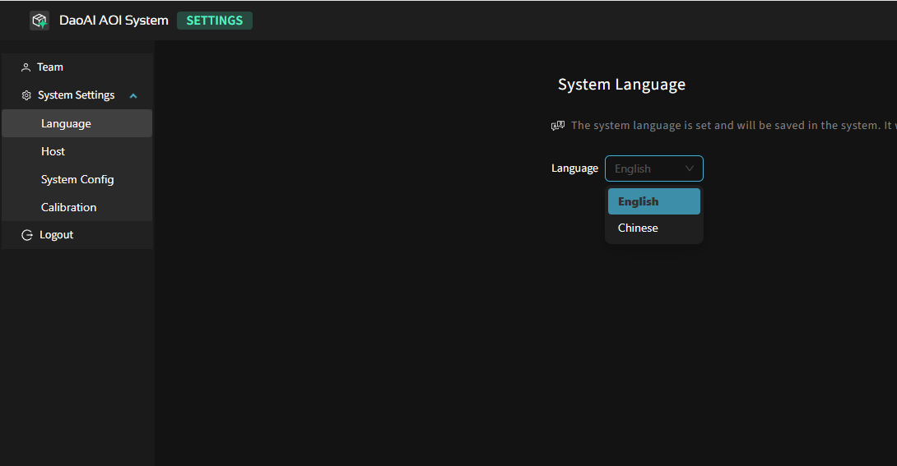
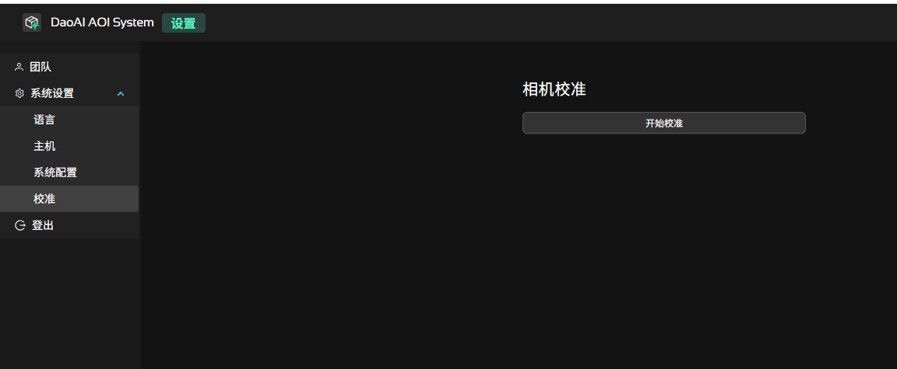

系统管理
=================

本章节介绍系统级通用配置

.. note::
	若为首次部署且尚未创建其他账号，请使用部署时提供的 `admin` 初始账号登录完成基础配置。

用户与角色权限
----------------------

系统内置三类角色（当前版本账号创建后不支持在界面内修改角色或禁用 / 启用，只能新增与删除）：

.. list-table:: 角色与权限对照
   :header-rows: 1
   :widths: 12 30 28

   * - 角色
     - 权限范围
     - 典型使用场景
   * - Admin
     - 全部功能（含成员/角色管理）
     - 工程负责人 / 系统管理员
   * - 编程员
     - PCB 产品创建、编程、训练、检测
     - 视觉 / 工艺工程师进行模板与参数维护
   * - 操作员
     - 仅执行检测任务与缺陷反馈
     - 产线操作人员、巡检员

账号操作（仅 Admin）：

1. 进入：右上角齿轮 → “设置” → “成员管理”。
2. 新增账号：点击“新增用户” → 填写 用户名（唯一，建议工号） / 初始密码 / 显示名称（可选） / 角色 → 保存。
3. 删除账号：在列表对应行点击“删除”（或垃圾桶图标）→ 确认。

.. note:: 
    操作完成或离开工位时，请立即在“设置”中登出，防止他人误用会话。

多语言设置
------------------

系统支持界面多语言（当前已支持：中文 / English）。多语言切换只影响 UI 字符串，不改变已创建的 PCB 产品名称与元件标识。

切换步骤：

1. 登录后点击右上角齿轮进入“设置”。
2. 在“通用”页签中找到“界面语言”。
3. 下拉选择目标语言后，界面自动应用。

.. note::
	语言切换不会重启后端；若浏览器多标签页打开本系统，请全部刷新以保持一致。

后端地址管理 
------------------

用于让当前浏览器前端连接指定的后端服务实例，并在多个部署环境（本地 / 测试 / 生产 / 备用节点）之间快速切换。 

常见使用场景：

1. 产线上使用笔记本或平板（Wi‑Fi）直接访问机台后端，无需占用后端主机显示器。  
2. 质检 / 工程 人员可在不同工位快速切换到测试或生产环境查看训练 / 检测状态。  
3. 支持远程协助：暂时指向测试服务器复现问题，再切回生产。  
4. 集中管理：同一前端界面可按需切换不同产线后端，统一查看检测结果、启动训练或执行任务，无需分别登录多台主机。  

切换步骤：

1. 点击右上角齿轮 → “设置”。
2. 找到“后端地址”输入框（默认为 `localhost:8000`）。
3. 输入新的服务地址（含协议与端口，如 `10.0.0.12:8000`）。
4. 点击“保存”或“应用”，页面自动重新连接。

相机现场校准
--------------------

用于在线更新相机的内参 / 畸变参数，确保尺寸测量及对齐精度。当出现以下任一情况，建议执行一次现场校准：

1. 更换或重新安装相机 / 镜头；
2. 调整过镜头焦距或光圈，导致成像比例明显变化；
3. 相机支撑结构被移动、震动或维护后位置可能偏移；
4. 图像边缘出现明显拉伸 / 弯曲，或测量尺寸偏差增大；
5. 3D 对齐或模板匹配稳定性下降（需先排除光照与污渍因素）。

.. note::
   校准操作会更新当前使用的标定文件（`certificate.bin`）。若需保留旧版本，可在执行前手动备份原文件。

前提准备：

- 使用官方提供的标定板（保持清洁、无划痕、无强反光）；
- 确保现场光照稳定，避免强烈局部反射；
- 传送带参数（宽度 / 速度）已正确配置。

操作步骤：

1. 打开：右上角齿轮 → “系统设置” → “相机校准”。
2. 将标定板放置在传送带中央，棋盘格（或圆点阵）面朝上，整体尽量覆盖相机主要视野；保持平整、不倾斜。
3. 点击“开始校准”。系统将自动执行：进板 → 拍照采集 → 出板。
4. 采集完成后前端显示进度与结果状态；成功时出现“校准成功”提示。
5. 校准文件 `certificate.bin` 自动更新；可记录时间戳以便追溯。

.. warning::
   校准过程中勿触碰标定板或传送带，避免产生运动模糊导致参数偏差。

系统配置
-------------

在这个页面，您可以查看和编辑系统的关键配置文件。这些配置文件以 JSON 格式存储，涵盖了采集、相机参数、算法设置以及系统行为等方面。请谨慎修改这些文件，建议在修改前备份原始文件。

.. image:: images/system_setting.png
    :scale: 60%
    :alt: 系统配置界面示意

捕获模块json配置
~~~~~~~~~~~~~~~~~~~~~~~~~~~~~~~

文件路径： ``<安装目录>/capture_agent/capture_agent_config.json``

用途：定义采集 / 标定流程（批次输出、使用哪些传感器、标定板规格与曝光基线）。

.. list-table:: capture_agent_config 关键字段
    :header-rows: 1
    :widths: 30 70

    * - 字段
      - 说明
    * - steps[].path
      - 采集输出目录；虚拟相机模式下系统从此目录读取图像。
    * - steps[].sensors
      - 参与采集的传感器 ID 列表（与 `sensor_config.json` 中 `id` 对应）。
    * - calibration_config.frame_config.exposure_stop / brightness / gain
      - 标定图像的曝光/亮度/增益基线；现场光照稳定后再调整。
    * - calibration_config.pattern_config.pattern_row / pattern_col
      - 标定板行列数（棋盘 / 点阵）。
    * - calibration_config.pattern_config.center_distance
      - 标定板相邻特征中心间距（mm）；仅更换不同规格标定板时需要更新。

传感器JSON配置
~~~~~~~~~~~~~~~~~~~~~~~~~~~~~~~~

文件路径： ``<安装目录>/capture_agent/sensor_config.json``

用途：单台或多台（2D/3D）相机参数与算法过滤。

.. list-table:: sensor_config 关键字段
      :header-rows: 1
      :widths: 32 68

      * - 字段
        - 说明
      * - sensors[].camera_name
        - 相机识别名。
      * - sensors[].id
        - 传感器编号（供采集 & 系统引用）。
      * - is_3d
        - 是否是 3D 相机。
      * - camera_configs[].config_2d.exposure_time / gain
        - 2D 基线曝光与增益。
      * - camera_configs[].config_3d.frame_settings[]
        - 3D 一次或多次帧曝光序列（多帧可实现类 HDR 动态范围）。
      * - camera_configs[].config_3d.algorithm_params: {40}
        - 算法滤波参数。

系统JSON配置
~~~~~~~~~~~~~~~~~~~~~~~~~

文件路径： ``<安装目录>/system_config.json``

用途：系统默认布局、检测项目默认参数、缺陷类型映射、拼版判废策略等。

.. list-table:: system_config 关键字段
      :header-rows: 1
      :widths: 34 66

      * - 字段
        - 说明
      * - pause_when_ng
        - NG 出现时是否暂停检测（true/false）。
      * - default_line_items.*
        - 各检测模块的初始参数模板（阈值、启用状态等）。
      * - wasted_array_board_failure_ratio
        - 拼版判废比例（NG 联数 / 总联数 > 该值 ⇒ 整板废）。例：阈值=0.5，5/8=0.625>0.5 → 废板。
      * - allowed_component_shift_mm / allowed_component_rotation_degree
        - 全局位移与旋转容差参考值（供对齐与健康度策略使用）。

模型更新器配置
~~~~~~~~~~~~~~~~~~~~~~~~~

文件路径： ``<安装目录>/model_updater_config.json``

用途：用于在运行过程中根据现场图像统计，自动或半自动更新模型相关的颜色阈值与比例参数，以提升 2D 锡膏/焊点等检测的稳健性与适配性。

.. list-table:: model_updater_config 关键字段（示例：solder_2d）
   :header-rows: 1
   :widths: 28 48 24

   * - 字段
     - 说明
     - 示例/范围
   * - solder_2d.update_color_range
     - 是否允许在更新周期内自动调整颜色范围（如红/非红通道的阈值区间）。
     - `true/false`
   * - solder_2d.update_color_ratio
     - 是否允许根据统计结果更新颜色比例阈值，用于区分焊点/背景（提高分割与缺陷筛选可靠性）。
     - `true/false`
   * - solder_2d.red_ratio_min / red_ratio_max
     - 红色通道占比的最小/最大阈值，用于限定有效焊点或目标区域的颜色特征范围。
     - 0–100（示例：0 / 50）
   * - solder_2d.non_red_ratio_min / non_red_ratio_max
     - 非红色通道占比的最小/最大阈值；与红色比例共同约束目标的颜色分布，避免误检。
     - 0–100（示例：20 / 100）

.. note::
   - 开启自动更新（`update_color_range` / `update_color_ratio`）后，请在稳定的光照与工艺条件下运行一段时间以收集统计，避免短期波动导致参数过度调整。
   - 建议结合版本管理或备份原始配置文件，必要时可回滚到上一版本参数集。

导出 MES 路径
~~~~~~~~~~~~~~

检测页面中，缺陷详情页面可以点击“导出 MES 结果”， 生成的文件将保存在配置的导出路径中。

.. list-table:: MES 导出选项说明
   :header-rows: 1
   :widths: 24 58 18

   * - 选项
     - 说明
     - 值
   * - 导出路径
     - 用于保存导出的 MES 文件与相关资源；请确保目标目录存在且有写入权限。
     - 导出路径的绝对地址
   * - 是否导出报告
     - 导出包含检测概览、统计与缺陷摘要的报告文件（如 PDF/HTML），便于对外流转与存档。
     - `开启/关闭`
   * - 是否导出元件图像
     - 针对每个缺陷元件导出裁剪的局部图像，便于 MES 或质检系统联动查看细节。
     - `开启/关闭`
   * - 是否导出整版图像
     - 导出整板（或整联）大图，用于复核现场光照、对齐与整体检测效果。
     - `开启/关闭`
   * - 导出图像质量
     - 控制导出 JPEG 等有损格式的压缩质量；数值越大图像越清晰、文件体积越大。
     - 1–100
   * - 报告保存期限
     - 在导出目录中为报告与图像设置保留天数；超过期限的历史文件可由系统或脚本定期清理，节省空间。
     - 1–30 天

编程默认参数
----------------------

.. image:: images/default_program_params.png
   :scale: 60%
   :alt: 编程默认参数界面示意

用途：为新建 PCB 产品或新增检测项提供一套“起始参数模板”。保存后，这些默认值将作为各模块的初始阈值与颜色范围。

关于
----------

在该页面可以查询系统版本号、加密密钥ID。

日志
------------

.. image:: images/system_log.png
   :scale: 60%
   :alt: 系统日志界面示意

输出日志详细程度 1-10，数值越大日志越详细。默认值为 3

数据备份和迁移
--------------------

随着检测记录不断积累，硬盘空间会逐渐减少，建议定期进行数据备份和清理。

请在安装目录下运行 `aoi_pcb_blob_liner.exe` 工具。

主要界面说明（见下图）：

.. image:: images/aoi_pcb_blob_liner.png
  :scale: 60%
  :alt: 数据迁移示意

- 左上角 File → FTP mount points 可配置 FTP 服务器，实现远程备份到 NAS 或其他网络硬盘。
- 右上角 Destination Volume 用于选择目标盘（如移动硬盘、第二磁盘等）。
- 上方搜索栏可按产品名或序列号快速检索检测记录。
- 搜索栏旁边的过滤器按钮可按日期、时间等条件过滤记录，便于批量操作。

操作步骤：

1. 选择目标盘（Destination Volume），如需远程备份可先配置 FTP。
2. 可通过搜索栏输入产品名或序列号，或点击 过滤器 按钮按日期/时间筛选需要迁移的检测记录。
3. 在列表中框选或按住 Shift 选中多个检测记录。
4. 点击下方 Archive 按钮，即可将选中的记录迁移至目标盘。
5. 如需恢复数据，可点击 Unarchive 按钮从目标盘导入。
6. 若需删除无用记录，可点击 Delete 按钮。

.. image:: images/archive_file_in_target_volume.png
  :scale: 60%
  :alt: 目标磁盘中的归档文件示意  

建议定期将重要检测数据备份到安全存储介质，防止因硬盘故障或空间不足导致数据丢失。

