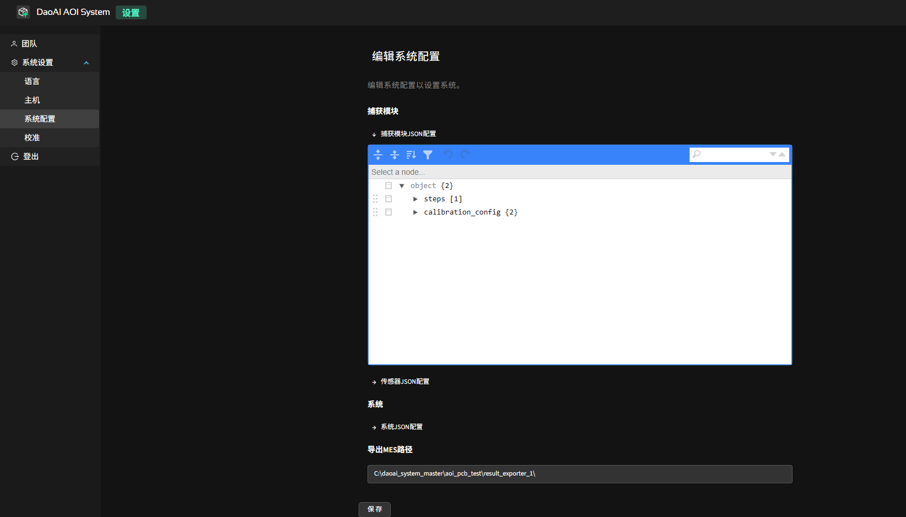

系统管理
=================

本章节介绍系统级通用配置

.. note::
	若为首次部署且尚未创建其他账号，请使用部署时提供的 `admin` 初始账号登录完成基础配置。

用户与角色权限
----------------------

系统内置三类角色（当前版本账号创建后不支持在界面内修改角色或禁用 / 启用，只能新增与删除）：

.. list-table:: 角色与权限对照
   :header-rows: 1
   :widths: 12 30 28

   * - 角色
     - 权限范围
     - 典型使用场景
   * - Admin
     - 全部功能（含成员/角色管理）
     - 工程负责人 / 系统管理员
   * - 编程员
     - PCB 产品创建、编程、训练、检测
     - 视觉 / 工艺工程师进行模板与参数维护
   * - 操作员
     - 仅执行检测任务与缺陷反馈
     - 产线操作人员、巡检员

账号操作（仅 Admin）：

1. 进入：右上角齿轮 → “设置” → “成员管理”。
2. 新增账号：点击“新增用户” → 填写 用户名（唯一，建议工号） / 初始密码 / 显示名称（可选） / 角色 → 保存。
3. 删除账号：在列表对应行点击“删除”（或垃圾桶图标）→ 确认。

.. image:: images/manage_user.png
   :scale: 65%
   :alt: 成员管理界面示意

.. image:: images/manage_user2.png
   :scale: 65%
   :alt: 成员管理界面示意

.. note:: 
    操作完成或离开工位时，请立即在“设置”中登出，防止他人误用会话。

多语言设置
------------------

系统支持界面多语言（当前已支持：中文 / English）。多语言切换只影响 UI 字符串，不改变已创建的 PCB 产品名称与元件标识。

切换步骤：

1. 登录后点击右上角齿轮进入“设置”。
2. 在“通用”页签中找到“界面语言”。
3. 下拉选择目标语言后，界面自动应用。

.. image:: ../../introduce/quick_start/images/change_language.png
	:scale: 60%
	:alt: 切换语言示意

.. note::
	语言切换不会重启后端；若浏览器多标签页打开本系统，请全部刷新以保持一致。

后端地址管理 
------------------

用于让当前浏览器前端连接指定的后端服务实例，并在多个部署环境（本地 / 测试 / 生产 / 备用节点）之间快速切换。 

常见使用场景：

1. 产线上使用笔记本或平板（Wi‑Fi）直接访问机台后端，无需占用后端主机显示器。  
2. 质检 / 工程 人员可在不同工位快速切换到测试或生产环境查看训练 / 检测状态。  
3. 支持远程协助：暂时指向测试服务器复现问题，再切回生产。  
4. 集中管理：同一前端界面可按需切换不同产线后端，统一查看检测结果、启动训练或执行任务，无需分别登录多台主机。  

切换步骤：

1. 点击右上角齿轮 → “设置”。
2. 找到“后端地址”输入框（默认为 `localhost:8000`）。
3. 输入新的服务地址（含协议与端口，如 `10.0.0.12:8000`）。
4. 点击“保存”或“应用”，页面自动重新连接。

.. image:: ../../introduce/quick_start/images/change_host.png
	:scale: 60%
	:alt: 后端地址切换示意

相机现场校准
--------------------

用于在线更新相机的内参 / 畸变参数，确保尺寸测量及对齐精度。当出现以下任一情况，建议执行一次现场校准：

1. 更换或重新安装相机 / 镜头；
2. 调整过镜头焦距或光圈，导致成像比例明显变化；
3. 相机支撑结构被移动、震动或维护后位置可能偏移；
4. 图像边缘出现明显拉伸 / 弯曲，或测量尺寸偏差增大；
5. 3D 对齐或模板匹配稳定性下降（需先排除光照与污渍因素）。

.. note::
   校准操作会更新当前使用的标定文件（`certificate.bin`）。若需保留旧版本，可在执行前手动备份原文件。

前提准备：

- 使用官方提供的标定板（保持清洁、无划痕、无强反光）；
- 确保现场光照稳定，避免强烈局部反射；
- 传送带参数（宽度 / 速度）已正确配置。

操作步骤：

.. image:: images/infield_calibration.png
   :scale: 60%
   :alt: 相机现场校准示意

1. 打开：右上角齿轮 → “系统设置” → “相机校准”。
2. 将标定板放置在传送带中央，棋盘格（或圆点阵）面朝上，整体尽量覆盖相机主要视野；保持平整、不倾斜。
3. 点击“开始校准”。系统将自动执行：进板 → 拍照采集 → 出板。
4. 采集完成后前端显示进度与结果状态；成功时出现“校准成功”提示。
5. 校准文件 `certificate.bin` 自动更新；可记录时间戳以便追溯。

.. warning::
   校准过程中勿触碰标定板或传送带，避免产生运动模糊导致参数偏差。

系统配置
-------------

在这个页面，您可以查看和编辑系统的关键配置文件。这些配置文件以 JSON 格式存储，涵盖了采集、相机参数、算法设置以及系统行为等方面。请谨慎修改这些文件，建议在修改前备份原始文件。

捕获模块json配置
~~~~~~~~~~~~~~~~~~~~~~~~~~~~~~~

文件路径： ``<安装目录>/capture_agent/capture_agent_config.json``

用途：定义采集 / 标定流程（批次输出、使用哪些传感器、标定板规格与曝光基线）。

.. list-table:: capture_agent_config 关键字段
    :header-rows: 1
    :widths: 30 70

    * - 字段
      - 说明
    * - steps[].path
      - 采集输出目录；虚拟相机模式下系统从此目录读取图像。
    * - steps[].sensors
      - 参与采集的传感器 ID 列表（与 `sensor_config.json` 中 `id` 对应）。
    * - calibration_config.frame_config.exposure_stop / brightness / gain
      - 标定图像的曝光/亮度/增益基线；现场光照稳定后再调整。
    * - calibration_config.pattern_config.pattern_row / pattern_col
      - 标定板行列数（棋盘 / 点阵）。
    * - calibration_config.pattern_config.center_distance
      - 标定板相邻特征中心间距（mm）；仅更换不同规格标定板时需要更新。

传感器JSON配置
~~~~~~~~~~~~~~~~~~~~~~~~~~~~~~~~

文件路径： ``<安装目录>/capture_agent/sensor_config.json``

用途：单台或多台（2D/3D）相机参数与算法过滤。

.. list-table:: sensor_config 关键字段
      :header-rows: 1
      :widths: 32 68

      * - 字段
        - 说明
      * - sensors[].camera_name
        - 相机识别名。
      * - sensors[].id
        - 传感器编号（供采集 & 系统引用）。
      * - is_3d
        - 是否是 3D 相机。
      * - camera_configs[].config_2d.exposure_time / gain
        - 2D 基线曝光与增益。
      * - camera_configs[].config_3d.frame_settings[]
        - 3D 一次或多次帧曝光序列（多帧可实现类 HDR 动态范围）。
      * - camera_configs[].config_3d.algorithm_params: {40}
        - 算法滤波参数。

系统JSON配置
~~~~~~~~~~~~~~~~~~~~~~~~~

文件路径： ``<安装目录>/system_config.json``

用途：系统默认布局、检测项目默认参数、缺陷类型映射、拼版判废策略等。

.. list-table:: system_config 关键字段
      :header-rows: 1
      :widths: 34 66

      * - 字段
        - 说明
      * - pause_when_ng
        - NG 出现时是否暂停检测（true/false）。
      * - default_line_items.*
        - 各检测模块的初始参数模板（阈值、启用状态等）。
      * - wasted_array_board_failure_ratio
        - 拼版判废比例（NG 联数 / 总联数 > 该值 ⇒ 整板废）。例：阈值=0.5，5/8=0.625>0.5 → 废板。
      * - allowed_component_shift_mm / allowed_component_rotation_degree
        - 全局位移与旋转容差参考值（供对齐与健康度策略使用）。

如何更改检测的默认配置
~~~~~~~~~~~~~~~~~~~~~~~~~

  
在系统JSON配置，您可以通过修改以下字段来调整默认检测参数：

  .. note:: 
    您可以直接通过右上角的搜索栏搜索路径已达到需要修改的参数，需要确保上方的路径和文档里的一致性

    .. image:: images/searchBar.png
      :scale: 60%
      :alt: 搜索栏

主体检测 (Mounting Detection)
^^^^^^^^^^^^^^^^^^^^^^^^^^^^^^^^^

- **显著缺陷检测阈值 (Significant Defect Check Threshold)**

  .. image:: images/significant_defect_check_threshold.png
     :scale: 60%
     :alt: 显著缺陷检测阈值示意

  - **路径 (Path)**：`default_line_items/mounting_inspection_2d/params/threshold/param_range/ok_max`
  - **说明 (Description)**：通过修改 `"ok_max"` 的值来设置显著缺陷的最大容差值。
  - **操作 (Action)**：修改 `"ok_max"` 的值（例如：`"ok_max": 0.5`）。

- **微小缺陷检测阈值 (Subtle Defect Check Threshold)**

  .. image:: images/subtle_defect_check_threshold.png
     :scale: 60%
     :alt: 微小缺陷检测阈值示意

  - **路径 (Path)**：`object/default_line_items/mounting_inspection_2d/params/defect_check_threshold/param_range/ok_max`
  - **说明 (Description)**：通过修改 `"ok_max"` 的值来设置微小缺陷的最大容差值。
  - **操作 (Action)**：修改 `"ok_max"` 的值（例如：`"ok_max": 0.2`），并可以通过 `"active"` 控制默认开启与否（`true` 启用，`false` 关闭）。

- **极性检测阈值 (Polarity Check Threshold)**

  .. image:: images/polarity_check_threshold.png
     :scale: 60%
     :alt: 极性检测阈值示意

  - **路径 (Path)**：`object/default_line_items/mounting_inspection_2d/params/polarity_check_threshold/ok_max`
  - **说明 (Description)**：设置极性检查的最大容差值。
  - **操作 (Action)**：修改 `"ok_max"` 的值（例如：`"ok_max": 0.2`），并可以通过 `"active"` 控制默认开启与否（`true` 启用，`false` 关闭）。

引脚检测 (Lead Inspection)
^^^^^^^^^^^^^^^^^^^^^^^^^^^^^^^^^

- **焊桥检测阈值 (Bridge Threshold)**

  .. image:: images/Lead_Bridge_Threshold.png
     :scale: 60%
     :alt: 焊桥检测阈值示意

  - **路径 (Path)**：`object/default_line_items/lead_inspection_2d/params/bridge_threshold`
  - **说明 (Description)**：设置焊桥检测的阈值。
  - **操作 (Action)**：修改 `"ok_max"` 的值（例如：`"ok_max": 0.2`）

OCR 检测 (Optical Character Recognition)
^^^^^^^^^^^^^^^^^^^^^^^^^^^^^^^^^^^^^^^^^^

- **最大字符不匹配数量 (Max Mismatch Count)**

  .. image:: images/max_mismatch_count.png
     :scale: 60%
     :alt: 最大字符不匹配数量示意

  - **路径 (Path)**：`object/default_line_items/text_verification/params/max_mismatch_count/param_int/value`
  - **说明 (Description)**：设置 OCR 检测中允许的最大字符不匹配数量。
  - **操作 (Action)**：修改 `"value"` 的值来达到允许的不匹配字符数量。

- **模糊模式 (Blur Mode)**

  .. image:: images/Fuzzy_mode.png
     :scale: 60%
     :alt: 缺失标记示例

  - **路径 (Path)**：`object/default_line_items/text_verification/params/fuzzy_mode`
  - **说明 (Description)**：控制模糊模式的开关。
  - **操作 (Action)**：通过 `"required"` 控制开关（`true` 启用，`false` 关闭）。

- **双向检测 (Bidirectional Inspection)**

  .. image:: images/Bidirectional_mode.png
     :scale: 60%
     :alt: 双向检测示意
     
  - **路径 (Path)**：`object/default_line_items/text_verification/params/text_verification/bidirectional`
  - **说明 (Description)**：控制 OCR 双向检测的开关。
  - **操作 (Action)**：通过 `"required"` 控制开关（`true` 启用，`false` 关闭）。

修改完成后，请保存文件并重启系统以应用更改。

导出 MES 路径
~~~~~~~~~~~~~~

检测页面中，缺陷详情页面可以点击“导出 MES 结果”， 生成的文件将保存在配置的导出路径中。

数据备份和迁移
--------------------

随着检测记录不断积累，硬盘空间会逐渐减少，建议定期进行数据备份和清理。

请在安装目录下运行 `aoi_pcb_blob_liner.exe` 工具。

主要界面说明（见下图）：

- 左上角 File → FTP mount points 可配置 FTP 服务器，实现远程备份到 NAS 或其他网络硬盘。输入用户名密码，服务器地址与路径，点击添加即可。
- 右上角 Destination Volume 用于选择目标盘（如移动硬盘、USB、第二磁盘等）。
- 上方搜索栏可按产品名或序列号快速检索检测记录。
- 搜索栏旁边的过滤器按钮可按日期、时间等条件过滤记录。

操作步骤：

1. 选择目标盘（Destination Volume），如需远程备份可先配置 FTP。
2. 使用搜索栏输入产品名或序列号，或点击过滤器按钮按日期/时间、检测结果等条件筛选需要迁移的检测记录。
3. 确认筛选结果无误，确保列表中显示的记录均为需要归档的内容。
4. 点击下方 Archive 按钮，即可将列表中显示的所有记录迁移至目标盘。

   .. note::
      - 归档后，在工作列表中查看检测记录时，图片等数据会从移动盘读取。如果移动盘断连，将无法查看这些图片；重新连接后即可恢复访问。
      - 根据移动盘的性能，查看图片的速度可能会有所变化，读写速度较低的移动盘可能导致加载变慢。

5. 如需恢复数据，可点击 Unarchive 按钮从目标盘导入。
6. 若需删除无用记录，可点击 Delete 按钮。

建议定期将重要检测数据备份到安全存储介质，防止因硬盘故障或空间不足导致数据丢失。

