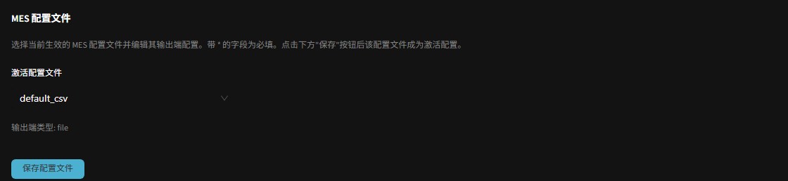

MES 结果导出
=================

系统可在每块板检测完成后，自动将检测结果导出到指定目录，供 MES / 上位系统读取。导出内容包括 CSV 报告文件、缺陷元件裁剪图与整板拼接图。本页介绍默认配置文件 ``default_csv`` 的使用方法。

**此页面的用途**

说明如何启用 MES 导出、如何选择导出配置文件，以及默认配置下文件保存在哪里、报告包含哪些字段，便于现场对接 MES 或归档查阅。

**如何进入**

右上角齿轮 → **设置** → **系统设置** → **系统配置** \ （Admin / 编程员 可见）。该页面与 MES 相关的设置分为两部分：

- **MES导出配置**：导出开关、路径、图像质量与保留天数。各选项含义详见 :ref:`系统JSON配置`。
- **MES 配置文件**：选择当前生效的导出配置文件，并编辑其输出端配置。

**启用 MES 导出**

在 **系统配置** → **MES导出配置** 中：

1. 在 **导出MES路径** 填写导出根目录（请确保目录已存在且可写入）。
2. 按需开启 **导出报告**、**导出元件图像**、**导出拼接图像** 三个开关（默认均为关闭，需要导出图片时请先开启）。
3. 通过 **导出图像质量（1-100）** 调整 JPEG 清晰度，通过 **报告保存期限（1-30天）** 设置本地文件保留天数。
4. 在页面底部点击 **保存** 生效。

**选择导出配置文件（MES 配置文件）**

不同的"配置文件"对应不同的 MES 对接格式与输出方式。在 **MES 配置文件** 区块：

- **激活配置文件**：下拉选择当前生效的配置文件。出厂默认为 ``default_csv`` —— 导出为本地 CSV 报告与图片，适用于无需直连 MES 的现场。
- 选择带连接信息的厂商配置文件时，下方会出现该配置文件的输出端配置项，带 ``*`` 的字段为必填。
- 部分定制配置文件需要单独启动外接进程，可在其外接进程控制区点击 **连接** / **断开** 管理运行状态。
- 配置文件的选择与编辑在点击页面底部的 **保存** 后才会生效。

.. note::
   修改导出配置文件或其字段后需重启后端服务才会完全生效。

**默认配置 default_csv 的导出内容**

启用导出后，所有文件保存在 **导出MES路径** 指定的根目录下，分为两个子目录：

- ``reports/``：报告文件。
- ``images/``：缺陷元件图与整板拼接图。

**报告文件**

每次检测生成一个 CSV 文件，文件名由 大板SN、检测状态、机型、产线编号 与 检测记录编号 组成，便于按板检索。报告包含两段内容。

整板信息（一行）：

.. list-table:: 整板信息字段
   :header-rows: 1
   :widths: 22 78

   * - 字段
     - 含义
   * - 机型
     - 该板对应的 PCB 产品（程序）名称。
   * - 大板SN
     - 整板条码 / 序列号。
   * - 开始时间
     - 本次检测开始时间。
   * - 结束时间
     - 本次检测结束时间。
   * - 拼版数量
     - 本次实际检测的有效小板数量。
   * - 状态
     - 整板最终判定结果（合格 / 不合格）。

缺陷明细（每个缺陷一行）：

.. list-table:: 缺陷明细字段
   :header-rows: 1
   :widths: 22 78

   * - 字段
     - 含义
   * - 异常原因
     - 缺陷 / 错误类型；显示为经"错误类型翻译"映射后的 MES 厂商代码（若已配置）。
   * - 位置号
     - 缺陷元件的位号（designator）。
   * - 物料
     - 元件的物料编号（part number）。
   * - 图片位置
     - 该缺陷元件裁剪图在导出目录中的路径。
   * - 小板号
     - 缺陷所在小板在拼版中的序号。
   * - 小板SN
     - 缺陷所在小板的条码 / 序列号。
   * - 状态
     - 该缺陷复核后的状态（合格 / 不合格）。

**图片存储路径**

开启 **导出元件图像** / **导出拼接图像** 后，图片按 机型 / 日期 / 大板SN / 检测记录编号 分目录存放（每次检测独立目录，重复测量同一条码不会互相覆盖）：

- 整板拼接图：固定命名为 ``full_image.jpg``。
- 缺陷元件图：按 位置号、小板号、小板序号 命名的 JPG 文件，与报告"图片位置"列一一对应。

**注意事项**

- **导出报告**、**导出元件图像**、**导出拼接图像** 默认均为关闭；需要导出图片时请先开启对应开关。
- 报告与图片仅在勾选导出且检测时实时生成；事后在复核页重新导出只会刷新报告，不会重新生成图片。
- 超过 **报告保存期限** 的本地报告与图片会被系统定期清理；通过 HTTP / 厂商接口直连 MES 的配置文件不写本地文件，不受此清理影响。
- 默认配置依据 大板SN 命名文件；若未扫描到整板条码，该次导出会失败并记录日志。
- 缺陷的 **异常原因** 显示的是 MES 厂商代码，其映射在 :ref:`错误类型翻译` 中维护。

**相关页面**

- :ref:`系统JSON配置`
- :ref:`错误类型翻译`
