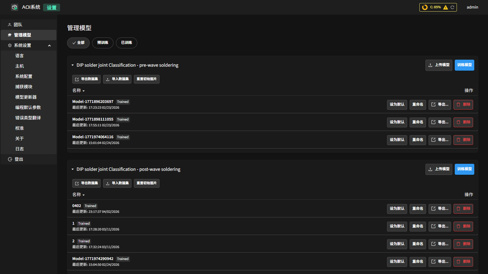
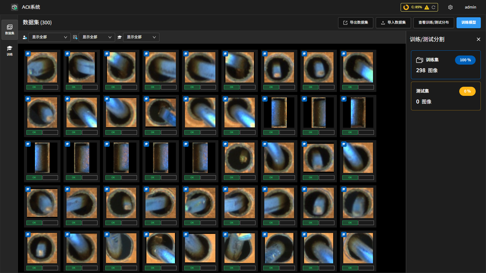
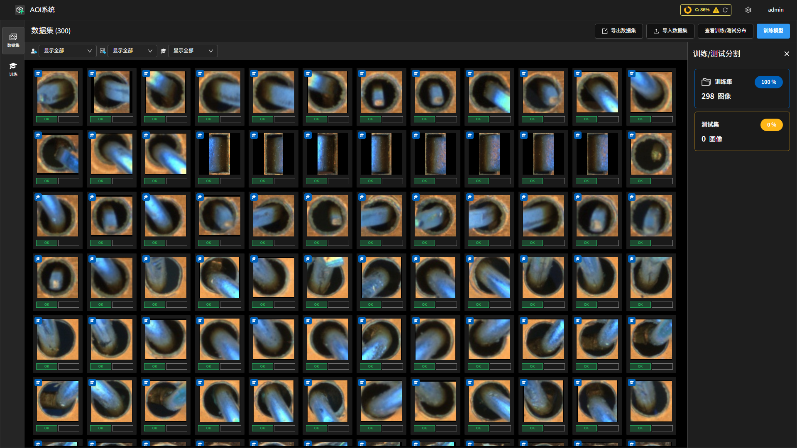
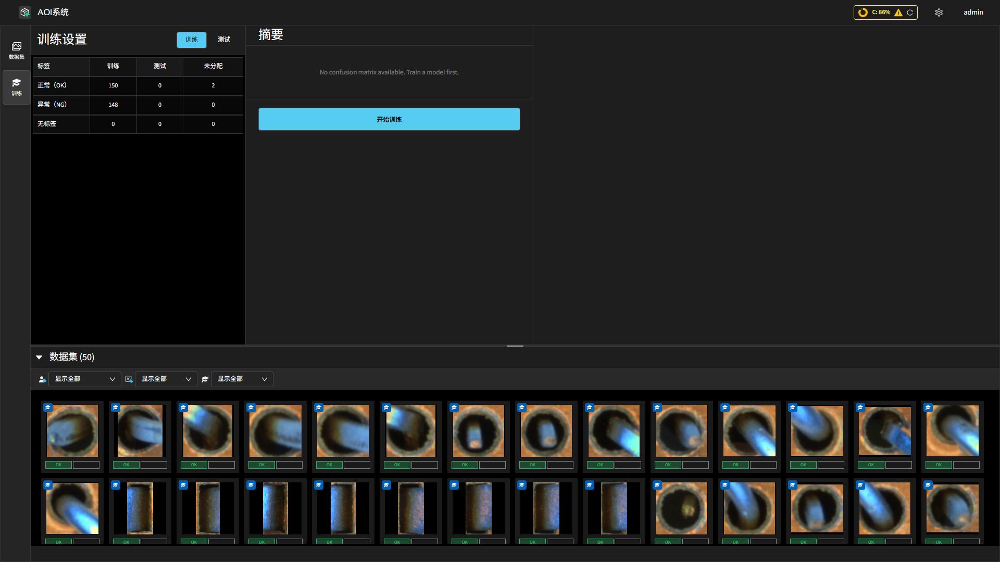

模型管理
=================

系统的检测能力由一组深度学习模型驱动。本章介绍如何管理这些模型与其训练数据集：包括查看 / 上传 / 切换模型，以及导入导出数据集、查看训练分布并发起训练。

模型有两个入口：

- **设置 → 管理模型**：模型清单与生命周期操作（设为默认、重命名、导出、删除等）。
- **模型页面（Models）**：以数据集为中心的视图，用于标注训练样本、查看训练/测试分布并发起训练。

模型清单（管理模型）
-----------------------

在 **设置** 左侧点击 **管理模型**，可按 **全部 / 预训练 / 已训练** 筛选系统中的模型。

常用操作：

- **上传模型**：导入外部训练好的模型文件。
- **训练模型**：跳转到模型页面，基于当前数据集发起一次训练。
- **设为默认**：将某模型设为对应检测类型的默认推理模型。
- **重命名**：修改模型条目的显示名称。
- **导出...**：将模型文件导出到本地。
- **删除**：从系统中移除该模型。
- **导入数据集 / 导出数据集**：在不同环境间迁移训练样本。
- **重置初始图片**：将数据集恢复到初始样本集合。

数据集与训练（模型页面）
---------------------------

模型页面位于导航栏 **Models**，左侧图标栏提供两个视图切换：

- **数据集**：查看、标注和管理训练样本。
- **训练**：配置训练参数、发起训练并查看训练结果。

数据集视图
~~~~~~~~~~~

**数据集** 视图展示当前检测类型已积累的所有训练样本（来自自动编程、评估与现场反馈）。

顶部工具栏按钮：

- **导出数据集**：将当前数据集打包导出为 .zip 文件，用于在不同环境间迁移或备份样本。
- **导入数据集**：从本地 .zip 文件导入样本，合并到当前数据集。
- **查看训练/测试分布**：切换右侧面板的显示，查看 **训练集** 与 **测试集** 的样本数量及占比。训练集包含 train 与 val 样本；测试集包含 test 样本。数字旁的百分比反映当前已标注样本中各部分的比例。
- **训练模型**：跳转到训练视图，发起模型训练。

训练视图
~~~~~~~~~

切换到 **训练** 视图后，界面分为左侧 **训练设置** 面板与右侧 **摘要** 面板，下方为可拖拽调整高度的 **数据集** 样本库。

**训练设置面板**

左侧面板顶部可在 **训练** 与 **测试** 子标签之间切换（用于筛选下方标签统计表的展示范围），下方显示样本标签分布统计表，列出各标签在训练集、测试集及未分配中的数量：

- 行标签：**正常（OK）** / **异常（NG）** / **无标签**
- 列标签：**标签** / **训练** / **测试** / **未分配**

**摘要面板**

右侧面板展示已选模型针对当前数据集的 **混淆矩阵** （Confusion Matrix）。矩阵行为实际标签（Actual），列为模型预测标签（Predicted），对角线格子（绿色背景）表示预测正确，非对角线格子（红色背景）表示预测错误。若尚未训练模型，面板显示提示信息。

面板底部的 **开始训练** 按钮用于发起训练（见下节训练流程）。

训练流程
-----------------

1. 在 **数据集** 视图或 **训练** 视图中确认已积累足够且类别均衡的样本。
2. （可选）点击 **查看训练/测试分布**，确认各类别样本数量合理，避免某一类别样本过少导致过拟合。
3. 在训练视图底部点击 **开始训练** 按钮。系统弹出 **为模型命名** 对话框，输入模型名称后点击 **开始训练** 确认。
4. 训练开始后，界面切换到 **训练进度** 视图，展示：

   - 当前 Epoch 进度与预计剩余时间。
   - 实时 **准确率** 与 **最佳** （best）准确率及进度条。
   - **训练图表**：准确率曲线（Accuracy）与训练/验证损失曲线（Training / Validation Loss）。
   - **停止训练** 按钮：点击后系统在当前 Epoch 完成评估后终止训练，并保留已达到最佳准确率的模型权重。
   - **返回模板** 按钮：退出训练进度视图，返回设置面板（训练仍在后台继续）。

5. 训练完成后，可在 **管理模型** 中将新模型 **设为默认**，使其在后续检测中生效。

.. note::
   反馈写入数据集后，建议在稳定的光照与工艺条件下积累一段时间样本再训练，避免短期波动导致模型过度拟合。

.. note::
   训练完成后，当前运行的检测会话不会自动切换到新模型。需在 **管理模型** 中执行 **设为默认** 并重新启动检测会话，新模型方可生效。
