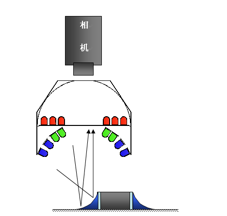
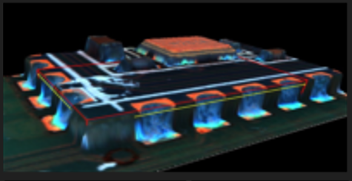
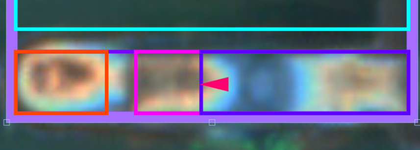

标注与成像基础
==========================================

在开始标注与检测之前，先理解 AOI 的 2D 成像原理，以及各类检测框分别检测元件的哪个部位。读懂“图像里的颜色代表什么”，是后续看懂标注、调参与判读结果的基础。

.. contents::
   :local:
   :depth: 1

.. role:: clr-red
.. role:: clr-green
.. role:: clr-blue
.. role:: clr-orange
.. role:: clr-purple
.. role:: clr-pink
.. role:: ui-feature

2D 彩色图像的成色原理（三色角度光）
--------------------------------------------------

AOI 的 2D 相机采用彩色多角度光源：相机正下方的环形光罩上分布着红、绿、蓝三组 LED，分别从高、中、低三个入射角照射 PCB；相机在正上方垂直俯视。

成像基于镜面反射——某个区域只有把对应角度的光反射进正上方相机时，才会呈现该颜色。因此图像颜色直接反映表面的倾斜程度：

- :clr-red:`红色`：平坦、近水平的表面（阻焊面、焊盘顶面）。
- :clr-green:`绿色`：中等坡度的表面。
- :clr-blue:`蓝色`：较陡坡度的表面。

所以焊锡的爬锡坡面会随坡度由绿渐变到蓝，平坦区域呈红。

为什么“颜色 = 坡度”很重要
--------------------------------------------------

普通白光只能拍出平面照片，而焊接质量几乎都写在三维形貌里：焊点有没有漂亮的爬锡坡、引脚有没有翘起、元件有没有立碑或偏移。这些高度与坡度信息在普通 2D 图像中基本丢失。三色光通过“角度对应颜色”的映射，把看不见的表面坡度直接编码进了 2D 图像。

需要特别记住的是：图像里的颜色不代表物体本来的颜色，而代表这块表面朝哪个方向倾斜。同一块银白色焊锡，平的地方呈红、斜的地方呈蓝——颜色是形状的指纹，不是材料的本色。

坡度恰好是焊接质量的命门。一个合格焊点有固定的立体形态：从平的焊盘（红）平滑上爬到锡坡（绿到蓝）再接到引脚。坡度对，说明焊锡量足、润湿良好。于是常见缺陷都会表现为颜色分布异常：

- **少锡或不润湿**：应有的爬锡坡缺失，缺少绿、蓝过渡，或一片发红。
- **多锡或锡球**：坡度过陡或形状杂乱，颜色分布异常。
- **引脚翘起或虚焊**：引脚未贴到焊盘、缺少爬锡，对应区域颜色不对。
- **立碑或偏移**：本体朝向改变，颜色块的位置与形状随之改变。

原本这些缺陷在白光下是微弱、难以分辨的几何差异，三色光把它们放大成醒目的红、绿、蓝色块，人与 AI 都更容易判读。软件中的颜色公式（如 2B-R-G）正是用“2 倍蓝减红减绿”把陡坡从平面中量化提取为一个可设阈值的分数，本质就是在量化坡度。

检测框的类型与含义
--------------------------------------------------

一个元件的标注由若干检测框（特征框）组成，每种框负责检测元件的不同部位：

- :ui-feature:`本体框（Body）`：框住元件主体，几乎所有元件都有的基础框，用于检测元件是否存在、是否偏移、是否错件或反向。
- :ui-feature:`焊锡框（Solder）`：框住引脚根部的焊点与爬锡区域，检测焊锡量与形态（少锡、多锡、虚焊等）；结合光源原理，爬锡坡面在 2D 图中通常呈蓝到绿。
- :ui-feature:`IC 引脚框（IC Lead）`：用于带引脚的 IC，由四个子区域框组成，各代表引脚的一段，如下表所示。
- :ui-feature:`文本框 / OCR 框（Text）`：框住需要识别的字符区域（丝印、料号、批次或日期码），用于 OCR 文本检测与比对。
- :ui-feature:`极性检测框（Polarity）`：框住元件上的极性标识（电容极性条、二极管色环、LED 缺角或标记等）；在“本体检测（2D）”中启用极性检测后，系统据此判断元件是否装反。

IC 引脚框的四个子区域：

.. list-table::
   :header-rows: 1

   * - 子框颜色
     - 区域
     - 在 2D 图中的典型表现
   * - :clr-orange:`橙`
     - 焊盘区（Pad）
     - 引脚下方的焊盘
   * - :clr-purple:`紫`
     - 焊料区（Solder）
     - 引脚根部爬锡，呈蓝到绿（坡面）
   * - :clr-pink:`粉`
     - 引脚末端（Tip）
     - 引脚尖端，呈黄色高亮
   * - :clr-blue:`蓝`
     - 引脚区（Pin/Area）
     - 覆盖整段引脚（蓝框加粉框即完整引脚）

此外，软件还支持 DIP 焊点框、桥接框、焊盘沾胶框、颜色检测框、条形码框等；各类框的检测参数详见 :ref:`检测工具参考`。
