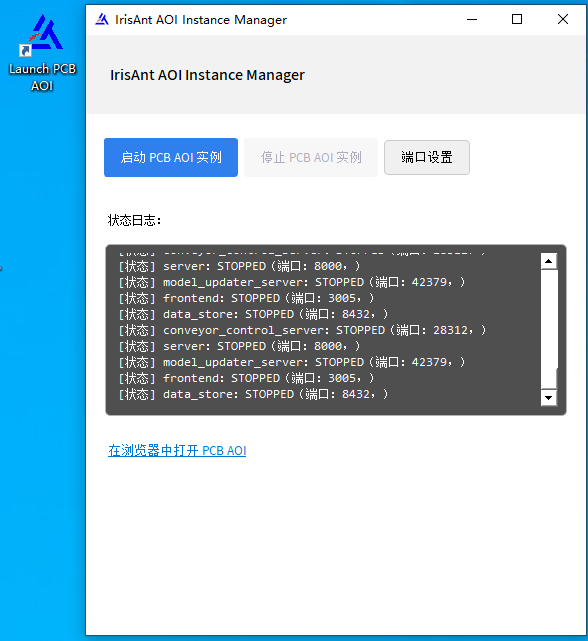
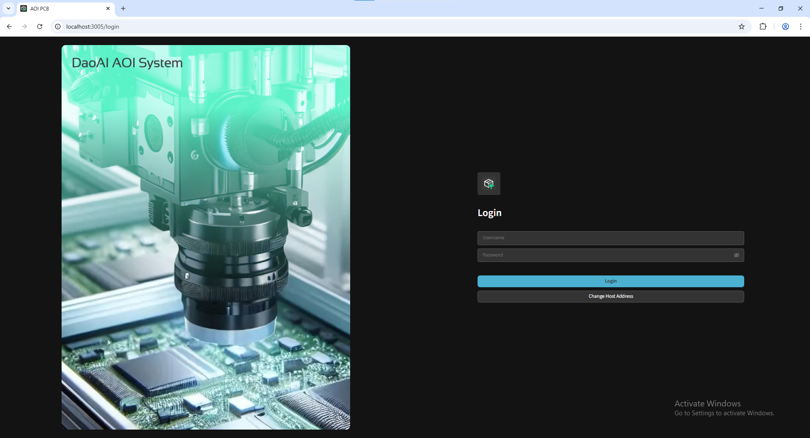
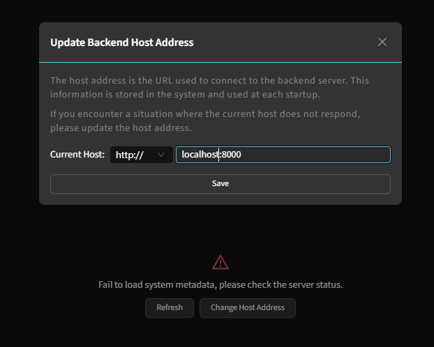
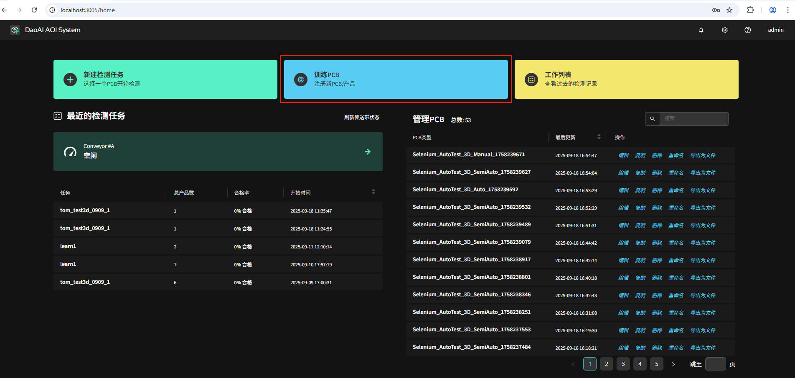
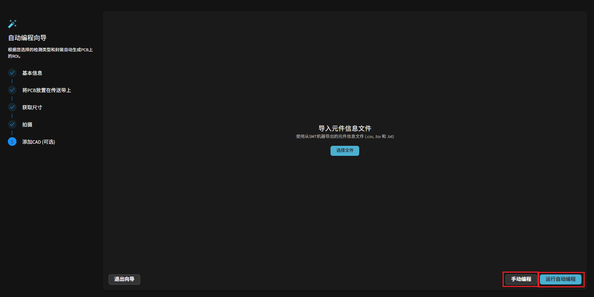
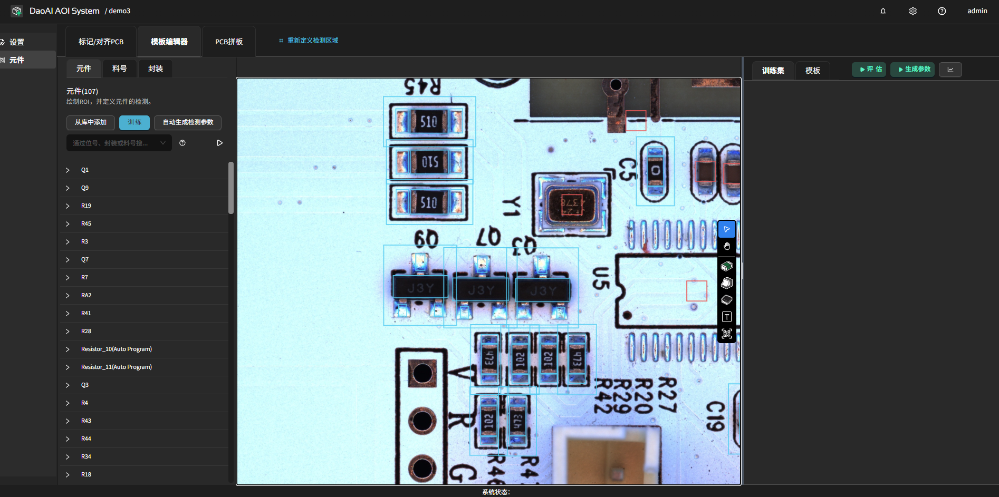
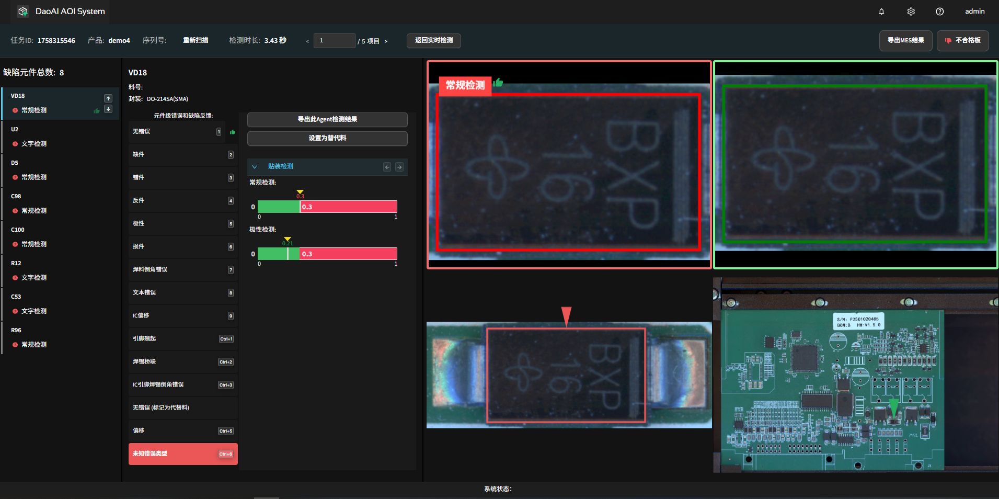

Quick Start
=================

DaoAI PCBA AOI is an intelligent Automated Optical Inspection Software for electronics manufacturing.  
The system is centered around visual AI and provides a complete process from automatic modeling, parameter generation to defect detection and continuous optimization.  
Unlike traditional approaches that require frequent manual parameter tuning, the system quickly adapts to the production floor while improving efficiency and maintaining accuracy and stability.
With adaptive algorithms and feedback mechanisms, it detects both common and subtle defects and continuously learns during production to improve yield and reduce maintenance costs.

.. raw:: html

    

        <video width="80%" height="auto" controls>
            <source src="http://docs.welinkirt.com/static/videos/pcba_aoi_quick_intro.mp4" type="video/mp4">
        </video>
    

This chapter demonstrates how to use DaoAI AOI System to quickly complete modeling, inspection, and feedback of a PCB in 2D inspection mode.

.. note::
   This system also supports industrial-grade 3D cameras and high-quality 3D inspection, including analysis of height, pad/solder volume, lead lift, tombstoning, missing parts, and other 3D features. This Quick Start uses the 2D workflow as an example; 3D usage and parameter details are covered in a later chapter.

Software Launch
-----------------

Before you start, we recommend the following settings to optimize performance:

- :ref:`How to disable GPU power saving mode to avoid slow inference?`
- :ref:`How to enable hardware acceleration in the browser to avoid lag?`

Start the software by clicking the launcher on the desktop.  

The browser will automatically open ``http://localhost:3005/``.  
The default backend address is ``http://localhost:8000/``.

.. note::
   To access from other devices, replace ``localhost`` with the target device's IP address.

Login and Settings
-----------------

You can log in for the first time using the **admin** account. 
Username will be **admin**, and the password will be provided during deployment.

After logging in, click the ⚙️ icon in the upper right corner to enter settings where you can set the system language:

   .. image:: images/settings.png
      :scale: 70%
      :alt: 设置界面示意

- language settings interface;
   .. image:: images/change_language.png
      :scale: 70%
      :alt: 语言设置

For more settings options, please refer to the :ref:`System Settings` chapter.

Create Product
-----------------

On the home page, click **Teach PCB** to register a new PCB product.

Enter a product name (e.g., "Test PCB") and select the list of inspection items desired.
After serlection, click "Next".

.. image:: images/create_product_2.png
   :scale: 50%
   :alt: 创建产品第二步

**Place the PCB on the Conveyor**

   - Place the PCB flat in the center of the conveyor
   - Select the corresponding conveyor, and click "Lock Conveyor for this task".
   - Enter or confirm the conveyor width parameters, then click "PCB In". 
   The PCB will be automatically shifted to the camera's capture/positioning area; 
   after it is in place, click "Next".

  .. image:: images/create_product_3.png
     :scale: 50%
     :alt: 将PCB放在传送带上示意

**PCB Dimensions**  

   - If the PCB dimensions are known, enter width and height (mm), then click **“Next”**.

   - If the dimensions are uncertain, you can move the camera to take pictures of the lower left and upper right corners of the PCB.
      
      - Click on these two positions in the image and select **Capture Dimensions**. The system will automatically calculate the dimensions.

   .. image:: images/size_calculation.png
      :scale: 50%
      :alt: 自动尺寸计算示意

**Capture full PCB**  

   #. Click **“Capture 2D/3D”**” to start the process. The system will coordinate the camera and conveyor to capture multiple sections and automatically stitch them into a complete PCB image.

   #. Then click **“Define Area”** to select the valid region used for auto-programming (typically the entire board; shrink slightly if you need to exclude fixture/jig edges).

   **IMPORTANT!** This reference image will be used for subsequent automatic programming, alignment, and detection. Be sure to use a clean, defect-free **Golden board** for shooting.
   
   Camera parameters such as brightness, exposure, gain, white balance, and point cloud filtering can be adjusted in real time. If needed, recapture to replace the previous image.

   .. image:: images/full_pcb_capture.png
      :scale: 55%
      :alt: 完整 PCB 拍摄

**Semi-Automatic Programming (Using a CAD File)**  

   After After providing a **CAD file (.csv format)**, the system can automatically:
   
   - Extract component information, including Package, Silkscreen/Label, Part Number (PN), X/Y Coordinates, and Rotation Angle.
   - Group components by Package or Part Number, allowing identical components to be modeled once, significantly speeding up training.
   - Reduce manual grouping and naming effort during later programming stages.

   If no CAD file is provided, the auto programming process can still be executed. 
   The inspection quality will not be affected — only the grouping-based acceleration will be skipped. 
   In this case, the system will model each component individually.

   .. image:: images/upload_cad.png
      :scale: 50%
      :alt: 上传 CAD 文件界面

   Steps: 

   #. Upload the `.csv` file and click **"Preview Table"**.

   #. In the Field Mapping window, assign the following columns in order: **Part Number (PN), Package, X, Y, and Rotation (°)**. Optionally, you may also map the Layer/Side field.

   #. Select the **coordinate unit (mm or mil)** and ensure the origin and orientation are consistent.

   #. Click **Run Auto Programming** to start processing.

   .. image:: images/upload_cad2.png
      :scale: 50%
      :alt: 字段映射示意

   If the CAD layout does not align correctly with the captured image on the first attempt, the system will open the Alignment Adjustment interface.
   Use rotation, translation, and scaling tools (with optional reference points if needed) to fine-tune the alignment until the main components roughly match.
   Once aligned, click **Rerun Auto Programming** to regenerate the model.

**Auto Programming (No CAD)**

   If there is no CAD file, simply click **Auto Programming** to proceed. 
   The system uses a combination of computer vision and AI algorithms to automatically:

      - Detect and segment component areas.
      - Infer category features and generate initial detection templates.
      - Establish the structured data required for subsequent alignment and detection.

   The entire auto programming process takes approximately 30 seconds.

Product Programming Page
-----------------

After automatic programming is completed, the system will open the **Product Programming page**.
This page contains three tabs:

#. **Mark/Align PCB**  
#. **Template Editor**  
#. **PCB Array**

**Mark/Align PCB**：  

Click **"+"** Mark to select fixed reference marks on the PCB (these can be circular, rectangular, or complex patterns).

.. image:: images/mark_alignment.png
   :scale: 50%
   :alt: 标记对齐示例

**Template Editor**：  

The left panel displays the list of components generated during automatic programming.
If a CAD file was uploaded, the system will automatically show silkscreen/designator labels and group identical components by type.
You can use the search bar to filter items that may contain errors.
For any component with incorrect labeling or classification, you can manually delete it and reprogram the item.

For detailed instructions on manual programming and editing tools, please refer to the :ref:`Manual Programming and Editing Tools` section.

**Training and Evaluation**
----------------------------------

After confirming that all components are correctly labeled and classified, click **Train** to start model training (about 1 minute).

   .. image:: images/train.png
      :scale: 50%
      :alt: 训练示意

When training completes, click **“Generate Params”** to produce an initial set of parameters based on the current templates and training results.

Next, click **Evaluate All** to run a batch evaluation of all components.
The system will display results using **color codes** — Green indicates healthy, and Red indicates components that require adjustment.
You can review the red items as needed and fine-tune their settings based on the Inspection Parameters section.

   .. image:: images/eval.png
      :scale: 50%
      :alt: 评估示意

开始检测
-----------------

1. 返回主页：点击左上角 Logo 回到主页，点击“新建检测任务”。
2. 任务配置：选择 PCB 产品、传送带及启动模式（单板 / 连续 / 调试），点击“开始检测”。

   .. image:: images/start_inspection.png
      :scale: 50%
      :alt: 新建检测任务

   .. image:: images/start_mode.png
      :scale: 80%
      :alt: 启动模式选择

进入检测页面后：

   - 按空格键：进板并立即开始检测。更多快捷键请参见 :ref:`快捷键` 章节。
   - 左侧控制按钮：进板 | 出板 | 通过 | 复位。
   - 右侧信息栏：实时显示检测计数、良率与缺陷统计

   .. image:: images/inspect_page.png
      :scale: 50%
      :alt: 检测页面

检测到缺陷时自动跳转至缺陷详情页，可查看放大图、定位框、缺陷类型及判定依据，并立即反馈。 

反馈后的数据会添加到数据集里，供后续持续优化使用。

查看检测历史
----------------

在主页点击“工作列表”进入历史任务列表。

   .. image:: images/worklist.png
      :scale: 50%
      :alt: 工作列表概览

列表展示每个任务的：创建时间、合格/不合格数量、良率、缺陷统计等。点击任意一行进入该任务详情。

   .. image:: images/worklist1.png
      :scale: 50%
      :alt: 任务详情概览

在任务详情中可展开单次检测记录；点击某次记录进入缺陷详情页，查看放大图、定位框、缺陷类型与判定依据，并可直接反馈。

   .. image:: images/worklist2.png
      :scale: 50%
      :alt: 缺陷记录与反馈

提交的反馈会写入数据集，用于后续再训练与参数自适应迭代。

迭代模型
-----------------

反馈写入数据集后，回到产品编程页面重新训练并评估，针对仍为红色的异常元件微调参数即可完成一次迭代。

|
|

以上即为快速开始全部流程，感谢您的使用。后续更多功能与更详细的说明请继续阅读完整用户手册。