快速开始
=================

DaoAI PCBA AOI 软件是一款面向电子制造的智能光学检测系统。
系统以视觉 AI 为核心，提供从自动建模、参数生成到缺陷检测与持续优化的完整流程。
与传统需要频繁手动调参的方式不同，系统可快速适配生产现场，在提升效率的同时确保精度与稳定性。
依托自适应算法与反馈机制，软件既能识别常见与细微缺陷，也能在生产过程中持续学习，提升良率并降低运维成本。

.. raw:: html

    

        <video width="80%" height="auto" controls>
            <source src="http://docs.welinkirt.com/static/videos/pcba_aoi_quick_intro.mp4" type="video/mp4">
        </video>
    

本章节演示如何使用 DaoAI AOI System 快速完成一块 PCB 的建模、检测与反馈流程。

启动软件
-----------------

在开始之前，建议您进行以下设置以优化性能：

- :ref:`如何避免 GPU 进入低功耗模式导致推理变慢？`
- :ref:`如何开启浏览器的硬件加速以避免浏览器卡顿？`

在桌面点击启动器即可启动软件。

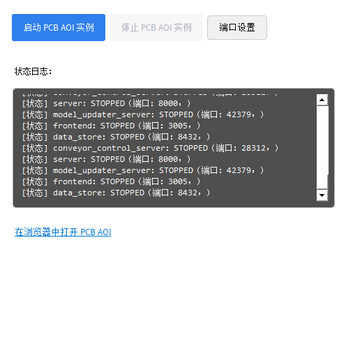

浏览器将自动打开 ``http://localhost:3005/``。
后端默认地址为 ``http://localhost:8000/``。

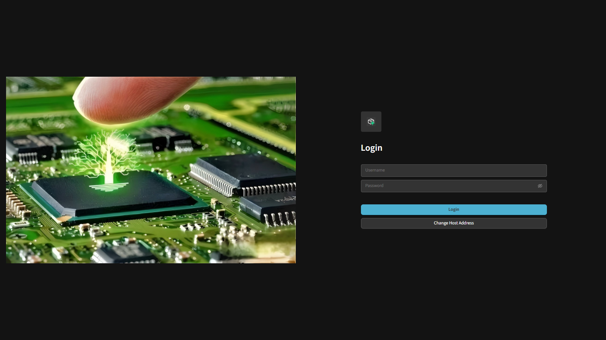

如需更换后端地址，可在登录页点击 **Change Host Address（更改主机地址）**，在弹窗中填写后端 URL 后保存。

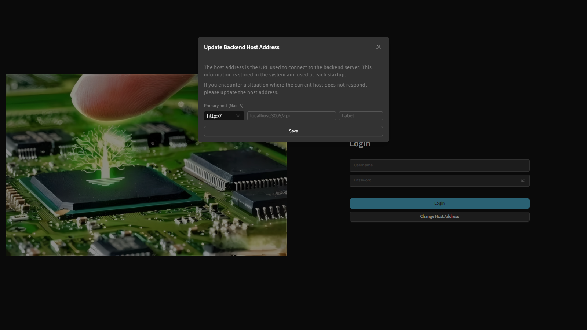

.. note::
   如需从其他设备访问，将 ``localhost`` 替换为目标机器的 IP。

登录与设置
-----------------

首次进入可以使用 **管理员** 账号登录：用户名 **admin**，密码在部署时提供。

登录后，点击右上角的 **齿轮图标** 进入 **设置** 页面。设置页左侧分为 **团队**、**管理模型**、**系统设置** 等分组。

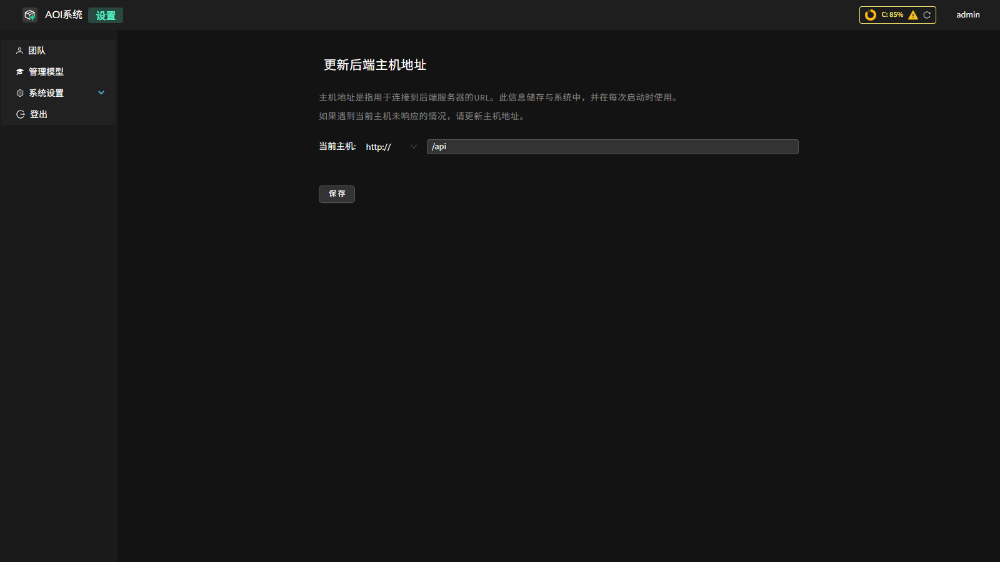

在左侧展开 **系统设置**，选择 **语言**，即可在 **系统语言** 中切换界面语言（如 ``English`` / ``中文``）。语言设置会保存在系统中，并在系统重启后生效。

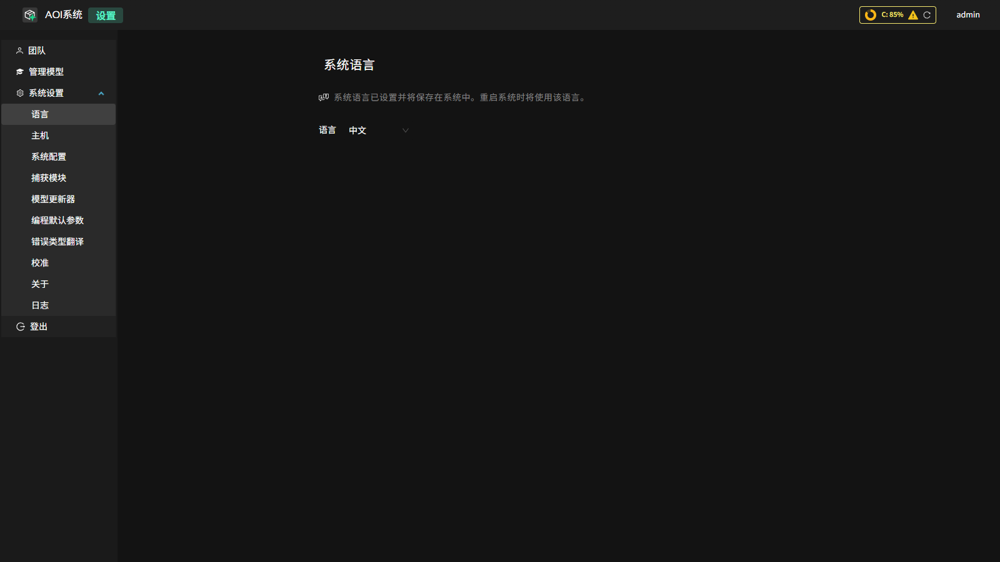

更多设置选项请参见 :ref:`系统管理` 章节。

注册产品
-----------------

在主页点击 **训练PCBA**（注册新的 PCBA/产品），进入 **自动编程向导**。向导分为 5 个步骤：**基本信息**、**将 PCB 放置在传送带上**、**获取尺寸**、**拍摄**、**添加 CAD（可选）**。

**1. 基本信息**

输入 **产品名称**；在 **自动编程检测类型** 中按需勾选关注的检测项（如 本体、极性、焊点、焊盘沾胶、IC 引脚、文字 等）；如有需要，可在 **自动编程参数** 中开启 **桥接** 检测并设置 **邻近距离（像素）** 阈值。完成后点击 **下一步**。

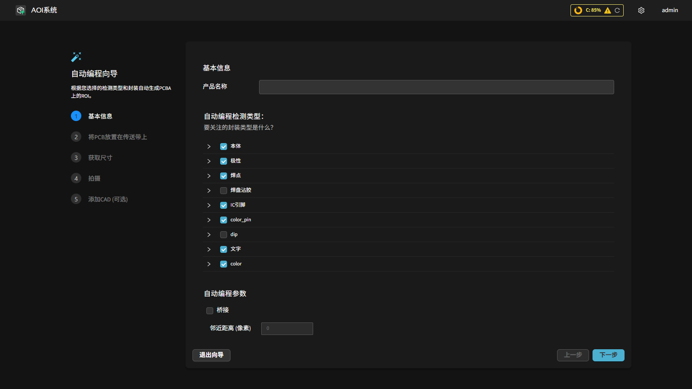

**2. 将 PCB 放置在传送带上**

选择对应传送带并点击 **锁定传送带**，确认或输入传送带宽度后点击 **进板**，PCB 将自动输送至相机下方的拍摄/定位区域；到位后点击 **下一步**。

**3. 获取尺寸**

若已知 PCB 尺寸，直接输入其宽度与高度（单位：mm）。若尺寸不确定，可移动相机分别拍摄 PCB 左下角与右上角，在图像上依次点击这两个位置并选择 **自动计算**，系统将自动推算尺寸。

**4. 拍摄**

点击拍摄，系统将联动相机与传送带分区采集并自动拼接生成完整 PCB 图像；随后框选用于自动编程的有效区域（通常为整板；若需排除治具/夹具边缘，可适当收缩）。该基准图像将作为后续自动编程、对齐与检测的参考，务必使用洁净、无缺陷的 **Golden board（良品板）** 拍摄。此界面可实时调整相机参数（亮度、曝光、增益、白平衡、点云滤波等）；如效果不佳，可重新拍摄覆盖上一版本。

**5. 添加 CAD（可选）**

提供 CAD（``.csv``）文件后，系统可自动读取封装(Package)、丝印/标识、料号(PN)、X/Y 坐标与旋转角度，并按封装或料号聚类，使同类元件一次建模、加速训练，同时减少后续人工分组与命名工作。

上传 ``.csv`` 文件后点击 **预览表格**，在字段映射界面依次指定：料号(PN)、封装(Package)、X、Y、旋转(°)，（可选）层/板面字段；选择坐标单位（mm 或 mil），确认原点与方向一致，随后点击 **运行自动编程**。若 CAD 与拍摄图像未正确重合，可在对齐界面通过旋转、平移、缩放微调后重新运行。

若不提供 CAD，后续自动编程仍可执行；检测质量不受影响，仅失去基于封装/料号的聚类加速，系统将对元件逐一建模。自动编程耗时约 30 秒。

产品编程页面
-----------------

自动编程完成后，会进入 **产品编程页面**。顶部提供多个标签页：

1. **标记/对齐 PCB**
2. **模板编辑器**
3. **PCB 拼板**
4. **整板检测**

左侧还可在 **设置（Recipe）** 与 **元件（Component）** 视图之间切换。

**标记/对齐 PCB**：

点击 **+ 独特标记**，框选 PCB 上固定的参考标记（圆形、矩形或复杂图案均可）。框选区域应略大，以保证在轻微位移情况下仍能正确定位。确认后完成标记定义。

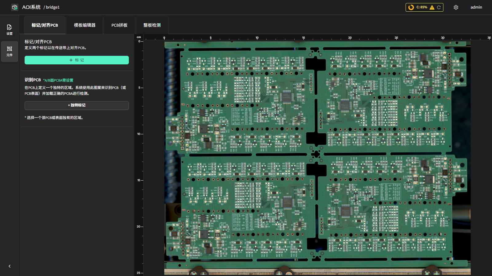

**模板编辑器**：

左侧显示自动编程获得的元件列表（可在 元件 / 料号 之间切换）。若上传了 CAD，系统会自动显示丝印/标识并将同类元件分组。可通过搜索栏过滤存在问题的项；对于标记不正确的元件，可手动删除并重新编程。

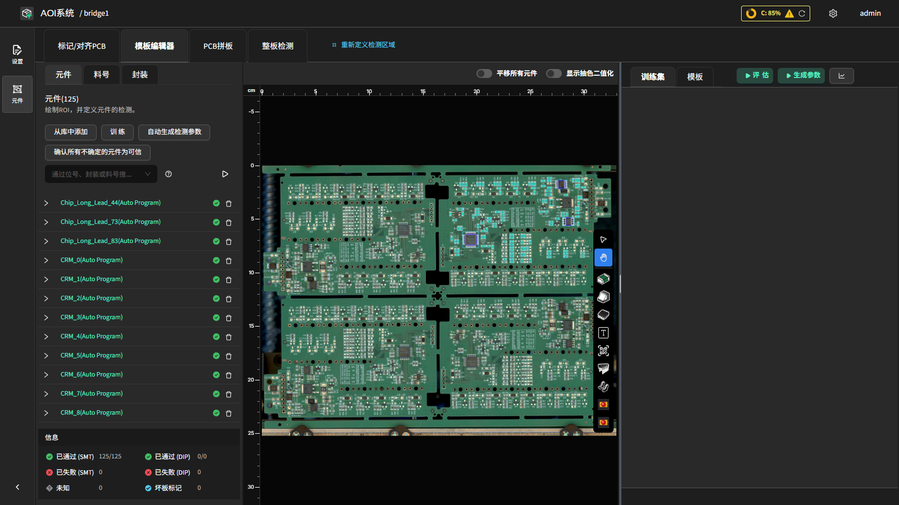

有关手动编程的详细步骤与编辑工具用法，请参见 :ref:`手动编程与编辑工具`。

训练和评估
-----------------

确认全部元件框与属性无误后，在模板编辑器右上角点击 **+ 训练** 启动模型训练，耗时约 1 分钟。

训练完成后，点击 **生成参数**，系统会基于当前模板与训练结果生成一套初始检测参数。随后系统将批量评估所有元件，并以颜色标记（绿：健康；红：不健康）。可按需查看不健康项并参考 :ref:`检测参数` 继续微调。

开始检测
-----------------

返回主页：点击左上角 Logo 回到主页，点击 **新建检测任务**。在弹窗中完成任务配置：

- **传送带**：选择传送带；
- **选择一个 PCBA**：选择已编程的产品；
- **选择任务模式**：选择任务模式（如自动连续运行任务）；
- **以演示模式运行**：如需在无实物/无硬件条件下演示，可开启此项。

完成后点击 **开始检测**。

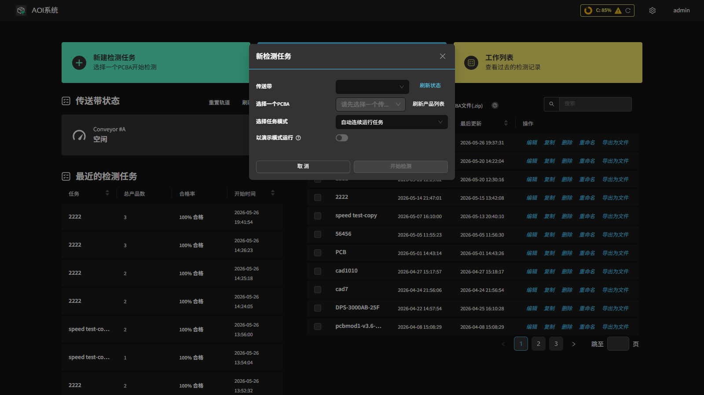

进入检测页面后：

- 按空格键：进板并立即开始检测。更多快捷键请参见 :ref:`快捷键` 章节。
- 右侧信息栏：实时显示产品统计（合格/不合格）、元件合格率/不良率/误报率与检测时长（可在整板/子板之间切换）。

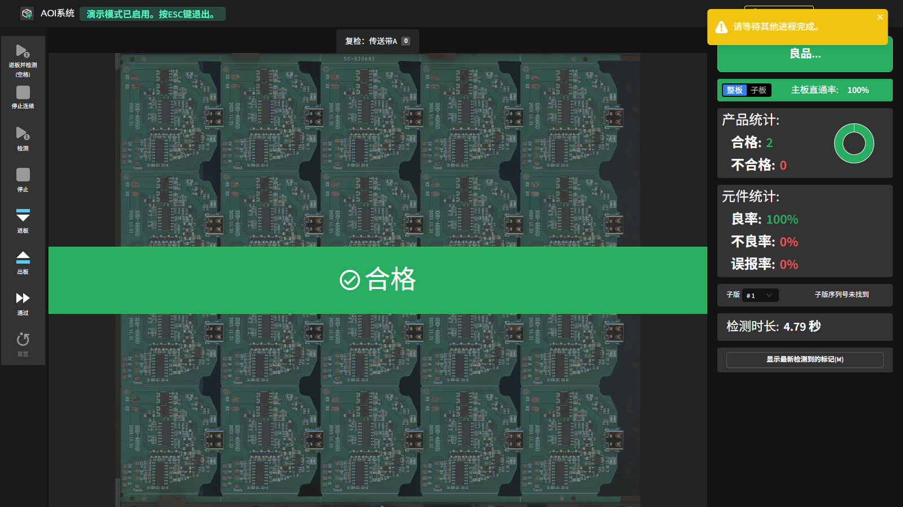

检测到缺陷的元件会被标记，可查看放大图、定位框、缺陷类型及判定依据，并立即反馈。反馈后的数据会写入数据集，供后续持续优化使用。

查看检测历史
----------------

在主页点击 **工作列表** 进入 **数据分析报告**。页面包含 **总结**、**检测结果**、**不良元件**、**误判元件** 等标签，并可按 今天 / 昨天 / 本周 / 本月 / 今年 过滤。

**总结** 提供 OK/NG 数量与比例、告警/误报的 PPM、DPU 等总览指标，以及 NG/OK 比例图。

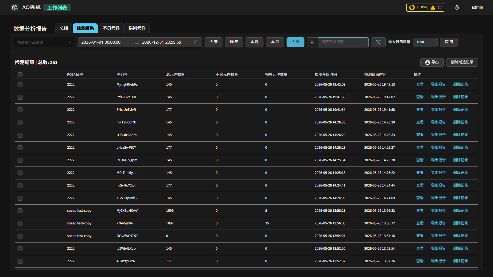

切换到 **检测结果**，可查看每次检测记录：PCBA 名称、序列号、元件数、不良/告警元件数、检测起止时间等。点击某条记录的 **查看** 进入复检详情。

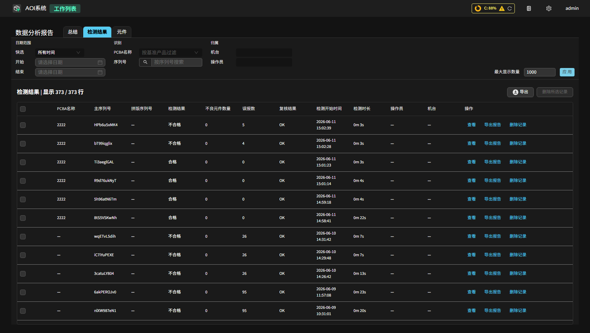

在复检详情中，左侧列出不良元件，中部与右侧展示整板及缺陷的放大图、定位框、缺陷类型与判定依据，并可直接反馈。

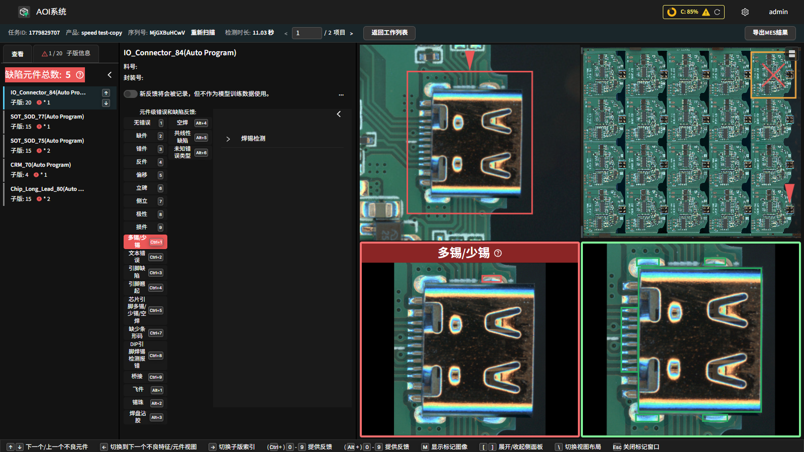

提交的反馈会写入数据集，用于后续再训练与参数自适应迭代。

迭代模型
-----------------

反馈写入数据集后，回到产品编程页面重新训练并评估，针对仍为红色的异常元件微调参数即可完成一次迭代。

|
|

以上即为快速开始全部流程，感谢您的使用。后续更多功能与更详细的说明请继续阅读完整用户手册。
