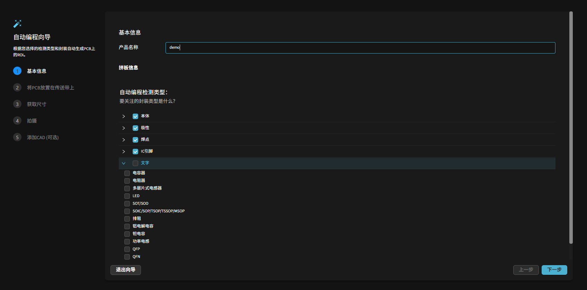
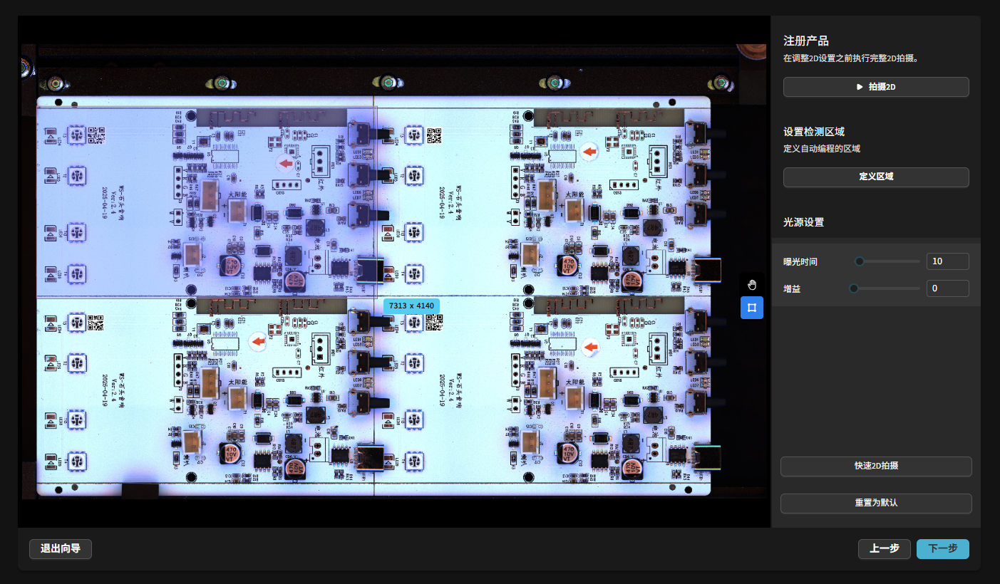

快速开始
=================

DaoAI PCB AOI 软件是一款面向电子制造的智能光学检测系统。  
系统以视觉 AI 为核心，提供从自动建模、参数生成到缺陷检测与持续优化的完整流程。  
与传统需要频繁手动调参的方式不同，系统可快速适配生产现场，在提升效率的同时确保精度与稳定性。  
依托自适应算法与反馈机制，软件既能识别常见与细微缺陷，也能在生产过程中持续学习，提升良率并降低运维成本。

.. raw:: html

    

        <video width="80%" height="auto" controls>
            <source src="http://daoai-robotics-1305756387.file.myqcloud.com/videos/DaoAI_AOI_PCB.mp4" type="video/mp4">
        </video>
    

本章节演示如何使用 DaoAI AOI System 快速完成一块 PCB 的建模、检测与反馈流程。

启动软件
-----------------

在桌面点击启动器即可启动软件。  

.. image:: images/startup.png
   :scale: 80%
   :align: center
   :alt: 启动软件界面

浏览器将自动打开 ``http://localhost:3005/``。  
后端默认地址为 ``http://localhost:8000/``。

.. note::
   如需从其他设备访问，将 ``localhost`` 替换为目标机器的 IP。

登录与设置
-----------------

首次进入需登录。系统提供默认管理员账号：用户名 **admin**，密码在部署时提供。

.. image:: images/login.png
   :scale: 70%
   :align: center
   :alt: 登录界面示意

登录后点击右上角齿轮进入设置，可执行：

- 切换界面语言；
- 管理成员账户与角色。

.. image:: images/manage_user.png
   :scale: 70%
   :align: center
   :alt: 账户管理

角色权限说明：

- **Admin**：拥有全部权限；
- **编程员**：除账号管理外的所有操作（创建/编辑 PCB 产品、执行检测任务等）；
- **操作员**：仅执行检测任务。

创建产品
-----------------

在主页点击 **训练PCB**，开始注册新的 PCB 产品。

输入产品名称。下方为系统支持的检测项列表，可按需启用/关闭。

**输入 PCB 尺寸**  
若尺寸不确定，可移动相机分别拍摄 PCB 的左下角与右上角，随后在图像上点击对应像素点并选择 **自动计算**，系统将自动计算尺寸。

**完整 PCB 拍摄**  
点击拍照后，相机与传送带将联动分区拍摄并拼接出完整 PCB 图像。该图像将作为后续编程基准，建议使用 **Golden board（良品板）** 进行拍摄。

拍摄时可按需调整相机参数（亮度、曝光时间、点云滤波器等）。

.. note::
   **可选：上传 CAD 文件**  
   若提供 CAD，系统可自动获取封装、丝印、料号等信息，并按封装/料号归类同类元件以加速训练。  
   未提供 CAD 时，自动编程仍可正常进行；此时元件将逐一建模，后续可通过反馈机制持续强化模型。

自动编程通常约需 30 秒完成。  
如需更高自由度，可选择 **手动编程**，逐一定义元件与检测项。

.. image:: images/manual_programming.png
   :scale: 80%
   :align: center
   :alt: 手动编程示例

产品编程页面
-----------------

自动编程完成后，会进入 **产品编程页面**。页面包含三个 Tab：

1. **标记/对齐 PCB**  
2. **模板编辑器**  
3. **PCB 拼版**

**标记/对齐 PCB**：  
点击“+ 标记”，框选 PCB 上固定的参考标记（圆形、矩形或复杂图案均可）。框选区域应略大，以保证在轻微位移情况下仍能正确定位。确认后，点击“预测中心”完成标记定义。

.. image:: images/mark_alignment.png
   :scale: 80%
   :align: center
   :alt: 标记对齐示例

**模板编辑器**：  
左侧显示自动编程获得的元件列表。若上传了 CAD，系统会自动显示丝印/标识，并将同类元件分组。  
可通过搜索栏过滤存在问题的项。对于标记不正确的元件，可手动删除并重新编程。

手动编程
-----------------

右侧工具栏提供多种手动编程工具：

1. **选择工具**：框选元件检测框，可进行分组或调整  
2. **拖拽工具**：拖动图像、缩放视野  
3. **本体工具**：定义元件本体检测框  
4. **焊料工具**：定义焊点检测框  
5. **引脚工具**：定义引脚检测框  
6. **文本工具**：定义文本检测框  
7. **条形码工具**：定义条码检测框（支持 PCB 序列号识别）  

.. image:: images/tools_overview.png
   :scale: 80%
   :align: center
   :alt: 手动编程工具栏

常见元件的编程方法
-----------------

以下章节将介绍电容、电阻等常见元件的编程方式。  

电容、电阻
~~~~~~~~~~~~~~~~~~

QFP 封装 IC 芯片
~~~~~~~~~~~~~~~~~~~~~~~~

SOP/TSSOP 封装的存储芯片或驱动芯片
~~~~~~~~~~~~~~~~~~~~~~~~~~~~~~~~~~~~