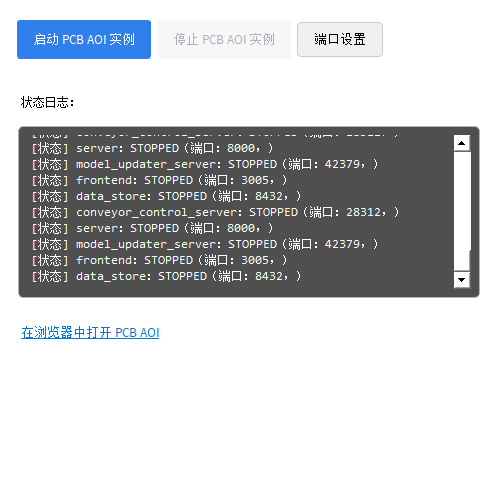
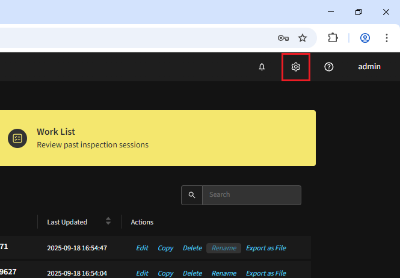

快速开始
=================

DaoAI PCB AOI 软件是一款面向电子制造的智能光学检测系统。  
系统以视觉 AI 为核心，提供从自动建模、参数生成到缺陷检测与持续优化的完整流程。  
与传统需要频繁手动调参的方式不同，系统可快速适配生产现场，在提升效率的同时确保精度与稳定性。  
依托自适应算法与反馈机制，软件既能识别常见与细微缺陷，也能在生产过程中持续学习，提升良率并降低运维成本。

.. raw:: html

    

        <video width="80%" height="auto" controls>
            <source src="http://daoai-robotics-1305756387.file.myqcloud.com/videos/DaoAI_AOI_PCB.mp4" type="video/mp4">
        </video>
    

本章节演示如何使用 DaoAI AOI System 在 2D 检测模式下快速完成一块 PCB 的建模、检测与反馈流程。

.. note::
   系统也支持工业级 3D 相机及高质量 3D 检测，包括高度、焊盘/焊点体积、引脚翘起、立碑、缺料等三维特征分析；本文快速开始以 2D 流程为例，3D 使用与参数说明将在后续章节中单独介绍。

启动软件
-----------------

在桌面点击启动器即可启动软件。  

浏览器将自动打开 ``http://localhost:3005/``。  
后端默认地址为 ``http://localhost:8000/``。

.. image:: images/login.png
   :scale: 50%
   :alt: 登录界面

.. image:: images/host_addr.png
   :scale: 80%
   :alt: 主机地址示意

.. note::
   如需从其他设备访问，将 ``localhost`` 替换为目标机器的 IP。

登录与设置
-----------------

首次进入可以使用 **管理员** 登录账号：用户名 **admin**，密码在部署时提供。

.. image:: images/login.png
   :scale: 50%
   :alt: 登录界面示意

登录后点击右上角齿轮进入设置，可执行：

- 切换界面语言；
   .. image:: images/change_language.png
      :scale: 70%
      :alt: 语言设置

- 切换后端地址；
   .. image:: images/change_host.png
      :scale: 70%
      :alt: 后端地址设置

- 管理成员账户与角色。
   .. image:: images/manage_user.png
      :scale: 70%
      :alt: 账户管理

   角色权限说明：
      - **Admin**：拥有全部权限；
      - **编程员**：除账号管理外的所有操作（创建/编辑 PCB 产品、执行检测任务等）；
      - **操作员**：仅执行检测任务。

创建产品
-----------------

在主页点击 **训练 PCB**，开始注册新的 PCB 产品。

.. image:: images/create_product_1.png
   :scale: 50%
   :alt: 创建产品第一步

输入产品名称。下方为系统支持的检测项列表，可按需启用/关闭。

.. image:: images/create_product_2.png
   :scale: 50%
   :alt: 创建产品第二步

**将 PCB 放在传送带上**

   将 PCB 平整放置于传送带中央，选择对应传送带并点击“锁定”。输入或确认传送带宽度参数，随后点击“进板”，PCB 将自动输送至相机下方的拍摄/定位区域；到位后点击“下一步”。

  .. image:: images/create_product_3.png
     :scale: 50%
     :alt: 将PCB放在传送带上示意

**输入 PCB 尺寸**  
   
   若已知 PCB 尺寸，直接输入其宽度与高度（单位：mm），然后点击“下一步”。
   若尺寸不确定，可移动相机分别拍摄 PCB 左下角与右上角，在图像上依次点击这两个位置并选择 **自动计算** ，系统将自动推算尺寸。

   .. image:: images/size_calculation.png
      :scale: 50%
      :alt: 自动尺寸计算示意

**完整 PCB 拍摄**  

   点击“拍摄”，系统将联动相机与传送带分区采集并自动拼接生成完整 PCB 图像。
   随后点击“定义区域”，在图像上框选用于自动编程的有效区域（通常为整板；若需排除治具/夹具边缘，可适当收缩）。
   该基准图像将作为后续自动编程、对齐与检测的参考，务必使用洁净、无缺陷的 **Golden board（良品板）** 拍摄。
   此界面可实时调整相机参数（亮度、曝光、增益、白平衡、点云滤波等）；如效果不佳，可重新拍摄覆盖上一版本。

   .. image:: images/full_pcb_capture.png
      :scale: 55%
      :alt: 完整 PCB 拍摄

.. （相机参数可调已在上文说明，此句删去避免重复）

**半自动编程（上传 CAD）**  

   提供 CAD（.csv）文件后，系统可：
   - 自动读取：封装(Package)、丝印/标识、料号(PN)、X/Y 坐标、旋转角度；
   - 按封装或料号聚类，同类元件一次建模，加速训练；
   - 减少后续人工分组与命名工作。

   若不提供 CAD，后续自动编程仍可执行；检测质量不受影响，仅失去基于封装/料号的聚类加速，系统将对元件逐一建模。

   .. image:: images/upload_cad.png
      :scale: 50%
      :alt: 上传 CAD 文件界面

   步骤：
   1. 上传 `.csv` 文件并点击“预览表格”。
   2. 在字段映射界面依次指定：料号(PN)、封装(Package)、X、Y、旋转(°)，（可选）层/板面字段；如存在多层数据，可按层号或面别过滤。  
   3. 选择坐标单位（mm 或 mil），确认原点与方向一致。  
   4. 点击“运行自动编程”。

   .. image:: images/upload_cad2.png
      :scale: 50%
      :alt: 字段映射示意

   若 CAD 初次与拍摄图像未正确重合，系统将进入“对齐调整”界面；通过旋转、平移、缩放（必要时辅助少量基准点）微调至主要元件位置大致重合后，点击“重新运行自动编程”即可重新生成。

**全自动编程（无 CAD）**

   不上传任何文件，直接点击“自动编程”即可。系统会通过视觉+AI自动：

      - 识别并分割元件区域；
      - 推断类别特征并生成初始检测模板；
      - 建立后续对齐与检测所需的结构化数据。

   自动编程耗时约 30 秒。

.. image:: images/full_auto_program.png
   :scale: 50%
   :alt: 全自动编程示意

产品编程页面
-----------------

自动编程完成后，会进入 **产品编程页面**。页面包含三个 Tab：

1. **标记/对齐 PCB**  
2. **模板编辑器**  
3. **PCB 拼版**

**标记/对齐 PCB**：  

点击“+ 标记”，框选 PCB 上固定的参考标记（圆形、矩形或复杂图案均可）。框选区域应略大，以保证在轻微位移情况下仍能正确定位。确认后，点击“预测中心”完成标记定义。

.. image:: images/mark_alignment.png
   :scale: 50%
   :alt: 标记对齐示例

**模板编辑器**：  

左侧显示自动编程获得的元件列表。若上传了 CAD，系统会自动显示丝印/标识，并将同类元件分组。  
可通过搜索栏过滤存在问题的项。对于标记不正确的元件，可手动删除并重新编程。

.. image:: images/template_editor.png
   :scale: 80%
   :alt: 模板编辑器示例

手动编程
~~~~~~~~~~~~~~~~

右侧工具栏提供多种手动编程工具：

1. **选择工具**：框选元件检测框，可进行分组或调整  
2. **拖拽工具**：拖动图像、缩放视野  
3. **本体工具**：定义元件本体检测框  
4. **焊料工具**：定义焊点检测框  
5. **引脚工具**：定义引脚检测框  
6. **文本工具**：定义文本检测框  
7. **条形码工具**：定义条码检测框（支持 PCB 序列号识别）  

常见元件的编程方法
-----------------

以下章节将介绍电容、电阻等常见元件的编程方式。  

电容、电阻
~~~~~~~~~~~~~~~~~~

步骤：
   1. 选择“本体工具”框出元件主体区域（紧贴真实外廓，尽量减少空白）。
   2. 选择“焊料工具”分别框出左右（或多端）焊盘/焊点区域；若焊盘间距很近，可视检测需求决定是否合并。

质量建议：
   - 框贴合元件实际形状，避免包含过多空白区域；
   
   .. image:: images/program_resistor.png
      :scale: 60%
      :alt: 手动编程电容、电阻示意

分组与属性：
使用“选择工具”框选主体与全部焊料框 → 右键 “分组” 生成一个元件，填写：

   - 标识（必填，建议与丝印一致）
   - （可选）料号 / 封装
   - （可选）备注或版本号

点击“创建新元件”完成。

   .. image:: images/add_component.png
      :scale: 80%
      :alt: 手动编程工具栏

QFP 封装 IC 芯片
~~~~~~~~~~~~~~~~~~~~~~~~

步骤：
   1. 选择“本体工具”框出芯片主体（紧贴封装外沿）。
   2. 选择“IC 引脚工具”框出任意一侧整排引脚（覆盖焊盘 + 焊料 + 引脚末端区域）。
   3. 右键“复制”该引脚框，拖动至对侧或其它边；必要时使用右键旋转使其与该边引脚方向一致。

质量建议：
   - 框贴合元件实际形状，避免包含过多空白区域；
   - (2D) IC 引脚检测需要划分 3 个区域：焊盘、焊料、引脚末端；参见 :ref:`3.2 IC 引脚检测 v2（2D，基于颜色比例）` 以了解区域划分标准。

   .. image:: images/program_qfc_1.png
      :scale: 50%
      :alt: QFP 封装 IC 芯片

   .. image:: images/program_qfc_2.png
      :scale: 50%
      :alt: QFP 封装 IC 芯片

分组与属性：
   使用“选择工具”框选主体与全部焊料框 → 右键 “分组” 生成一个元件，填写：

   - 标识（必填，建议与丝印一致）
   - （可选）料号 / 封装
   - （可选）备注或版本号

点击“创建新元件”完成。

   .. image:: images/add_component.png
      :scale: 80%
      :alt: 手动编程工具栏

SOP/TSSOP 封装的存储芯片或驱动芯片
~~~~~~~~~~~~~~~~~~~~~~~~~~~~~~~~~~~~

与 QFP 类似：本体工具框主体 → IC 引脚工具框一侧引脚后复制到另一侧 → 分组创建元件。

   .. image:: images/program_sop.png
      :scale: 80%
      :alt: SOP/TSSOP 封装示例

确认所有元件框
------------------

在训练前确保每个元件的框、分组与属性正确无误。

核对要点：

1. 全板预览：是否有缺失、漂移、异常超大/超小框。
2. 局部放大：密集区框是否挤压/重叠，未覆盖相邻器件。
3. 过滤搜索不健康的元件：低置信度 / CAD 未匹配 / 尺寸或重叠异常。

   .. image:: images/unhealthy.png
      :scale: 70%
      :alt: 不健康元件示意

**正确但是标为不健康的元件**：若置信度较低被标为不健康但框位置正确，可点击列表中对应元件的问号图标即可确认，归为健康。

**识别错误的元件**：删除后重新手动编程。

**CAD 中存在但未被自动检测的元件**：若出现 missing 标记，先删除该标记并手动新增；若实板确实无此元件，则直接删除/忽略。

   .. image:: images/missing.png
      :scale: 60%
      :alt: 不健康元件示意

训练和评估
-----------------

确认全部元件框与属性无误后，点击“训练”启动模型训练，耗时约 1 分钟。

   .. image:: images/train.png
      :scale: 50%
      :alt: 训练示意

训练完成后，点击“自动生成检测参数”，系统会基于当前模板与训练结果生成一套初始检测参数。

随后点击“评估全部”，系统将批量评估所有元件，并以颜色标记（绿：健康；红：不健康）。可按需查看不健康项并参考 :ref:`检测参数` 继续微调。

   .. image:: images/eval.png
      :scale: 50%
      :alt: 评估示意

开始检测
-----------------

1. 返回主页：点击左上角 Logo 回到主页，点击“新建检测任务”。
2. 任务配置：选择 PCB 产品、传送带及启动模式（单板 / 连续 / 调试），点击“开始检测”。

   .. image:: images/start_inspection.png
      :scale: 50%
      :alt: 新建检测任务

   .. image:: images/start_mode.png
      :scale: 80%
      :alt: 启动模式选择

进入检测页面后：

   - 空格：进板并立即开始检测。
   - 左侧控制按钮：进板 | 出板 | 通过 | 复位。
   - 右侧信息栏：实时显示检测计数、良率与缺陷统计。

   .. image:: images/inspect_page.png
      :scale: 50%
      :alt: 检测页面

检测到缺陷时自动跳转至缺陷详情页，可查看放大图、定位框、缺陷类型及判定依据，并立即反馈。 

反馈后的数据会添加到数据集里，供后续持续优化使用。

.. image:: images/inspect_detail.png
   :scale: 50%
   :alt: 缺陷详情

快捷键：
   - 数字键 1–0：快速反馈（具体含义见 :ref:`快捷键` 章节）。
   - 上 / 下方向键：切换上一 / 下一条缺陷。
   - Enter：返回检测主页面。
   - 空格：进板并开始检测

查看检测历史
----------------

在主页点击“工作列表”进入历史任务列表。

   .. image:: images/worklist.png
      :scale: 50%
      :alt: 工作列表概览

列表展示每个任务的：创建时间、合格/不合格数量、良率、缺陷统计等。点击任意一行进入该任务详情。

   .. image:: images/worklist1.png
      :scale: 50%
      :alt: 任务详情概览

在任务详情中可展开单次检测记录；点击某次记录进入缺陷详情页，查看放大图、定位框、缺陷类型与判定依据，并可直接反馈。

   .. image:: images/worklist2.png
      :scale: 50%
      :alt: 缺陷记录与反馈

提交的反馈会写入数据集，用于后续再训练与参数自适应迭代。

迭代模型
-----------------

反馈写入数据集后，回到产品编程页面重新训练并评估，针对仍为红色的异常元件微调参数即可完成一次迭代。

|
|

以上即为快速开始全部流程，感谢您的使用。后续更多功能与更详细的说明请继续阅读完整用户手册。