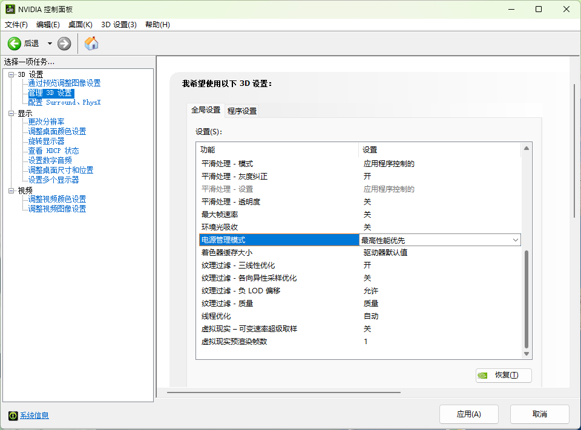
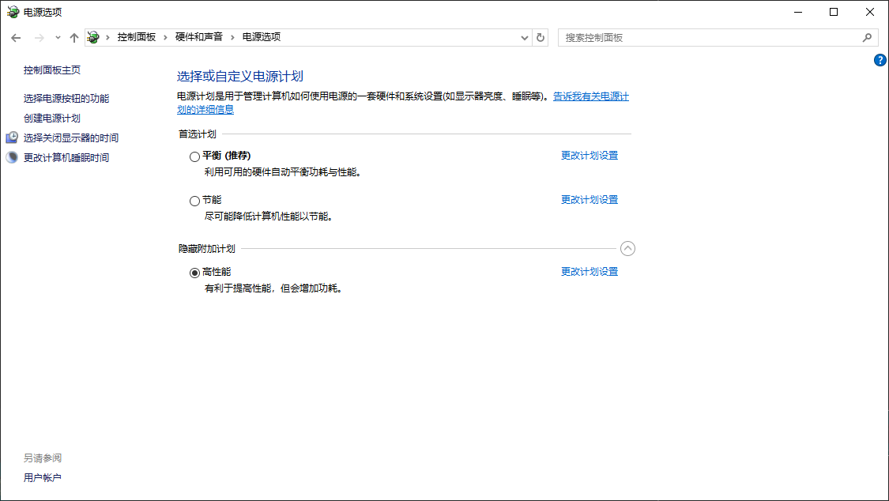
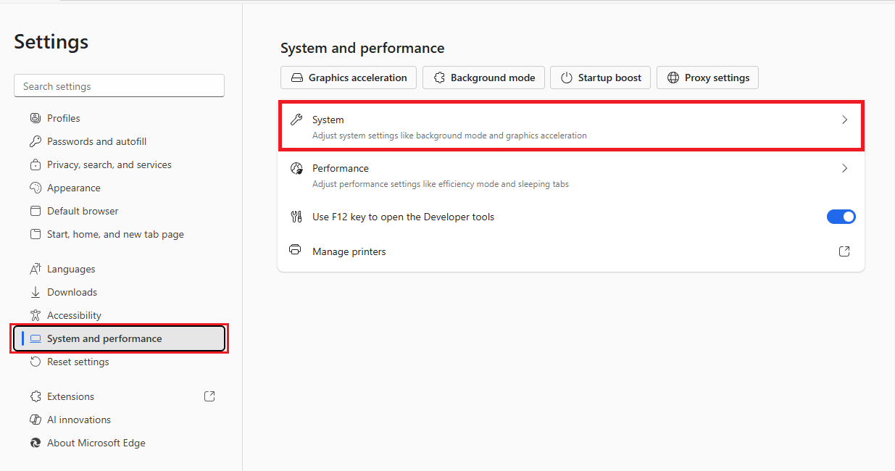
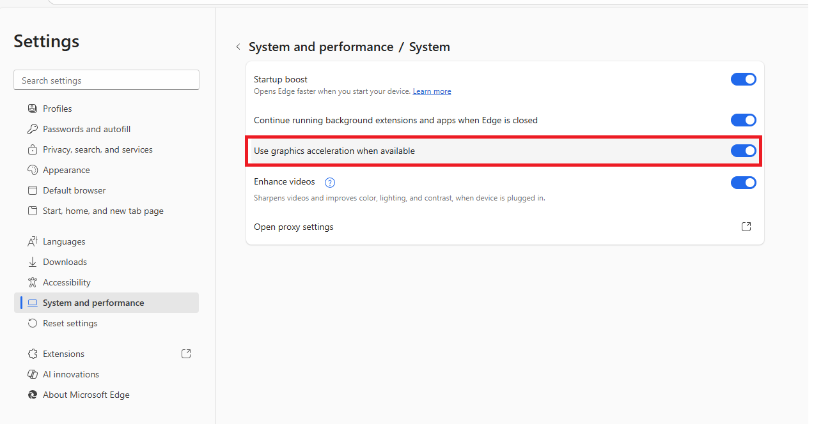

常见问题
================

如何避免 GPU 进入低功耗模式导致推理变慢？
-------------------------------------------------------------

在某些设备上，如果连续使用模型推理，执行速度非常快（例如 10 毫秒以内）；但如果两个推理调用之间的间隔较长（例如超过 5 秒），则可能出现执行时间大幅变慢的情况（例如变成 100 毫秒以上 然后之后回到10ms以内）。

这是由于 GPU 进入低功耗状态导致的性能下降问题。

为了保证您的设备始终以高性能运行，建议您进行以下设置：

1. 在 NVIDIA 控制面板中设置： 
    - 打开 NVIDIA Control Panel → Manage 3D Settings。 
    - 找到 Power management mode，设置为 Prefer maximum performance。

2. 在系统电源管理中设置： 
    - 打开 控制面板 → 电源选项。 
    - 选择 高性能 电源计划。

设置示例如下图所示：

如何开启浏览器的硬件加速以避免浏览器卡顿？
-------------------------------------------------------------

在编程一个元件数量较多的 PCB 模板时，浏览器可能会出现卡顿现象。建议开启浏览器的硬件加速功能以提升性能。

1. 启用硬件加速（Edge）：
    - 打开 Microsoft Edge
    - 点击右上角“...” → “设置”
    - 左侧选择“系统和性能”
    - 点击 “系统”
    - 找到“在可用时使用硬件加速”并勾选启用
    - 若提示“重新启动”，点击以生效

2. 确保您的显卡驱动程序是最新的。

