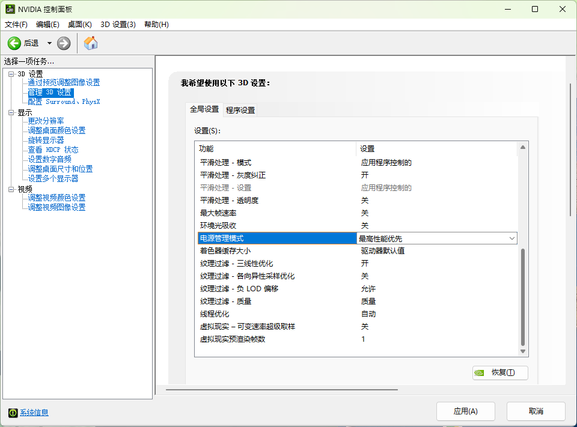
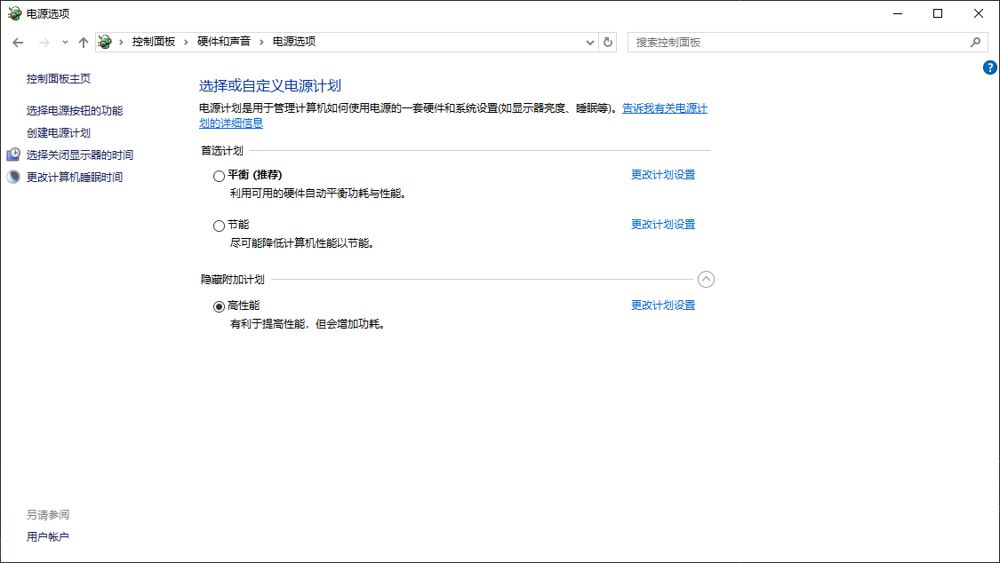
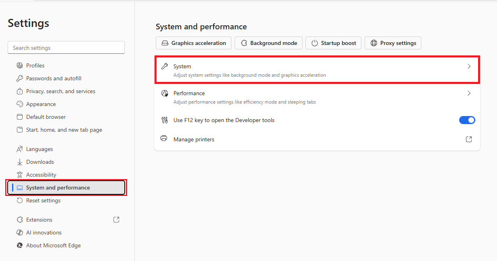
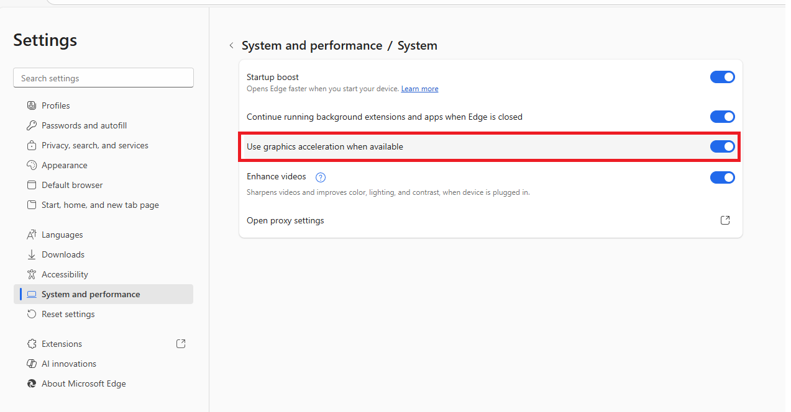

常见问题
================

.. contents:: 
   :local:
   :depth: 1

如何避免 GPU 进入低功耗模式导致推理变慢？
-------------------------------------------------------------

在某些设备上，如果连续使用模型推理，执行速度非常快（例如 10 毫秒以内）；但如果两个推理调用之间的间隔较长（例如超过 5 秒），则可能出现执行时间大幅变慢的情况（例如变成 100 毫秒以上 然后之后回到10ms以内）。

这是由于 GPU 进入低功耗状态导致的性能下降问题。

为了保证您的设备始终以高性能运行，建议您进行以下设置：

1. 在 NVIDIA 控制面板中设置： 
    - 打开 NVIDIA Control Panel → Manage 3D Settings。 
    - 找到 Power management mode，设置为 Prefer maximum performance。

2. 在系统电源管理中设置： 
    - 打开 控制面板 → 电源选项。 
    - 选择 高性能 电源计划。

设置示例如下图所示：

如何开启浏览器的硬件加速以避免浏览器卡顿？
-------------------------------------------------------------

在编程一个元件数量较多的 PCB 模板时，浏览器可能会出现卡顿现象。建议开启浏览器的硬件加速功能以提升性能。

1. 启用硬件加速（Edge）：
    - 打开 Microsoft Edge
    - 点击右上角“...” → “设置”
    - 左侧选择“系统和性能”
    - 点击 “系统”
    - 找到“在可用时使用硬件加速”并勾选启用
    - 若提示“重新启动”，点击以生效

2. 确保您的显卡驱动程序是最新的。

自动编程没有 CAD 可以吗？
-------------------------------------------------------------

可以。未提供 CAD 时，系统会：

* 仅基于图像/AI 识别结果生成初始元件框集合。
* 不能自动补充料号、封装、丝印映射，需要人工后续补录。
* 分组初期只能按“封装（推断/人工）”或“主体外形”进行粗分。

推荐做法：
1. 先执行自动编程获取基础框。
2. 手动补充关键元件的封装与料号（优先高价值器件）。
3. 统一封装命名后，再做参数调优与训练。

元件录入时只有封装，没有料号可以吗？
------------------------------------

可以。系统会先按封装分组：

* 优点：仍可聚合样本、共享封装级参数。
* 局限：无法区分同封装不同规格（如阻值/容值），统计维度较粗。

后续补录料号后：
* 自动进入封装下的二级料号节点。
* 已有参数继承保留，可再按料号覆盖特化（如亮度阈值）。

某一个元件频繁误检，是否应单独脱离分组？
-------------------------------------------------------

排查顺序建议：
1. 确认其标注是否正确（主体 / 焊料 / 引脚框是否偏移）。
2. 对比同封装其它样本是否共有问题：若多数异常 → 说明封装级参数需调整。
3. 仅该件异常 → 检查是否器件瑕疵 / 光照阴影 / 翘脚。 

如果确认该元件与组内模式差异较大（颜色、焊料成形、几何高度）：
* 可临时关闭“Link Package / Link PN”脱离继承，单独调整。
* 若差异具有系统性（整批次都不同），应新建料号；若几何本质不同，应新建封装。

注意：脱离分组后参数修改不会再反馈到组内。

修改封装参数后需重新训练吗？
-------------------------------------------------------

分情况：

* 纯检测参数阈值（阈值、面积、距离、比率等）调整：无需重新训练，保存后即时生效。
* 重绘/增删检测框（主体、焊料、引脚掩膜）导致样本几何变化：需要重新训练，以更新特征表示。
* 批量合并/拆分组（封装或料号）后：若仅分组结构变化通常无需训练；若引入了大量新增样本，建议增量再训练一次提升稳定性。

如何在元件里新增检测项？
--------------------------

要在元件中新增检测项（ROI），请按以下步骤操作：

1. 在模板编辑器中，选中目标元件（已分组）。
2. 在右侧属性栏找到”在组中添加 ROI”按钮。
3. 点击后，进入 ROI 编辑模式，可在图像上框选新的检测区域。
4. 添加您需要的 ROI 类型（如焊料、引脚、文本、条码等）
5. 然后保存并退出即可。

“以演示模式运行”是什么？
--------------------------

**以演示模式运行** 是新建检测任务弹窗中的一个勾选项。勾选后：

* 检测任务自动运行，无需手动触发。
* 检测到缺陷时，系统在复检页面停留约 7 秒，随后自动返回实时检测页面并继续。
* 按 ``Esc`` 可随时退出演示模式。
* 演示模式下无法通过按钮手动触发检测。

详情请参见 :doc:`../complete_user_guide/inspection/index` 中的”新建检测任务”一节。

实时检测页面的”整板 / 子板”直通率切换是什么含义？
----------------------------------------------------

实时检测页面（Live）右侧统计面板上方提供 **整板 / 子板** 切换控件，用于选择直通率（FPY）的统计口径：

* **整板**：以整块 PCB 为单位计算直通率（合格板数 / 已检测板数），标签显示 **主板直通率**。
* **子板**：以子板为单位计算，仅适用于拼板产品，标签显示 **子板直通率**；非拼板产品显示 **N/A**。

该设置会持久化保存，页面刷新后仍保留。子板判废逻辑（比例模式 / 坏板标记模式）在产品设置的 **检测设置** 子标签中配置，详情请参见 :ref:`检测设置（子板判废逻辑）`。

软件升级与安装
================================================

升级后软件无法启动或拍不了照片
-------------------------------------------------------------

升级前请先 **重启电脑**，避免后台残留进程导致旧版本卸载不干净。

1. 重启电脑。
2. 卸载旧软件（使用安装目录下的 ``unins000.exe``）。
3. 安装新版本。
4. 参考随版本发布的更新说明文档完成升级后的额外操作（如校准、配置迁移等）。

更新软件后第一次启动很慢
-------------------------------------------------------------

i7-8 代工控机上首次启动大约需要 **2.5 分钟** 属正常现象；第二次及以后启动会显著加快。等待启动完成即可。

新版本功能不显示 / 设置里看不到
-------------------------------------------------------------

1. 浏览器缓存可能未刷新。按 ``Ctrl + R`` 或 ``Ctrl + Shift + R`` 强制刷新浏览器，让最新的前端代码加载进来。
2. 确认实际安装的软件版本正确（**设置 → 系统设置 → 关于** 页面查看版本号）。

授权 / 加密狗过期，软件无法使用
-------------------------------------------------------------

1. 检查加密狗是否插好、USB 接口是否松动。
2. 在 **设置 → 系统设置 → 关于** 页面查看授权到期日期。
3. 备用方案：若有备用加密狗，可临时替换使用。

软件长时间启动失败（i.e. 与其他软件端口冲突）
-------------------------------------------------------------

AOI 软件后端使用 **8000 端口**。若同设备上运行其他占用 8000 端口的程序（如个别音乐 / 通讯软件），AOI 软件无法正常启动。

1. 关闭可能占用 8000 端口的其他程序后重新启动 AOI 软件。
2. 命令行可通过 ``netstat -ano | findstr :8000`` 查看 8000 端口当前被哪个进程占用。

软件启动 / 崩溃 / 卡顿
================================================

浏览器页面卡顿、不出图
-------------------------------------------------------------

按 ``Ctrl + R`` 或 ``Ctrl + Shift + R`` 强制刷新浏览器缓存。如频繁出现，建议同时启用 :ref:`如何开启浏览器的硬件加速以避免浏览器卡顿？` 中介绍的浏览器硬件加速。

SSE 报错（后台模块崩溃）
-------------------------------------------------------------

启动器面板上可看到各后端模块的状态指示。若有模块显示为红色（STOPPED），通常重启软件即可恢复。

检测记录积累过多导致卡顿
-------------------------------------------------------------

* 自 **v4.1-587** 起，软件支持自动清理旧检测数据。可在 **设置 → 系统设置 → 系统配置** 中设置保留天数 / 磁盘阈值，过期数据会被自动清理。
* 也可在 **数据分析报告 → 检测结果** 标签页中手动多选并删除指定时间段的检测记录。

.. warning::

   **请勿手动删除安装目录下的数据库文件夹**。手动删除可能误删程序数据，导致软件黑屏 / 无法启动。如需清理空间，请使用软件内置的自动 / 手动清理功能。

软件更新后启动卡在 99%
-------------------------------------------------------------

1. 重启电脑后重新尝试。
2. 重新运行版本更新。
3. 检查启动器面板上各模块状态。如果 ``conveyor_server`` 显示为红色（STOPPED），可能是设备处于急停状态或硬件初始化失败：先解除急停状态再重启软件；若是硬件初始化失败，请参见硬件相关章节。

图像质量
================================================

编程拍照时拼接的大图上有重影
-------------------------------------------------------------

1. 换一块 PCB 重新拍摄。若依然有重影，说明轨道标定已偏，需要 **重新校准**\ （相机标定 + 轨道标定）。
2. 若重影是偶发现象，可进入 **设置 → 系统设置 → 捕获模块**，把 **图像拼接配置 → 最大偏移像素 X 与 Y** 调大（例如调到 30）；重启软件后再试。

编程时元件显示正常，检测时元件表面泛红
-------------------------------------------------------------

原因：元件本身存在一定倾斜，编程时位于视野中部（光照均匀），但检测时智能路径规划可能让该元件落在视野边缘，被环形光源照得表面反光发红。

解决方法：在该元件 **周围** 添加一个更大的占位元件（仅包含本体检测，阈值放到最宽松）。占位元件本身不会真正影响判定，但能改变路径规划，使原元件落在视野中部。

其他常见问题
================================================

板子放反 / 全部被屏蔽时报错处理
-------------------------------------------------------------

* **板子放反**：在新建检测任务前请再次确认 PCB 放置方向；若使用拼板，注意拼板基准位置。
* **全部子板被判定为坏板时**：v4.0.1-561 起，复检页面会按 NG 处理，避免被误标记为 OK。

同名程序保留两个版本
-------------------------------------------------------------

* **临时解决**：先 **复制** 旧程序为另一名称，删除旧程序，再导入同名新程序。
* **注意**：删除旧程序后，相关检测记录的图像可能不可见。
* 4.2 版本起会优化此处的程序命名 / 版本管理逻辑。

按料号跳过某些元件不检测
-------------------------------------------------------------

在模板编辑器中找到对应料号的元件，关闭它们的所有检测项；或直接使用 :ref:`跳过此元件的检测` 开关进行整体跳过。

红胶板检测
-------------------------------------------------------------

红胶板专用的检测模型与算法尚在开发中；当前版本暂无可靠的红胶板检测方案。

版本升级影响矩阵
================================================

升级前请对照下表了解可能需要的额外操作。

.. list-table::
   :header-rows: 1
   :widths: 18 14 68

   * - 版本
     - 日期
     - 升级注意事项
   * - v4.0.1-565+
     - 2026-03-05
     - 完整安装包。v4.0-541 或更高版本可直接安装升级；早于 v3.9 的版本需先按升级流程操作。在线机版本 / 无商标版本有独立安装包。
   * - v4.0.1-568
     - 2026-03-06
     - 修复 IC 引脚检测工具 *使用同步参数* 开关无法关闭的问题。
   * - v4.0.1-561
     - 2026-03-04
     - 修复全部子板被判为坏板时复检页面错报 OK 的问题。
   * - v4.1-587
     - 2026-03-16
     - 新增自动清理旧检测记录功能，可在 **系统配置** 中设置保留天数。
   * - v3.9-503
     - 2026-01-30
     - 桥接检测工具支持独立放置（可手动添加到元件旁），增强电容 / 电阻连锡检测能力。
   * - v3.8-473
     - 2026-01-22
     - 修复 OCR 识别到检测框外文字的问题。
