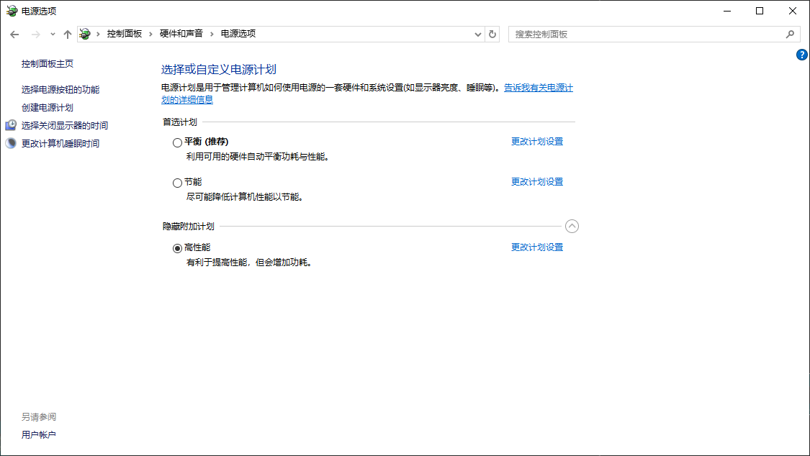

常见问题
================

.. contents:: 
   :local:
   :depth: 1

如何避免 GPU 进入低功耗模式导致推理变慢？
-------------------------------------------------------------

在某些设备上，如果连续使用模型推理，执行速度非常快（例如 10 毫秒以内）；但如果两个推理调用之间的间隔较长（例如超过 5 秒），则可能出现执行时间大幅变慢的情况（例如变成 100 毫秒以上 然后之后回到10ms以内）。

这是由于 GPU 进入低功耗状态导致的性能下降问题。

为了保证您的设备始终以高性能运行，建议您进行以下设置：

1. 在 NVIDIA 控制面板中设置： 
    - 打开 NVIDIA Control Panel → Manage 3D Settings。 
    - 找到 Power management mode，设置为 Prefer maximum performance。

2. 在系统电源管理中设置： 
    - 打开 控制面板 → 电源选项。 
    - 选择 高性能 电源计划。

设置示例如下图所示：

.. image:: images/nv_power.png
   :scale: 50%
   :alt: GPU 设置示例

如何开启浏览器的硬件加速以避免浏览器卡顿？
-------------------------------------------------------------

在编程一个元件数量较多的 PCB 模板时，浏览器可能会出现卡顿现象。建议开启浏览器的硬件加速功能以提升性能。

1. 启用硬件加速（Edge）：
    - 打开 Microsoft Edge
    - 点击右上角“...” → “设置”
    - 左侧选择“系统和性能”
    - 点击 “系统”
    - 找到“在可用时使用硬件加速”并勾选启用
    - 若提示“重新启动”，点击以生效

2. 确保您的显卡驱动程序是最新的。

.. image:: images/edge_hardware_acc.png
   :scale: 40%
   :alt: Edge 浏览器硬件加速设置示例

.. image:: images/edge_hardware_acc2.png
   :scale: 50%
   :alt: Edge 浏览器硬件加速设置示例

.. image:: images/edge_hardware_acc3.png
   :scale: 50%
   :alt: Edge 浏览器硬件加速设置示例

自动编程没有 CAD 可以吗？
-------------------------------------------------------------

可以。未提供 CAD 时，系统会：

* 仅基于图像/AI 识别结果生成初始元件框集合。
* 不能自动补充料号、封装、丝印映射，需要人工后续补录。
* 分组初期只能按“封装（推断/人工）”或“主体外形”进行粗分。

推荐做法：
1. 先执行自动编程获取基础框。
2. 手动补充关键元件的封装与料号（优先高价值器件）。
3. 统一封装命名后，再做参数调优与训练。

元件录入时只有封装，没有料号可以吗？
------------------------------------

可以。系统会先按封装分组：

* 优点：仍可聚合样本、共享封装级参数。
* 局限：无法区分同封装不同规格（如阻值/容值），统计维度较粗。

后续补录料号后：
* 自动进入封装下的二级料号节点。
* 已有参数继承保留，可再按料号覆盖特化（如亮度阈值）。

某一个元件频繁误检，是否应单独脱离分组？
-------------------------------------------------------

排查顺序建议：
1. 确认其标注是否正确（主体 / 焊料 / 引脚框是否偏移）。
2. 对比同封装其它样本是否共有问题：若多数异常 → 说明封装级参数需调整。
3. 仅该件异常 → 检查是否器件瑕疵 / 光照阴影 / 翘脚。 

如果确认该元件与组内模式差异较大（颜色、焊料成形、几何高度）：
* 可临时关闭“Link Package / Link PN”脱离继承，单独调整。
* 若差异具有系统性（整批次都不同），应新建料号；若几何本质不同，应新建封装。

注意：脱离分组后参数修改不会再反馈到组内。

修改封装参数后需重新训练吗？
-------------------------------------------------------

分情况：

* 纯检测参数阈值（阈值、面积、距离、比率等）调整：无需重新训练，保存后即时生效。
* 重绘/增删检测框（主体、焊料、引脚掩膜）导致样本几何变化：需要重新训练，以更新特征表示。
* 批量合并/拆分组（封装或料号）后：若仅分组结构变化通常无需训练；若引入了大量新增样本，建议增量再训练一次提升稳定性。

如何在元件里新增检测项？
--------------------------

要在元件中新增检测项（ROI），请按以下步骤操作：

1. 在模板编辑器中，选中目标元件（已分组）。
2. 在右侧属性栏找到“在组中添加 ROI”按钮。
3. 点击后，进入 ROI 编辑模式，可在图像上框选新的检测区域。
4. 添加您需要的 ROI 类型（如焊料、引脚、文本、条码等）
5. 然后保存并退出即可。